# 开发快速手册

​	==这是我毕业第一段工作时开始记录的，也算是纪念（能遇到宣扬家文化、利他之心等，的盛和塾文化公司，也很不错），就保留前面这些东西了==

​       (部分已过时) 撰写本文的目的，是为了新来的小伙伴尽快熟悉相关的前情提要，补齐数据差异；同时记录开发过程走踩过的坑，让后来者少走弯路。文档是按照撰写者研究内容上的时间顺序编写的，因此可能略显杂乱，但您可以在浏览器或Typora中展开侧边栏，Ctrl + F等，快速检索您需要的内容。


**作者：曾霖晖		上次更新时间：25年12月01日		微信：13622872136**

*最近更新内容：MKdocs、Github密钥*

---------------------


## 0. 业务交接

### 1. 购买清单

**测距类：**

激光雷达-镭神 [镭神智能C16多线激光雷达测距车规级自动驾驶建图导航三维重建C32-tmall.com天猫](https://detail.tmall.com/item.htm?id=661385169472&ns=1&priceTId=2147bfde17262254382865387e1c34&skuId=4979114222837&spm=a21n57.1.item.5.39bc523cBCegDN&utparam={"aplus_abtest"%3A"cc055d6f4e42f9dfd756ecea90af3299"}&xxc=ad_ztc)

激光雷达-速腾 [RS-Helios系列 - 机器人激光雷达 - RoboSense速腾聚创 | 让世界更安全，让生活更智能](https://www.robosense.cn/rslidar/RS-Helios)

超声波-电应普 [超声波测距机器人人体靠近障碍物避障 1拖4 1拖8探测模块传感器-淘宝网](https://item.taobao.com/item.htm?ft=t&id=826395799065&sku_properties=-1%3A-1)

------

**视觉类：**

深度相机-奥比中光 [Astra Pro Plus深度相机摄像头双目ROS视觉SLAM奥比中光Gemini-淘宝网](https://item.taobao.com/item.htm?id=646073233035&ns=1&priceTId=2147bfde17262255402252384e1c34&skuId=5585744153495&spm=a21n57.1.item.5.7493523ccYEEe1&utparam={"aplus_abtest"%3A"67ca5565fb42276dedf2b82e2b63c872"}&xxc=ad_ztc)

深度相机-图漾 [[风火轮FS820-E1\]工业相机 双目深度视觉 毫米级精度ROS机器人3D-淘宝网](https://item.taobao.com/item.htm?app=chrome&bxsign=scdw8RGcUvNZVgVh239e-JMfTlAR6NVvN20bMqWfd4uS5DZ7XBrZiNeaWfwOm5Ualx0cBwmESrRmzeoFG-GZkOwquzuY7tSFr4nzfnDcqvwUdKtTtZ9gp62uwWlfS4GXpb5&cpp=1&id=770687446004&share_crt_v=1&shareurl=true&short_name=h.T0wP1cjam1l9kqz&sp_tk=M25sbzNyOGVERlk%3D&spm=a2159r.13376460.0.0&tbSocialPopKey=shareItem&tk=3nlo3r8eDFY&un=cdea73b7a06ff3584c6e4bed9157ce66&un_site=0&ut_sk=1.ZX8bAPQXlJ8DAFNid3SHa5pj_21646297_1731477281632.Copy.1&wxsign=tbwVaEzA6TopOGh8D4UeD4V_k4ec5y0IC0TD6AkiWk2E2w7BH1Y4YVTZR1Y2WEvL3KbFfDk-RSbcVyUzKGyZsuNlQnCNt475qyVUpfA-Il79ThZ_rNO8HZRx4dxJrhUKUR-&skuId=5450141666122)

网络相机-亚博 [WiFi摄像头图传模块 ROS2机器人智能小车两自由度云台AI视觉识别-淘宝网](https://item.taobao.com/item.htm?_u=l2jo877i6f6a&id=799318150841&spm=a1z09.2.0.0.4e582e8d6OKNeb)

机器视觉-矽速  [Sipeed MaixCAM pro RISC-V Linux开发板摄像头wifi视觉识别模块-淘宝网](https://item.taobao.com/item.htm?_u=l2jo877i9c13&id=801149661182&spm=a1z09.2.0.0.4e582e8d6OKNeb)

------

**定位姿态类：**

差分定位-陆海天 [INS622车规级GNSS组合GPS卫星导航定位系统RTK模块ROS机器人G70-tmall.com天猫](https://detail.tmall.com/item.htm?id=669018195643&priceTId=2150447717262926778306778e1c68&spm=a21n57.sem.item.136.1c963903N9ZzFp&utparam={"aplus_abtest"%3A"6b3c5e30303313a5253673e4f4f44dc4"}&xxc=ad_ztc)

------

**主机类：**

JETSON [Jetson AGX Xavier 开发者套件 AI边缘计算人工智能-tmall.com天猫](https://detail.tmall.com/item.htm?id=680471489849&priceTId=213e38ae17262144887558131e1cb5&skuId=5048850210619&spm=a21n57.sem.item.1.51013903V7Zd6s&utparam={"aplus_abtest"%3A"8f01f10004f5d58eaa1b072425dfd94f"}&xxc=ad_ztc)

机器人控制板-亚博 [亚博智能 ROS机器人控制器ROS2小车IMU电机驱动STM32扩展板JETSON-tmall.com天猫](https://detail.tmall.com/item.htm?_u=l2jo877id602&id=675486815782&spm=a1z09.2.0.0.4e582e8d6OKNeb)

ESP32-S3-DevKitC-1[源地ESP32-S3核心板/开发板/系统板乐鑫WROOM ESP32S3蓝牙BLEwifi-淘宝网](https://item.taobao.com/item.htm?_u=l2jo877i4458&id=669443108979&spm=a1z09.2.0.0.4e582e8d6OKNeb)

RK3568-风火轮科技 [[YY3568\]开源ARM核心开发主板瑞芯微RK3568人工智能安卓Linux鸿蒙-淘宝网](https://item.taobao.com/item.htm?_u=l2jo877i6708&id=696526180784&spm=a1z09.2.0.0.4e582e8d6OKNeb)

------

**控制类：**

继电器 [1 2 4 8路5V12V24V继电器模块带光耦隔离支持高低电平触发开发板-tmall.com天猫](https://detail.tmall.com/item.htm?_u=l2jo877i0e18&id=15909056050&spm=a1z09.2.0.0.4e582e8d6OKNeb)

遥控器 [HOT RC智能小车2.4G HT-8A遥控器 8通道手柄 PWM接收器航模无人机-淘宝网](https://item.taobao.com/item.htm?_u=l2jo877i666a&id=676076810787&spm=a1z09.2.0.0.4e582e8d6OKNeb)

SBUS转UART [航模遥控器SBUS信号与TTL-UART转换模块，SBUS转串口，串口转SBUS-淘宝网](https://item.taobao.com/item.htm?_u=l2jo877i87ca&id=682199935952&spm=a1z09.2.0.0.4e582e8d6OKNeb)

模拟舵机-MG996R [SG90 9g舵机MG996R mg90s MG995模块马达遥控飞机航模9克360度180-tmall.com天猫](https://detail.tmall.com/item.htm?_u=l2jo877iec77&id=41248626148&spm=a1z09.2.0.0.4e582e8d6OKNeb)

总线舵机20KG-80KG-舵机测试仪器-众灵科技 [总线舵机串行大扭力20KG金属防水双轴舵机做机器人防堵转兼容PWM-淘宝网](https://item.taobao.com/item.htm?_u=l20aaraa1md929&id=696917253317&pisk=fwXquQDFl-eqwtw3lnJZUdFnyoAvHK4QSOT6jGjMcEY06nwiQGSHfoUTD_-G5aETDKsM7N7WyAt_MPHNzZshGI_1GFxMrajjhFwv_NSCJNM_HstiQas9sN6NXA-GjNEv5oE5Dip9IyaBQJsAD4VS49W2j0Dl2HYiSuC0I6v9IyaQdJsADdQLspbkSbxkynumnNcmrgYJbmxGSEAorH-pIdvGSQckxHKMjFYGqUYJAmciiI0kZHttnnDcSgqybHhdAdvKRHA0vH0JMV0x2eLhmEmj0tq9_jIWzIOAEnuIqi8yNQ6y0I8BwKrZ4tb5jt6vw5h6Bg1F71bTObpVjsvDAieqUpjcNO-5ClGwog6PqOREjkYhHgXpEQw3YgXRliBPfc2MVwTlDtvnrRKRhGX2_OzZ6K1CAOdhn-upPBKNlU_3KYJksgJIW3V8AOCqSfAmC38Q4uSif4YujgZ85fh9M0KyRodisf0KdAGVCoht6InM4eZvC&spm=a1z09.2.0.0.52dc2e8dvegOJp)

ZLink-众灵科技 [ZLink USB/TTL串口调试板总线舵机转接板UART下载器CH340驱动-淘宝网](https://item.taobao.com/item.htm?_u=l20aaraa1m10bd&id=677336830650&pisk=fmproFwwPYHyjhDiPgWU39QTtn5RLT0s-p_CxHxhVabo9gM3LH-GA03K2ISHREnK2Tth8e8fkJsIw2eeuUtMN_TBNwjhoEx7FwMRTe-6WewIeQs3LEtdte9evJSHxenRR0nX23BdKVg1LAtJ2UhJIt9PxtVDDMQ3tmdoKCXdKVgsCAtJ29LttsDFrSjckgzlqe23oxbAYWVk-af0oGSOK9XH-t4cbGe3rJflmZbAfz4lraV0mMj3t7XH-nmVffEFKOU1j_mOjur7NxQAaNxV6J2NMR1lSab0Kiph4AQMqZy3da12rUx2V4y9cTpW7GTSn88wXKLVmFDEu9LvtejeoAUCeCTJBs8Ss-xGLa8hTI3aCgWWg1JywDUDqF_ysTKQb4tVtGJRFIgzINAwqCsvdqel8IAHF_BLrV1JxI8V4OjyPyImMc9payVhZJsV5mo2xkacoDxjD2NL9_EA0NiRtWV3WRwQapi89WC8xi7s291..&spm=a1z09.2.0.0.52dc2e8dHhiNpE&skuId=4865428285267)

------

**电源类：**

DC-DC降压 [500W大功率18A降压恒压恒流可调电源模块 DC12-95V转1.5-90V-淘宝网](https://item.taobao.com/item.htm?_u=l20aaraa1m3b30&id=741020693884&pisk=fpgmo2sBjmrjDSjPn3zXb4RePTKdhsas7AQTBPew48yW1iIvGlPZsA0tDfyTSADiI-Ewhr3iEXG9GVdbuFVZpY4tM-etECDx1NpXfrQNIxGehje9GV2aExkgfIwTQRDt_mnDJehjGPaaIpLpJjm9Dekc0NP2_aPL10hVD6ljGPawppLpJj6gZLPGu5ywZUPU1P5VuPRuzSFg7ZrNugWzF8ya7lPNUTPg6N7a7-RlUWNgQ5za_UyzGS7a7okaaXnyg-Hjp4Jxx9p1vy-SgSq0IVeR-X0fJuyF487GSCLU0JJLEN7ZrSG87rDG-heEA-ELhY8RoPczsxe-Le7uzkmI65DDoZzx40gbk4phBoDgQuuqnKjb3mHuA7rPseN-p8lju0A1UjkLnzmEWCQgLDlZuomWRtyt2X0gsV96rvcIPYVrLFvV4IjPYIp557RtrGs807NupRU1R9-nd7NXZQjUfoP7GU09ZGSAdN7OVQAlYRr4NSt5.&spm=a1z09.2.0.0.52dc2e8dvegOJp)

DC-DC降压 [XL4005双路降压模块DCDC隔离多路电源可调直流大电流24V12V转5V-淘宝网](https://item.taobao.com/item.htm?abbucket=19&id=814656718854&ns=1&pisk=f6fmLuGd0tJjbJHkr8RbQ_kQXKwJqqO6hGh9XCKaU3-SMd-ThGvGXg9NMIQAqhSdjFCA61XSsw_1MrOTlI_X1CrLvWKGlZO_2kTIVsYr4EQrgERZmZRjuCrLv5D-zKZv_ieNzvGrUetyuFJZ_zAy5ekw_d8VzzYwWmkZgGzlz3TM7hl270uy8eow_fJ2zY8pJm8q_flyz3Tw_FlkQr-AcMCzD90tua7j6_TDnhc9kfxliXpWYOtr_kSHoDtFu3cZsnMxGgblkocCyI1CxeIYajjhR_skzMPgqCs5QG8G4Wi9G9IfOLb7Lb7Ji39e46oq3eADmp52F2zC8dWlZIC4fv_RrnJHwTe7Dddcm9tB38Z5jaxAbsvrmuKOpaC2EMr-ZG9GdNLGmScVYgyxUvPRwfTzW_ksCK8WrHEtPxq3gXqIGz4oLd92PENurzDsCK8WrHUurvJ63UTbZ&priceTId=214781bc17321609700007929ecbdf&skuId=5678261678559&spm=a21n57.1.item.47.61a1523cdPZnXp&utparam={"aplus_abtest"%3A"b3f84f2873b13faf96d1169eb82d0014"}&xxc=taobaoSearch)

DC-DC降压 [直流DC变压模块72V48V36V24V转12V5V2A10A20A车载降压电源转换器-淘宝网](https://item.taobao.com/item.htm?abbucket=2&id=681452830164&ns=1&priceTId=213e37f317262159342777374e18d1&skuId=4878399424116&spm=a21n57.1.item.148.3ac8523cEmT8Cx&utparam={"aplus_abtest"%3A"e22dddf5036562257a8a4a0544dd7915"})

DC-DC升压 [DC转DC升压模块大功率直流恒压恒流充电可调电源12V转24V48V36V-淘宝网](https://item.taobao.com/item.htm?_u=l2jo877i5cb1&id=752268736282&spm=a1z09.2.0.0.4e582e8d6OKNeb)

4路继电器 [1 2 4 8路5V12V24V继电器模块带光耦隔离支持高低电平触发开发板-tmall.com天猫](https://detail.tmall.com/item.htm?_u=l2jo877i0e18&id=15909056050&spm=a1z09.2.0.0.4e582e8d6OKNeb)

------

**嵌入式模块：**

Lora-汇承科技 [汇承HC-12无线模块433MHz接收发射1km串口通信透传数传si4438组网-淘宝网](https://item.taobao.com/item.htm?_u=l20aaraa1mcc4a&id=20265137304&pisk=f2cougX6KYy7XpWVqKPWLj8wGipTFaNITDCLvWEe3orXRTBJPJzE-DcKe2rLtDmnxueeV7hnmVgpPXL7aB4EXmVKyuEKmem-R6KWd7CFx0gwV4EpPXqUm0o3dUZLYkmK8YHk6C3SPWNUxhd964DpeColLzye8rz8Rx3PeNuSPWNeXhd964s3o3tCTyreoIzaRW7PaW80gza_T_yFatS4corUTJzF0iz3J65UTu803yadLTyz4ir4RPPUzDyP0SlpOUr-Vch22Aj9AOHlJcauEkcL01mIG1ezbtEft6YpI8rwXofFTj4SkWPox1vLbAZ8Bui2M_Vnuym8DcRNiSyiC2UnqQfzwxkjN7hvjMeoxkyqa0xlFuk-mRa43wA_kcEqPbkDRiurXuVmQXLdtlkZ8byohCszvx3itycBAImi5ji0ucRH4gSc3O8Jc6a2JjXCH8zbolELO1swIcabPEYcQJwzlzOm9EXFeG1F9tTDoOrUUraWh&spm=a1z09.2.0.0.52dc2e8dvegOJp)

485转TTL-优信电子 [【优信电子】原装正品 RS485电平转TTL电平串口通信模块-淘宝网](https://item.taobao.com/item.htm?_u=l20aaraa1m4fc1&id=616671187527&pisk=fOgmuJsBjmrb82jPn3zXb4RePTKLhsas7AQTBPew48yW1iIvGlPZsA0tDfyTSADiI-Ewhr3iEXG9GVdbuFVZpY4tM-etECDx1NpXfrQNIxGehje9GV2aExkgfIwTQRDt_mnDJehjGPaaIpLpJjm9Dekcborw_aPas0hVD6ljGPawppLpJj6gZK1575ywZUPU1P5VuPRuzSN47ZrNugWzF8ya7lPNUTPg6N7a7-Rl45Fdbtr40_Wz95B47PkazzlKYIyxhv3yHDXpCMUFfbP0mR0TUw4EywEbLOwPSNA9yoyep8bN74VjwPzmIwxTLDwYv-MyyZ4ia5DYev8FrzrnAfFinEb4k0oSlr3JKOEmIRrruxvcc-oxEkNz41YQwverGqok1Tlqp-4oYVdOSJoE_qrmVe64B0hnS506CUDnO4Muav8M3gRc4MRvFNNy64j12oP7ZJeT5w6exvN7GQAlYlZ4NSToWQjND9_NWgOkZMya07NXV&spm=a1z09.2.0.0.52dc2e8dvegOJp)

232-CAN转TTL-eixpsy [RS232 RS485 CAN 转TTL 通信模块 串口模块 CAN模块-tmall.com天猫](https://detail.tmall.com/item.htm?_u=l20aaraa1mf88d&id=741819407388&pisk=fjzqonYUhZQVXCbhhjuwzVIHesmxRqXCIPMss5ViGxDcXj_M75Pn1sBOMulgC8COMqNiQRySeFG1DOLaU-N3cmw_cAciE8VXlA_xbRPQpRT1koGM78NtjRaa6FlgsRCxCsC7MS3tS96I7wNYMLjWayzqs0buwfKis_EcSk0tS96CRwNYMVedj42In3coejJDoRxDE7D-_dA0IxmkEXlKSV0gI0xotXhisADgZYD-9FcDSmboZfhpodYgI7fr6XgKS2pItmfKtLnvIExKHvVmnIOYoOiyDSHPciUyRTMUiCLMSzlqDPEuqabqclVKvrN57U3bTu0oOSQ2z2VmT-M7KwYrr7NuCDERBegbUPozS07HUbEuGl4Y3C8iMraIbvnPsFnsryi3bVWJ4bZgtzo3r1OECkN7o0yhFUytbkFs_-72oJjrddhl26aT0dximFGrd_5zsC9oE1V5wOt9Xmd-av1xjhxMpeT60P1vXhnvsbkCMV1..&skuId=5117535929800&spm=a1z09.2.0.0.52dc2e8dvegOJp)

小车照明灯 [电动车摩托车超亮LED大灯外置 12v72V三轮电瓶车透镜强光铺路射灯-淘宝网](https://item.taobao.com/item.htm?_u=l2jo877ifcb0&id=706952968830&spm=a1z09.2.0.0.4e582e8d6OKNeb)

小车转向灯 [汽车LED日行灯流水灯12V/24V通用超亮水晶灯箭头日行灯流光转向灯-淘宝网](https://item.taobao.com/item.htm?_u=l2jo877i2c09&id=576059984554&spm=a1z09.2.0.0.4e582e8d6OKNeb&sku_properties=6939376%3A3809527)

### 2. 网络分布情况（已过时）

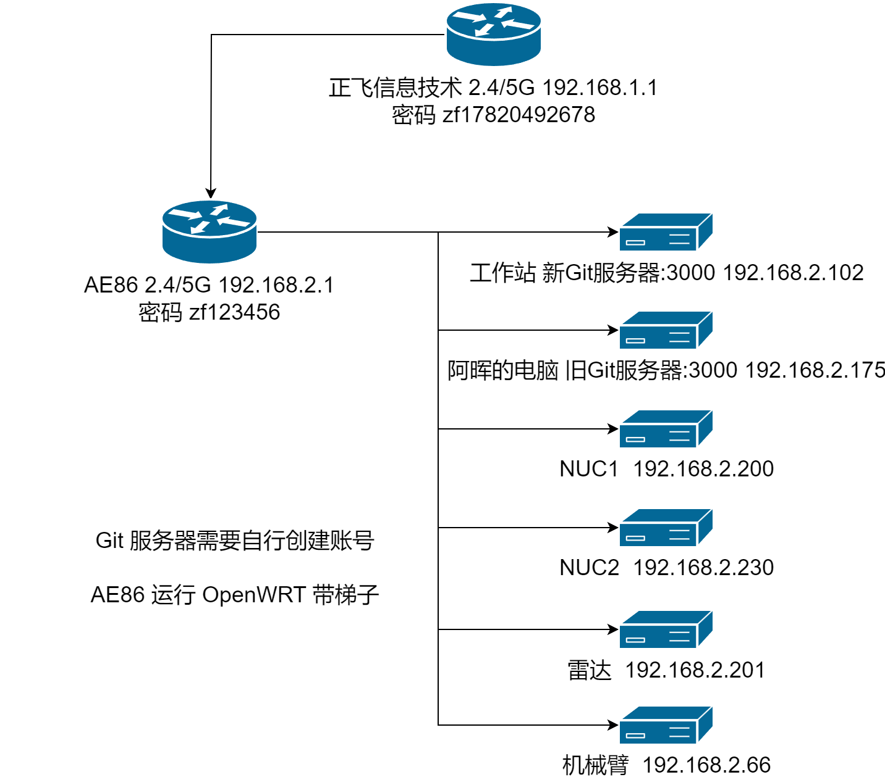

### 3. 开发规则

每位小伙伴需要在当前主控上的用户下，如user/zf/，创建自己的文件夹，如/zzl或/sulin


对于自己负责的内容，当功能可以运行后，需要在/zf下写入一键脚本，方别其他同学调用

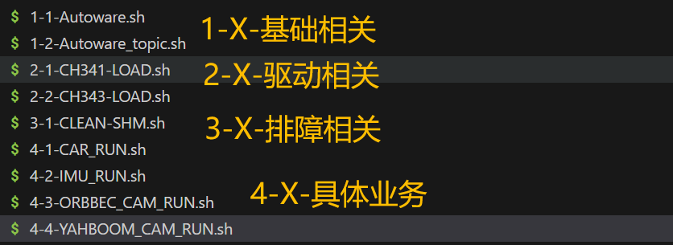

代码参考

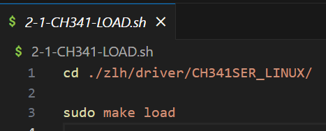

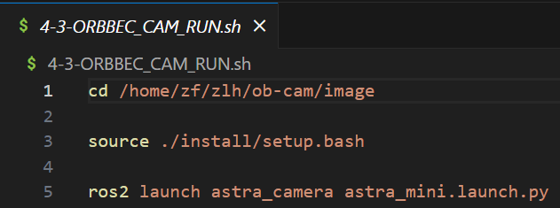

对于环境变量，每一行都需要打上注释，并且写明自己修改的区域，如：

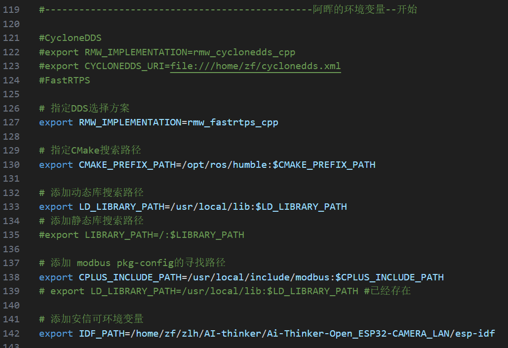

### 杂项

**服务器非必要不要开柜门，人为、意外断电造成的硬件损坏，将付费售后，具体参考合同**

上面 存储服务器
备注：由于只插了一颗U，所以前面板的USB只能作为供电

IP: 192.168.1.15
用户 nas					密码 12345678 	(正常功能账户)
用户 suser				 密码 123456		 (只能访问share路径下的用户)
用法：Win + R 访问 \\192.168.2.211\share

下面 模型服务器

IP: 192.168.1.17
用户 administrator	 密码 123456

## 1. 新手入门

### 1. WSL 安装

#### 1.1先去控制面板把功能打开

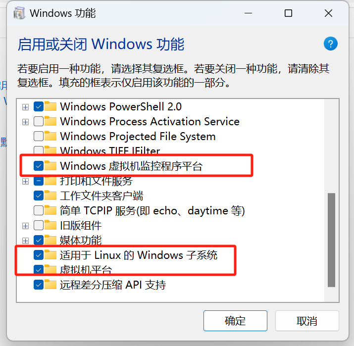

#### 1.2保险起见再输入如下dism指令确保功能开启

```bash
dism.exe /online /enable-feature /featurename:Microsoft-Windows-Subsystem-Linux /all /norestart
```

```bash
dism.exe /online /enable-feature /featurename:VirtualMachinePlatform /all /norestart
```

#### 1.3然后重启电脑，再下载内核包

https://wslstorestorage.blob.core.windows.net/wslblob/wsl_update_x64.msi

#### 1.4去微软商店下载22.04的Ubuntu

https://www.microsoft.com/store/productId/9PN20MSR04DW?ocid=pdpshare

#### 1.5设置用户名和密码，尽量简单

#### 1.6设置为网络镜像模式

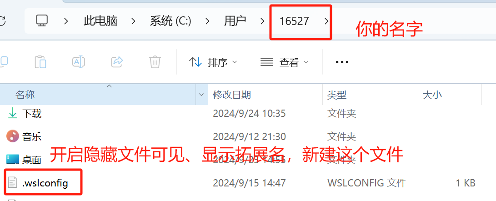

```bash
[experimental]
autoMemoryReclaim=gradual
networkingMode=mirrored
dnsTunneling=true
firewall=true
autoProxy=true
```

WSL访问USB相关(很麻烦，还不如VM虚拟机)

[用于将本地连接的 USB 设备共享到其他计算机](https://github.com/dorssel/usbipd-win)

[连接 USB 设备 | Microsoft Learn](https://learn.microsoft.com/zh-cn/windows/wsl/connect-usb)

#### 1.7结合Autoware开发显示无密码输入窗口时

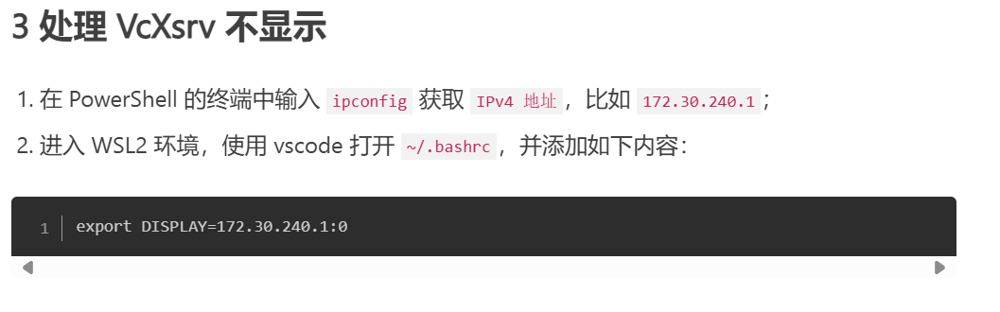

### 2. ROS 安装

#### 2.1安装

进入鱼香ROS一键安装网站 ，默认装最新版即可

```bash
wget http://fishros.com/install -O fishros && . fishros
```

[小鱼的一键安装系列 | 鱼香ROS (fishros.org.cn)](https://fishros.org.cn/forum/topic/20/小鱼的一键安装系列)

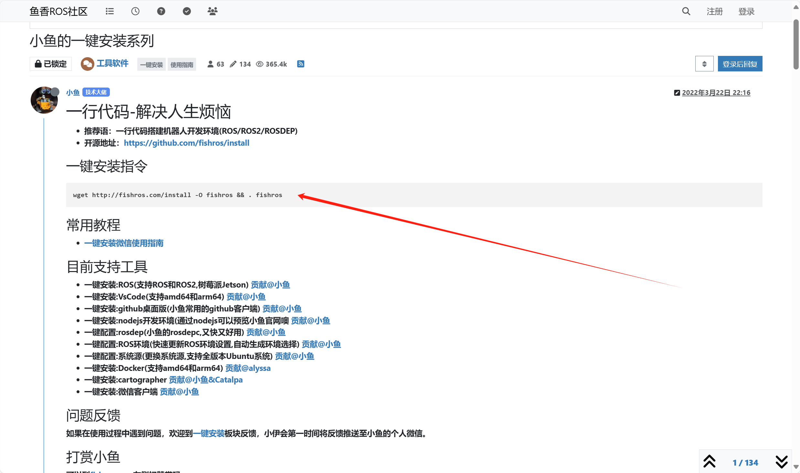

#### 2.2相关资料指路

官方 [了解节点 — ROS 2 文档： Iron 文档](https://docs.ros.org/en/iron/Tutorials/Beginner-CLI-Tools/Understanding-ROS2-Nodes/Understanding-ROS2-Nodes.html)

鱼香ROS [动手学ROS2 (fishros.com)](https://fishros.com/d2lros2/#/)

### 3. VScode 插件推荐

[VSCode 有哪些让人眼前一亮的插件？ - Skywind Inside](https://skywind.me/blog/archives/3082)

很多非必须，只是用起来事半功倍

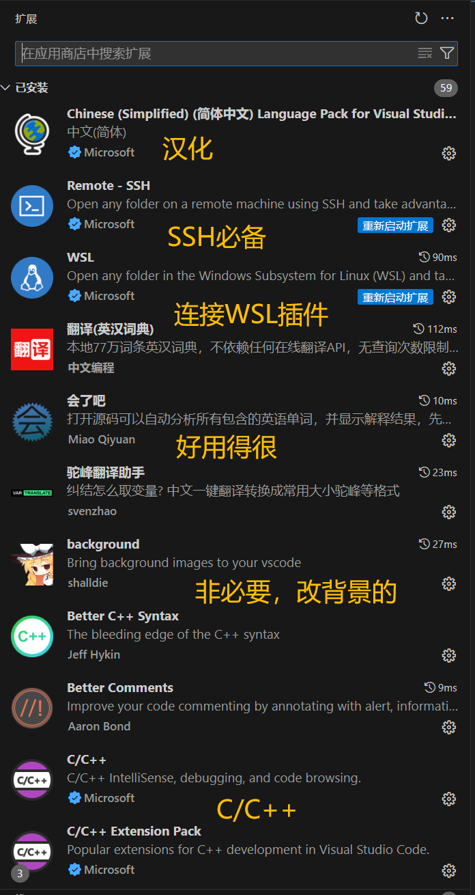


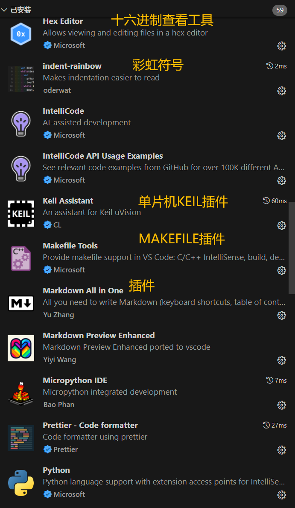

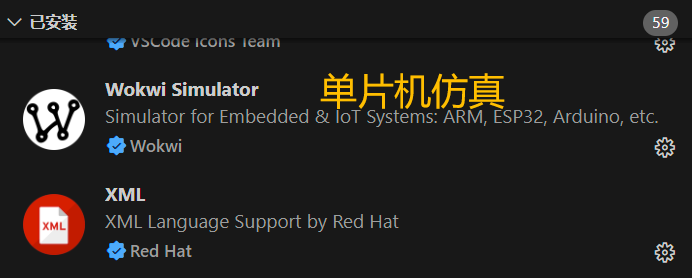

==如果你某个插件强烈依赖科学上网，屡次安装失败==

他会提示你下载离线版本的插件安装包，一般以 `vsix` 结尾


如果成功，右下角会提示安装完成


### 4. 远程桌面 NoMachine 配置（Linux/Windows)

主要用在连接开发板，WSL不需要这么麻烦

#### 4.1下载

Windows https://download.nomachine.com/download/8.13/Windows/nomachine_8.13.1_1_x64.exe

Linux (ARMv8) https://download.nomachine.com/download/8.13/Arm/nomachine_8.13.1_1_aarch64.tar.gz

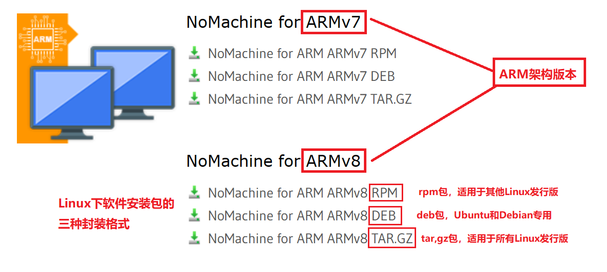

#### 4.2安装

Win安装结束后不需要重启

Linux安装详细步骤：

传文件可以直接通过SCP协议，格式如下

```bash
scp /path/to/local/file username@remote_host:/path/to/remote/directory
```

也可以使用利用SCP协议的远程软件，如MobaX

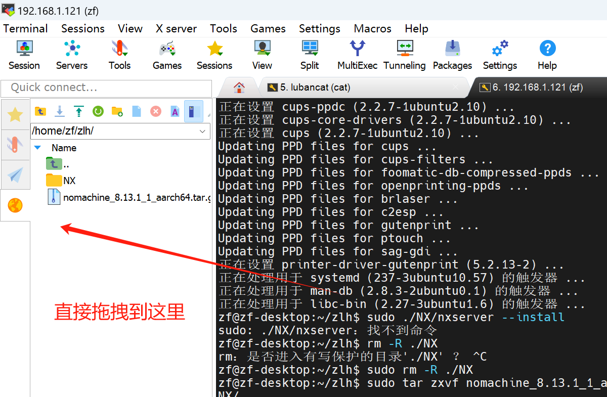

**疑难杂症！如果没有上图这个选项卡，去设置里看你的远程使用的是什么协议**

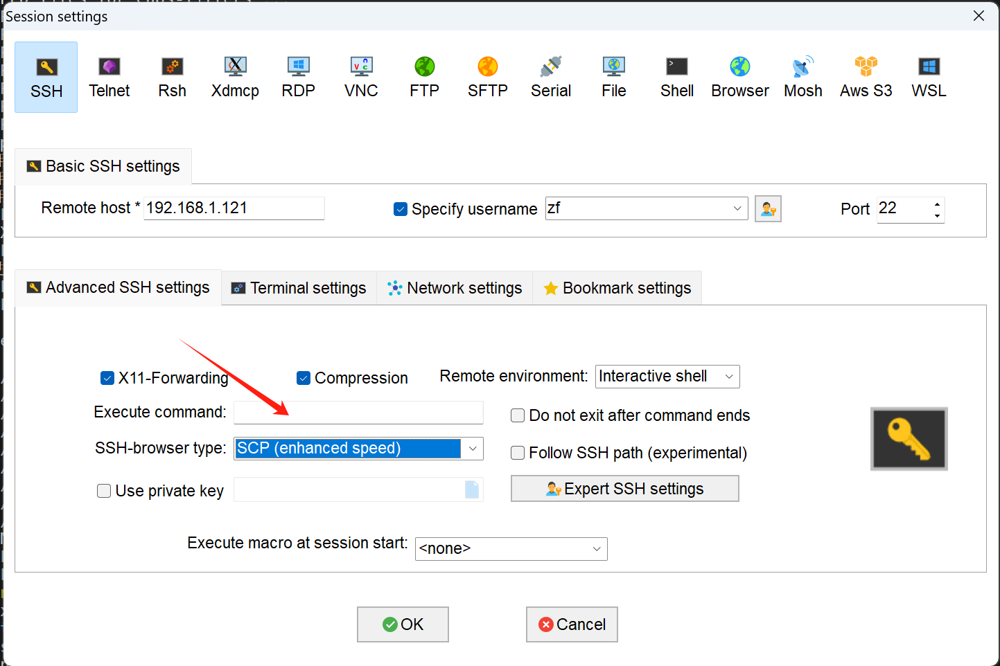

不一定非要按照官方教程解压到 `/usr`下面，你可以自己选择安装路径

```bash
sudo tar zxvf nomachine_8.13.1_1_aarch64.tar.gz
```

**官方没有说，但必不可少的一步，添加文件夹可执行权限**

```bash
sudo chmod 777 ./NX
```

进行安装

```bash
sudo ./NX/nxserver --install
```

如果提示缺少相关组件，则补齐，如

```bash
sudo apt-get install cups
```

完成后删除./NX文件夹，并重新进行解压和安装步骤，删除指令

```bash
sudo rm -R ./NX
```

如果安装过程中出现如下信息

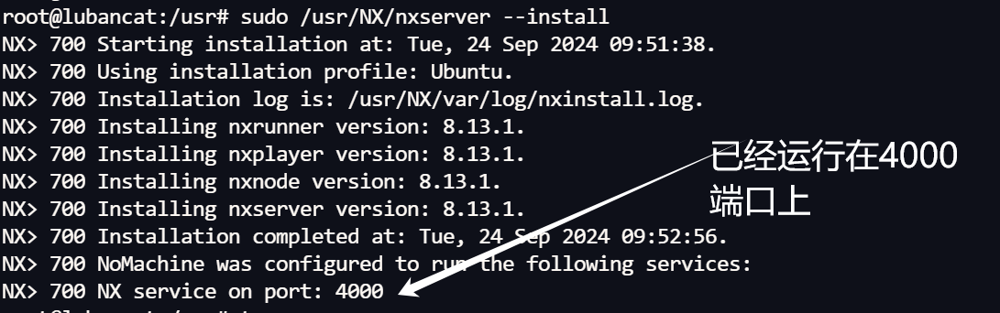

则表示安装成功了，有时即使有警告，一样可以连接

#### 4.3连接

连接端（Win）稍等片刻，就会出现局域网可以访问的其他设备，当然也可以自己主动连接

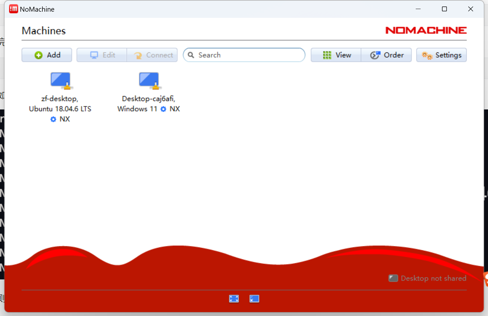

如果想调整画质，可以通过Ctrl + Alt + 0来调出画质设置界面

### 5. Git本地部署和 Github 小技巧

==如果要进行多仓库管理，请自行学习repo==

可以参考野火的SDK下载流程

 [3. LubanCat_Gen_SDK — [野火\]嵌入式Linux镜像构建与部署——基于LubanCat-RK系列板卡 文档](https://doc.embedfire.com/linux/rk356x/build_and_deploy/zh/latest/building_image/lubancat_sdk/lubancat_gen_sdk.html)

------

**前情提要：** [服务器（Windows系统）自建git服务器超详细教程 - 苦行者的刀 - 博客园 (cnblogs.com)](https://www.cnblogs.com/alexgl2008/articles/17948253)

**小白必用：**[Git简明教程](https://learngitbranching.js.org/?demo=&locale=zh_CN)

### 使用图形化操作 Git

参考文章 [【立创·衡山派D133EBS开发板】编译环境搭建 | 立创开发板技术文档中心](https://wiki.lckfb.com/zh-hans/hspi-d133ebs/beginner/sdk-compilation/hspi-development-environment-setup.html)

Git https://git-scm.com/downloads

SourceGit [sourcegit-scm/sourcegit: Windows/macOS/Linux GUI client for GIT users](https://github.com/sourcegit-scm/sourcegit)


**安装步骤详解**

不用管，直接点击next即可！


安装路径：不要有中文

选择安装的组件


选择git默认编辑器


新仓库的主干名字 我们直接默认即可！！


调整电脑PATH环境变量 我们直接选择这个推荐的选项即可!

这个选项的意思是：

```bash
Git from the command line and also from 3rd-party software

(Recommended) Thie ontion adde onbr eome mimimal Git wrannere to vour DATH to aunid dtterinn vnur anirnnmont sith ontonal Lniv tonle Vou wil be able to use Git from Git Bash, the Command Prompt and the Windows PowerShell as well as any third-party software looking for Git in PATH.

从命令行和第三方软件中使用Git。

(推荐) 为DATH添加一个基本的Git仓库，以确保一致的版本控制，并确保与任何使用Git的第三方软件的兼容性。这样，您就可以从Git Bash、命令提示符、Windows PowerShell以及任何在PATH中查找Git的第三方软件中使用Git。
```


选择SSH执行文件 我们使用git自带的就可以了


选择HTTPS的传输后端 我们选择使用 OpenSSL库 !!!


配置行尾符号转换 这三种选择分别是：

- 签出Windows样式，提交Unix样式的行结尾。
- 按原样签出，提交Unix样式的行结尾。
- 按原样签出，按原样提交。

我们选择默认的就可以！


配置终端模拟器以与Git Bash一起使用 我们选择第一个即可


选择默认的 "git pull" 行为 我们选择第一个！！

```bash
Fast-forward or merge
在可能的情况下，将当前分支快速前进到获取的分支，否则创建合并提交。

Rebase
将当前分支重新定位到获取的分支上。如果没有本地的提交到rebase，这相当于快进。

Only ever fast-forward
款进到获取的分支。如果这不可能，则失败。这是 git pull 的标准行为。
```


选择一个凭证帮助程序 我们选择git凭证

（Git 有时需要用户的凭据（例如用户名和密码）才能执行操作，这样保护了数据的安全！）


sourcegit 只需要在 Github 上下载最新的安装包即可 安装好后


设置中文


填入刚刚 Git 的路径 + bin 目录下的 git.exe （它只能选择指定的可执行文件）


添加下载


填入你要下载的仓库


附上下载截图


**从命令行创建一个新的仓库** (可选)

```bash
touch README.md
git init
git checkout -b main
git add README.md
git commit -m "first commit"
git remote add origin http://192.168.2.102:3000/zlh/ALL.git
git push -u origin main
```

**从命令行推送已经创建的仓库** (可选)

```bash
git remote add origin http://192.168.2.102:3000/zlh/ALL.git
git push -u origin main
```

**日常更新**

```bash
git add .
git commit -m "change"
git push origin main --force
```

**如果下别人的仓库，报缺东西，可能是依赖子模块**

```bash
git clone XXXXXXXXXX --recursive
```

**一键自动上传脚本**

```bash
@echo off
setlocal

:: 检查是否提供了更新文字，如果没有，则默认为 "日常更新"
if "%~1"=="" (
    set "commit_message=daily updata"
) else (
    set "commit_message=%~1"
)

:: 执行git add
git add .

:: 执行git commit 使用设置的提交信息
git commit -m "%commit_message%"

:: 首先尝试执行不带--force的git push
git push origin main
if %errorlevel% neq 0 (
    echo Encountered an error with git push, attempting with --force
    git push origin main --force
)

endlocal
```

------------------------------------------------------常用命令看上面就好了------------------------------------------------------------

#### 5.1创建仓库

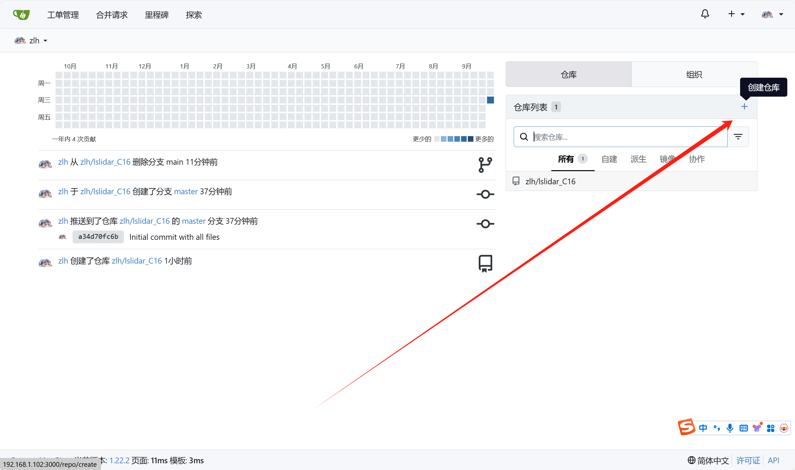

**默认分支为main，后续上传时注意区分**

#### 5.2上传仓库

在文件管理器中去到指定目录，鼠标右键选择 

```bash
Open Git Bash Here
```

在弹出的命令行界面中，初始化Git仓库 

```bash
git init
```

连接到远程仓库 

```bash
git remote add origin  https://github.com/yourusername/yourrepository.git
```

将当前目录下的所有文件添加到暂存区

```bash
git add .
```

提交更改，并附上一个描述性的提交信息

```bash
git commit -m "Initial commit with all files"
```

将本地提交推送到远程仓库。如果是第一次推送，需要使用 `-u` 参数来设置上游分支

```bash
git push origin main
```

<u>如果您的远程仓库的默认分支名称不是 `main`，请替换为实际的分支名称，例如 `master`</u>

```bash
git push origin master
```

#### 5.3拉取仓库

可以直接简单粗暴

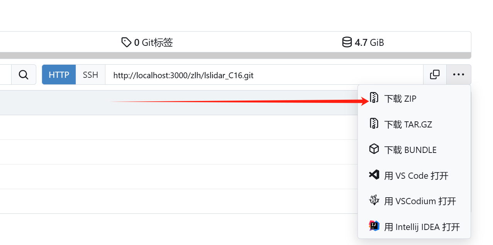

也可以使用命令行下载（优雅）

```bash
git clone http://localhost:3000/zlh/lslidar_C16.git
```

#### 5.4疑难杂症

**Q:** `fatal: not a git repository (or any of the parent directories): .git`

**A:** 表明当前目录不是一个Git仓库。这意味着您还没有在当前目录初始化一个Git仓库：`git init`

**Q:** `git submodule add <url>`

**A:** 表明在您的项目目录中嵌套了其他Git仓库：可以使用子模块的形式把其他git包含进来，或把包含git的工程，先打包为压缩文件

**Q:** `Please tell me who you are`

**A:** 表明Git无法识别您的身份，因为您还没有配置您的用户名和电子邮件地址：

​	全局配置 `git config --global user.email "you@example.com"` `git config --global user.name "Your Name"`

​	项目级配置`git config user.email "you@example.com"` `git config user.name "Your Name"`

**Q:** 我有些文件和目录不想上传怎么办？

**A:** 建议了解 `.gitignore`文件

**Q:** 

**A:** 


#### 5.5其他指令

排序


强制推送(如果不是第一次使用这个分支就把 -u 去掉) `git push -u origin master --force`

删除暂存区 `git rm -r --cached .`

创建分支 `git branch <branch-name>`

切换分支 `git switch -c <branch-name>`

创建并切换 `git checkout -b <branch-name>`

删除分支 `git remote remove origin`

**公司除了本地的Git，同时还有Github的备份：**

```bash
https://github.com/johnsionFarry/ZF.git
```

同步到备份

```bash
git push backup master https://github.com/johnsionFarry/ZF.git
```

可以参考文章：[如何同时向两个远程 Git 仓库推送代码 - 奇妙的 Linux 世界](https://www.hi-linux.com/posts/45935.html)

**如果我们想搜索Github用户，但只知道关键字，如果你直接在搜索框里输入，很大概率是找不到的，但：**

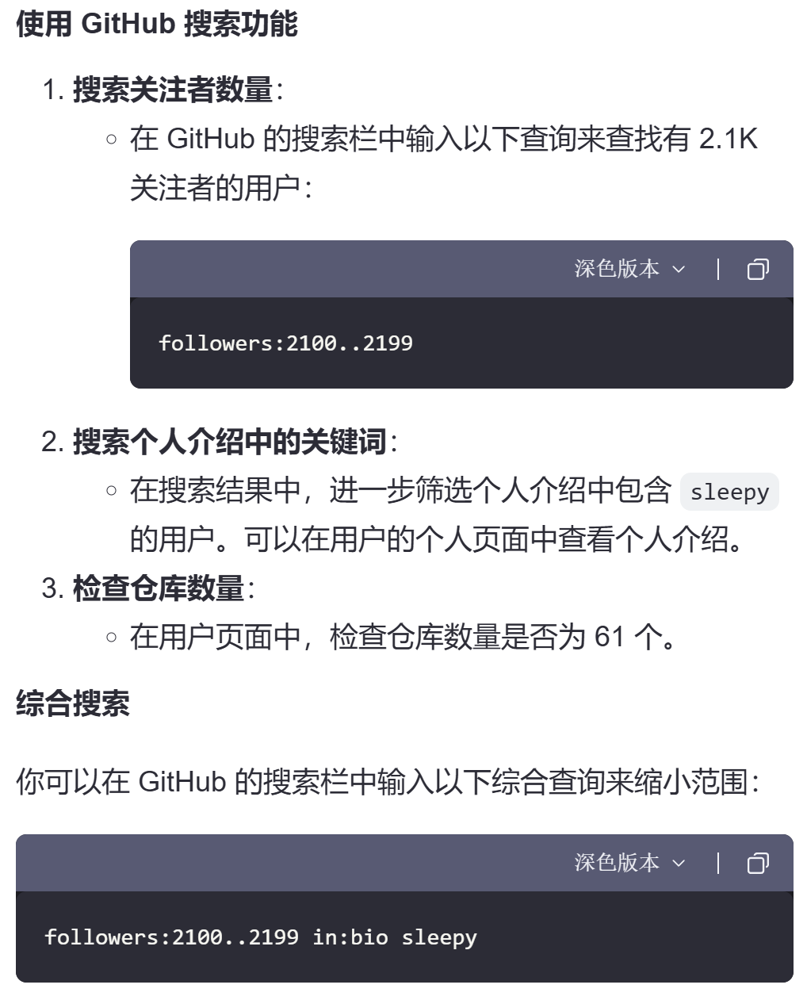

则可以轻松找到

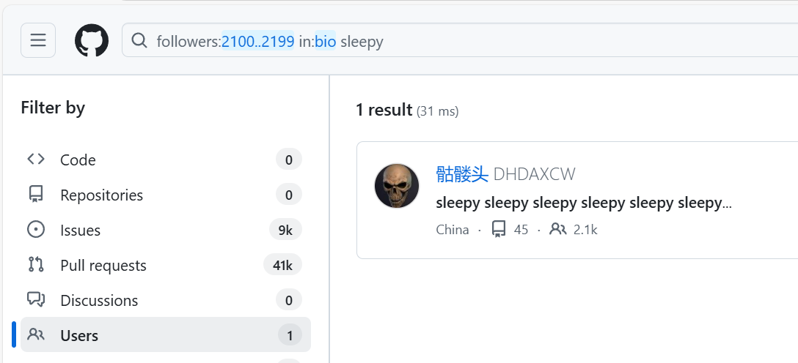

#### 5.6 补充

​		一开始我们的Git是运行在阿晖电脑上的，但随着数据量来到了几百寄的水平，决定迁移至B760M服务器上，而数据存储在机械硬盘上（后加装的），因此需要挂载硬盘

查看当前硬盘 `lsblk`

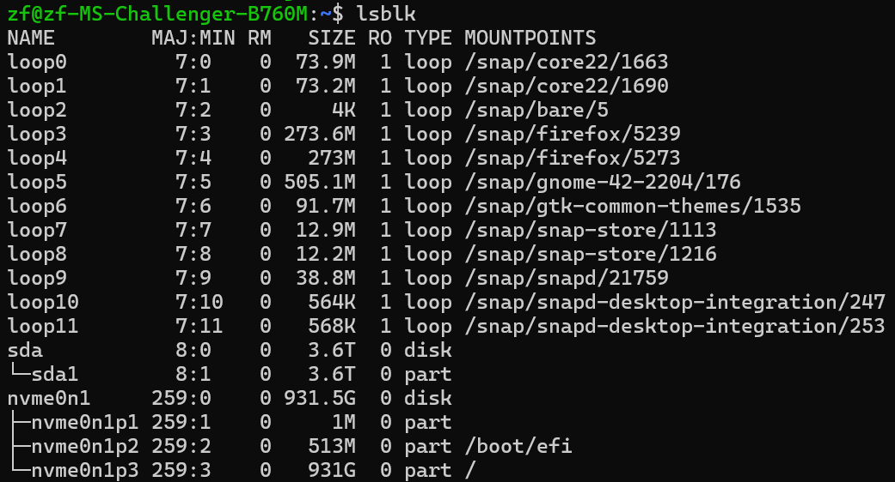

挂载硬盘

```bash
sudo mount /dev/sdb1 /mnt/mydisk
```


### 6. JETSON 刷机

看教程 [Jetson AGX Xavier 刷机指南_agx xavier刷机-CSDN博客](https://blog.csdn.net/wjinjie/article/details/118295766)

#### 6.1获取镜像

请联系作者

#### 6.2打开虚拟机

启用镜像之前，请确认您当前设备满足虚拟机参数要求，如果不符合请及时更改，在接下来的提示框中选择“我移动了虚拟机”。

*18的虚拟机可以刷18和以后的JETSON，20只能刷20以上的*

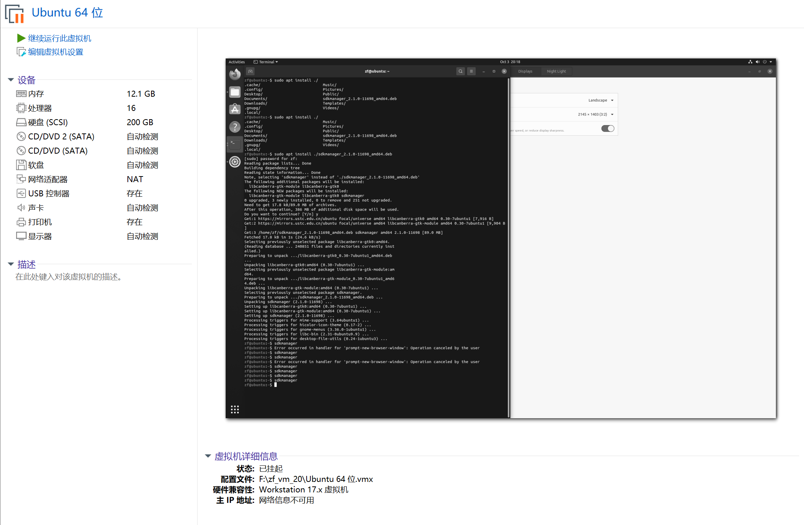

如果您有自己的虚拟机，也可以使用最新的管理软件，请前往：https://developer.nvidia.com/embedded/jetpack
得到软件包后使用类似指令安装：`sudo apt`

` install ./sdkmanager_2.1.0-11698_amd64.deb`

#### 6.3开始刷机

*关机状态下，按住中间的按钮，再按开机键，维持1秒左右，此时VM会弹出新设备提醒，就成功了*

在命令行中输入：`sdkmanager` 会弹出下列窗口（如果是您自己的镜像，第一次需要手动登录英伟达的账号密码），不需要sudo

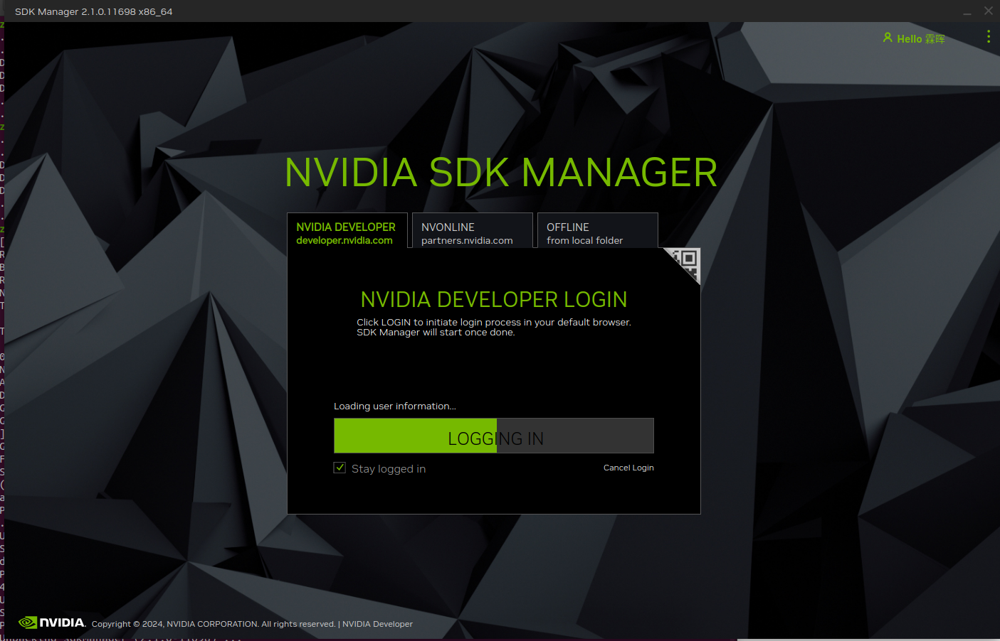

加载完毕后弹出界面


前面两步需要选择需要安装的版本，如果您下载完指定版本后，会出现绿色的钩子。此时需要把JETSON关机（等白色指示灯熄灭），机身上有两个Type-C接口，只有一个是可以用的：

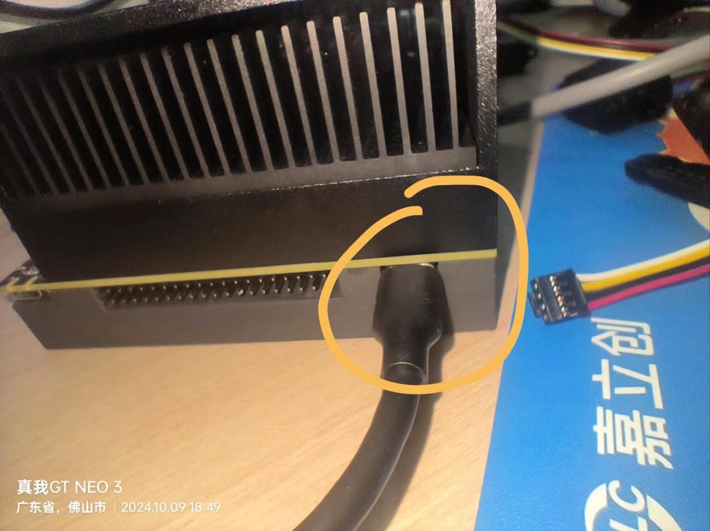

### 7. plotjuggler

安装指令

```bash
sudo apt install ros-melodic-plotjuggler-ros
# 不要用 
sudo apt install ros-melodic-plotjuggler
```

运行

```bash
rosrun plotjuggler plotjuggler
```

官方说明 [基础知识：如何可视化数据 - PlotJuggler](https://facontidavide.github.io/PlotJuggler/visualization_howto/index.html)

### 8. MobaX

```bash
# 设为当前 IP
export DISPLAY=192.168.50.195:0.0
sudo apt-get install xorg
```

[推荐使用集串口，SSH远程登录和FTP传输三合一工具MobaXterm - 韦东山 - 博客园](https://www.cnblogs.com/weidongshan/p/7760313.html)

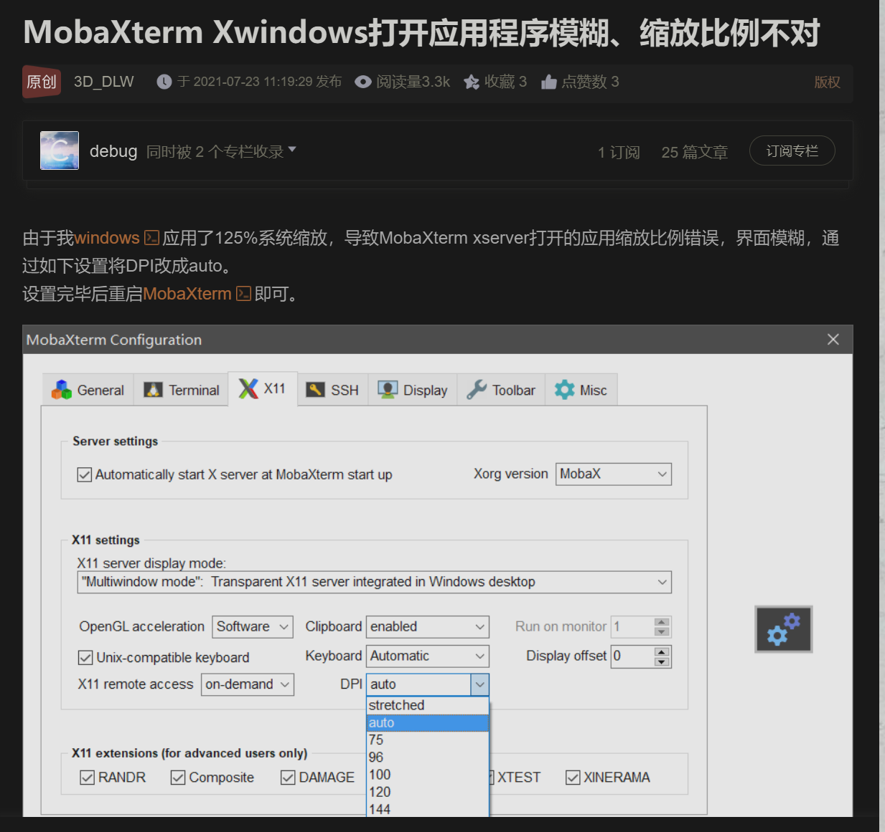

这个问题在同样的位置


### 9. Wireshark 抓包

[网络顶级掠食者 Wireshark抓包从入门到实战_哔哩哔哩_bilibili](https://www.bilibili.com/video/BV12X6gYUEqA/?spm_id_from=333.1007.tianma.1-1-1.click&vd_source=00fe280cdfc4a645876630b6c032bf30)

### 10. Swap交换空间

查看当前是否开启了交换空间

```bash
free -m
```

如果最后一行是0 0 0，则表示当前没有开启；如果已经开启，也可以增大

创建 Swap 文件

```bash
mkdir myswapfile
cd myswapfile/
sudo dd if=/dev/zero of=/swapfile bs=1M count=2048 或者
sudo dd if=/dev/zero of=swapfile bs=1G count=2
```

==如果你的系统资源较少，请降低申请的空间，否则会导致==

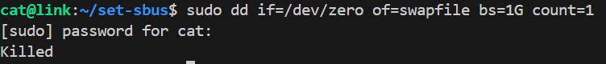

如果你的存储介质是TF卡，这个过程会比较慢，结束后会输出

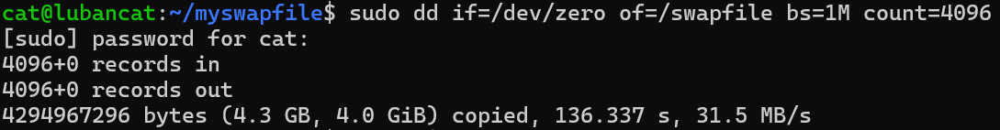

查看是否创建成功

```
ls ./ | grep swapfile
```

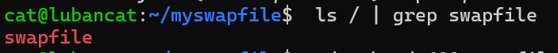

修改权限

```bash
sudo chmod 600 ./swapfile
```

格式化(可选)并启用

```bash
sudo mkswap ./swapfile
sudo swapon ./swapfile
```

开启交换空间自动启用

```bash
sudo vim /etc/fstab
```

在文件末尾添加

```bash
pathto/swapfile none swap sw 0 0
```

查看是否起作用

```bash
sudo swapon --show
```

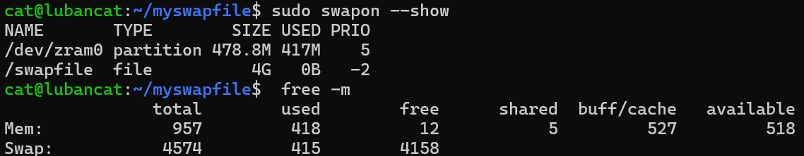

### 11. 禁用防火墙

```bash
sudo systemctl disable firewalld
sudo systemctl disable ufw
sudo systemctl disable iptables
```

### 12. Anaconda3 安装

前往 [Index of /](https://repo.anaconda.com/archive/) 查看最新版本

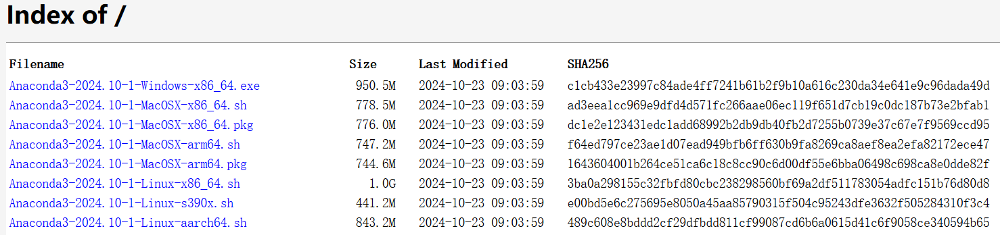

右键复制符合架构的下载链接

```bash
wget XXX
chmod +x XXX.sh
./XXX.sh
# 无脑回车看协议
# 问你什么你就说 YES 
source /.bashrc
```


### 13. 设为中文

```bash
# 安装中文语言包
sudo apt install language-pack-zh-hans -y
# 重新配置本地化设置
sudo dpkg-reconfigure locales
# 复制 Windows 字体到 Linux 系统
sudo cp -r /mnt/c/Windows/Fonts /usr/share/fonts/windows
# 安装字体配置工具
sudo apt install fontconfig -y
# 更新字体缓存
fc-cache -f -v
```

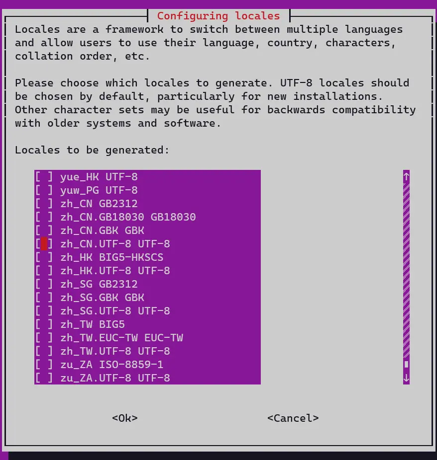

空格选中，TAB去到底下的选项，回车OK

==注意，如果你WSL首选语言选的是中文，那可能会有诸多奇怪事件：VScode报"(错误: WebSocket close with status code 1006)"==

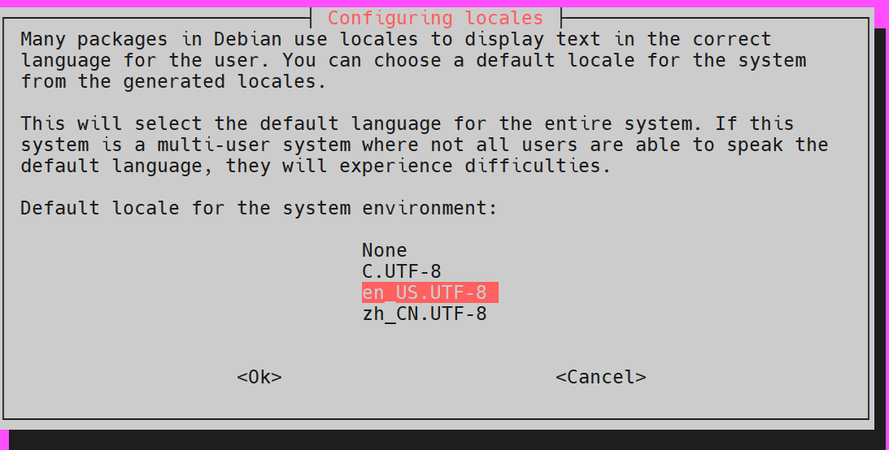

在命令行

```bash
exit
wsl --shutdown
# 等待十秒以上 问为什么去搜 "WSL十秒法则"
wsl
```

有了

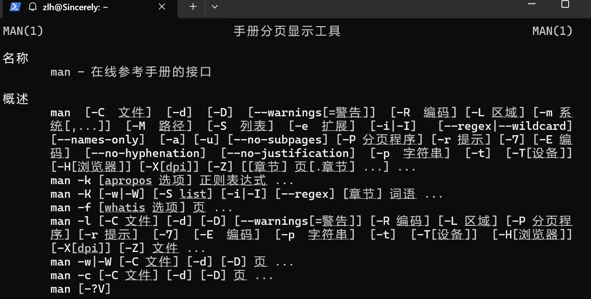

这个方法也可以解决 `X11` 下无法显示中文的问题

### 14. 切换Python默认版本

```bash
# 查看当前版本
python2 --version
python3 --version
ls /usr/bin/python*
# 默认版本
python --version
# 优先级越大越先试用
sudo update-alternatives --install /usr/bin/python python /usr/bin/python2.7 10
sudo update-alternatives --install /usr/bin/python python /usr/bin/python3.6 5
```


### 15. 删除乱码文件

```bash
# 先查看借点号
ls -i

root@TinaLinux:~# ls -i
66 ?��@��??@8?@! 	68 ??�                 55 adpcm

find -inum 66 -delete
find -inum 68 -delete
```


### 16. 保留目录删除

```bash
 rm -rf -- *
```


### 17. Makrdown

http://www.uinio.com/Software/Markdown


### 18. WSL环境变量隔离

```bash
echo $PATH

sudo vim /etc/wsl.conf

# 按下i 后面补上

[interop]
enabled = false
appendWindowsPath = false

# :wq 保存
exit
wsl --shutdown

# 过10秒启动 wsl (参考 wsl 10秒原则)

# 比较前后输出的环境变量
echo $PATH
```


### 19. 包管理器

```bash
sudo apt install aptitude
# aptitude 可以出来一个 tui (命令行图形化窗口) 
# 也可以像 apt 一样来安装应用 处理更复杂或者安装不上的软件
```

[什么是 APT 和 Aptitude？和他们之间的真正区别是什么？](https://cn.linux-console.net/?p=1157)


```bash
# 管理员运行
Set-ExecutionPolicy Bypass -Scope Process -Force; [System.Net.ServicePointManager]::SecurityProtocol = [System.Net.ServicePointManager]::SecurityProtocol -bor 3072; iex ((New-Object System.Net.WebClient).DownloadString('https://chocolatey.org/install.ps1'))

# 比如用它更新 git
choco upgrade git -y
```

[(15 封私信 / 80 条消息) 在Windows下像Linux一样安装程序 -- Chocolatey - 知乎](https://zhuanlan.zhihu.com/p/110394287)


### 20. 串口工具

[Linux下常用的串口助手 —— minicom、putty、cutecom_linux串口助手-CSDN博客](https://blog.csdn.net/Mculover666/article/details/87647810)

==XGCOM 太古老了！不好用==


不要用他的安装指令 看我的

[Linux下的串口调试工具——Xgcom - anobscureretreat - 博客园](https://www.cnblogs.com/sea-stream/p/10715877.html)

```bash
wget https://storage.googleapis.com/google-code-archive-downloads/v2/code.google.com/xgcom/xgcom-zh-0.02.2.tar.gz
tar -zxvf xgcom-zh-0.02.2.tar.gz
cd ./xgcom-zh-0.02.2
# 安装更先进的包管理器 参考 "1-19包管理器"
sudo apt-get install aptitude
sudo aptitude install automake libglib2.0-dev libvte-dev libgtk2.0-dev
# 这里可能存在两个依赖表示版本冲突
```


```bash
# 第一个建议选择 n 第二个建议选择 y
./autogen.sh
make -j4
sudo make install
sudo xgcom
# 如果没有 X Server 支持 请参考其他章节
```

==CUTECOM==

不知道为什么 就算改了tty权限 也不行

[Ubuntu下图形界面串口工具CuteCom的安装和升级 - Milton - 博客园](https://www.cnblogs.com/milton/p/15631160.html)

```bash
# 这样安装出来的版本是 0.30
sudo apt install cutecom

# 去Gitlab可以下载到 0.60 或更新 https://gitlab.com/cutecom/cutecom/-/releases
git clone https://gitlab.com/cutecom/cutecom.git
sudo apt install cmake qt6-base-dev libqt6serialport6-dev libgl1-mesa-dev
cmake .
make -j4
sudo ./cutecom
```

==SerialTool==

跨平台 但目前Linux版本只构建了x86版本 看起来是纯英文的 不太友好

[Duolabs/SerialTool：用于串行通信的 SerialTool 免费软件。Windows、MAC OX 和 Linux --- Duolabs/SerialTool: SerialTool free Software for Serial communication. Windows, MAC OX and Linux](https://github.com/Duolabs/SerialTool)

==Serial-Studio==

[Serial-Studio/Serial-Studio：可视化嵌入式设备数据。 --- Serial-Studio/Serial-Studio: Visualize embedded device data.](https://github.com/Serial-Studio/Serial-Studio)

[我又发现一个开源串口神器，太强了 - 知乎](https://zhuanlan.zhihu.com/p/507354079)

这个下载可执行程序只有14天的试用 要自己编译的版本才可以无限拥有 看本事/doge


### 21. 运维 1Panel

请先参考 `2-21` 的 `Docker` 安装

安装

```bash
sudo su
bash -c "$(curl -sSL https://resource.fit2cloud.com/1panel/package/v2/quick_start.sh)"
```

如果是WSL 出现连接问题请参考 `12-5`


### 22. VMware

这个解决方案同样适用于 刚刚创建虚拟机 但是一直黑屏的状况

[虚拟机提示繁忙问题（已解决）_虚拟机ubuntu繁忙-CSDN博客](https://blog.csdn.net/BieZhangFuChen/article/details/107378613)


### 23. 网络配置

不重启就能更改网络的工具 `nmcli` (未尝试)

[openEuler网络配置 - pipci - 博客园](https://www.cnblogs.com/pipci/p/17941079)

作者常用的工具 `nmtui`

如果项目总是报 `IPv6` 的网络故障 那么请关闭他 ( 因为很多带宽根本没有 `v6` )


## 2. 进阶

### 1. 第三方库或驱动的安装与使用

#### 1.1CH341驱动的安装(其他同类的驱动可以参考)

症状：在 `ls /lib/modules/$(uname -r)/kernel/drivers/usb/serial` 中可以看到对应的`*.ko`文件，但是插上搭载相关驱动外设以后，`/dev/`上却没有弹出相关的设备文件：

```bash
aircable.ko         io_ti.ko        navman.ko        ti_usb_3410_5052.ko
ark3116.ko          ipaq.ko         omninet.ko       upd78f0730.ko
belkin_sa.ko        ipw.ko          opticon.ko       usb_debug.ko
ch341.ko            ir-usb.ko       option.ko        usbserial.ko
cp210x.ko           iuu_phoenix.ko  oti6858.ko       usb-serial-simple.ko
cyberjack.ko        keyspan.ko      pl2303.ko        usb_wwan.ko
cypress_m8.ko       keyspan_pda.ko  qcaux.ko         visor.ko
digi_acceleport.ko  kl5kusb105.ko   qcserial.ko      whiteheat.ko
empeg.ko            kobil_sct.ko    quatech2.ko      wishbone-serial.ko
f81232.ko           mct_u232.ko     safe_serial.ko   xr_serial.ko
f81534.ko           metro-usb.ko    sierra.ko        xsens_mt.ko
ftdi_sio.ko         mos7720.ko      spcp8x5.ko		 ch34x.ko
garmin_gps.ko       mos7840.ko      ssu100.ko
io_edgeport.ko      mxuport.ko      symbolserial.ko
```

上面可以看到含有ch341.ko文件，系统自带的版本比较老，删除掉：

```bash
cd /lib/modules/$(uname -r)/kernel/drivers/usb/serial
sudo rm -rf ch34x.ko
```

也有可能你没有这个文件，但是有显示

```bash
lsmod | grep ch34x
```

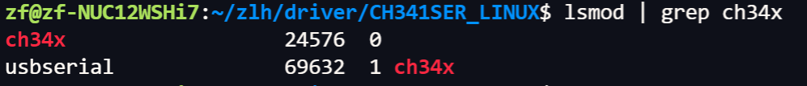

卸载掉`sudo rmmod ch34x`

下载模版： https://pan.baidu.com/s/17jMzlg5q4Jneo4E4L-K0xQ?pwd=ZF66

可以得到这三个文件

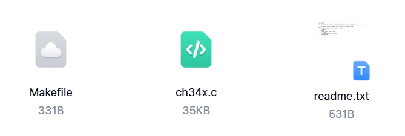

查询当前操作系统发行版本 

```
uname -r
```

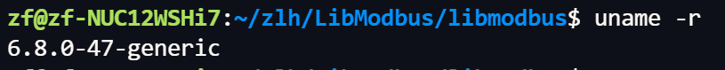

打开发新版本对应的代码 [ch341.c - drivers/usb/serial/ch341.c - Linux source code v6.8 - Bootlin](https://elixir.bootlin.com/linux/v6.8/source/drivers/usb/serial/ch341.c)

复制对应的代码，把模板中的文件内容替换掉

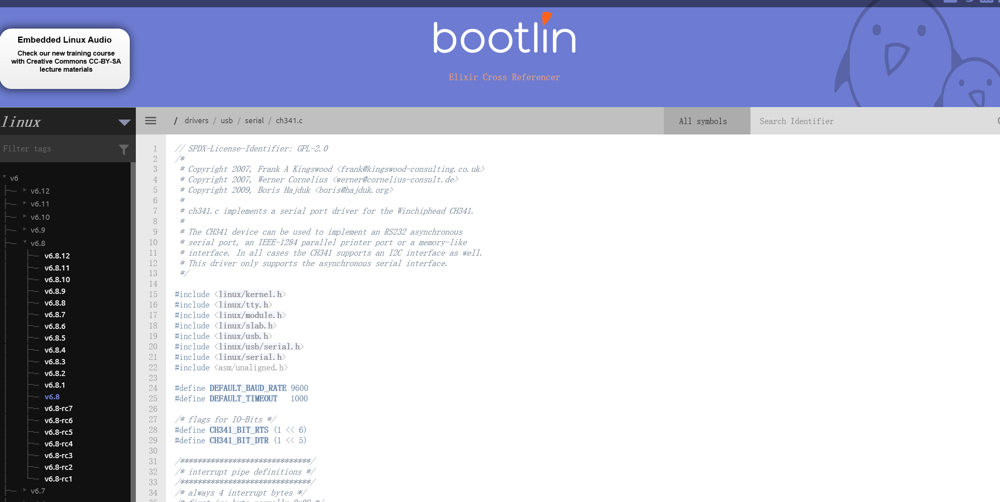

然后执行`make`，如果出现下列错误，解决方法是安装，gcc-12 （在比较旧的内核上，就没有这个问题，如JETSON18）

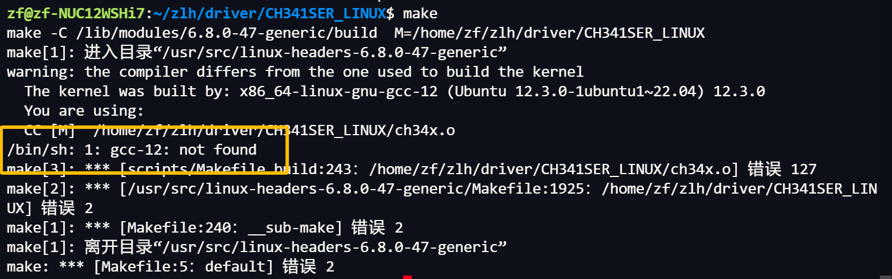

```bash
sudo apt update
sudo apt install gcc-12
make clean
make CC=gcc-12
```

可以看到，已经出来了

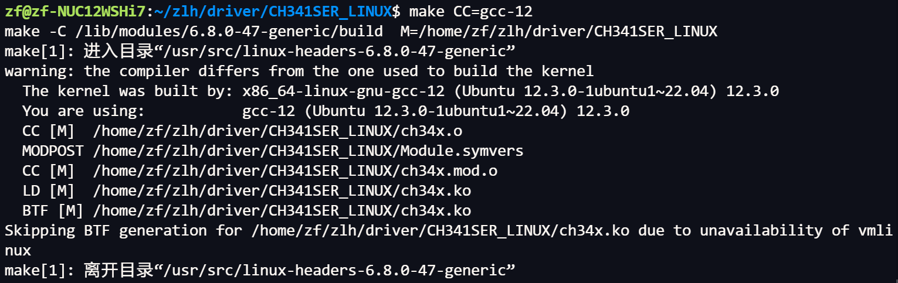

接下来执行`sudo make load`进行驱动安装（**注意：不要直接把*.ko文件复制进驱动目录，没有用的**)

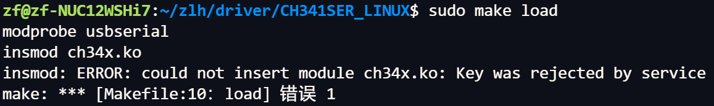

出现这个错误`Key was rejected by service`是因为驱动没有签名，需要进行接下来的流程：安装依赖

```bash
sudo apt install mokutil
sudo apt install shim-signed
sudo update-secureboot-policy --new-key
```

这个是创建出来的秘钥文件

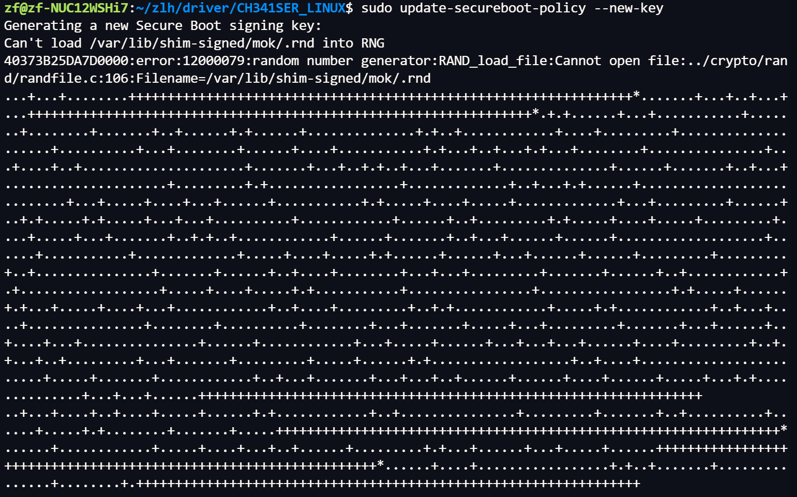

生成的证书(MOK.der)和私钥(MOK.priv)位于 `/var/lib/shim-signed/mok/` 目录下

```bash
openssl req -new -x509 -newkey rsa:2048 -keyout MOK.priv -outform DER -out MOK.der -nodes -days 36500 -subj "/CN=Descriptive name/"
```

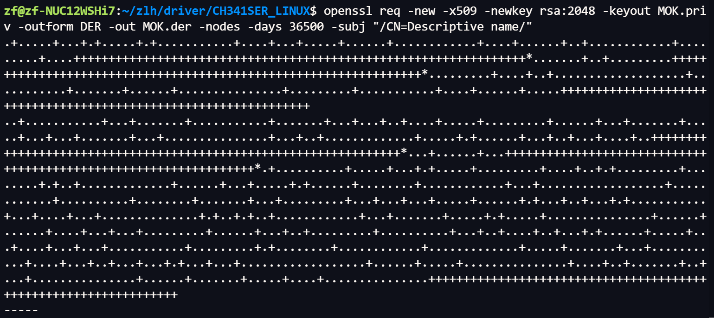

导入签名证书

```bash
sudo mokutil --import /var/lib/shim-signed/mok/MOK.der
```

当然也可以更简洁

```bash
sudo mokutil --import MOK.der
```

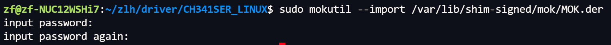

此时需要重启电脑，连接屏幕，尽快按下任意键（如果错过了会照常启动，想再次进入这个界面需要把上面的指令再输一遍，然后继续步骤）


按下图进行选择，密码就是当前用户密码（没有回显。输完按回车）


输入

```bash
hexdump -C ch34x.ko | tail
```

查看当前驱动签名情况，输入下列指令进行签名

**（其他驱动也可以按照这条进行签名）**，查看签名前后的变化：

```bash
sudo /usr/src/linux-headers-$(uname -r)/scripts/sign-file sha256 /var/lib/shim-signed/mok/MOK.priv /var/lib/shim-signed/mok/MOK.der ch34x.ko
```

或者

```bash
sudo /usr/src/linux-headers-$(uname -r)/scripts/sign-file sha256 MOK.priv MOK.der ch34x.ko
```

```bash
hexdump -C ch34x.ko | tail
```

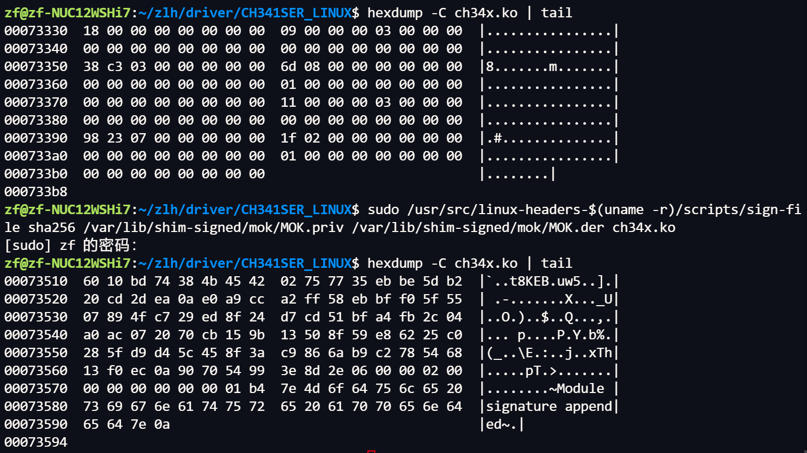

再次导入驱动`sudo make load`，成功导入

```bash
sudo make load
lsmod | grep ch34
```

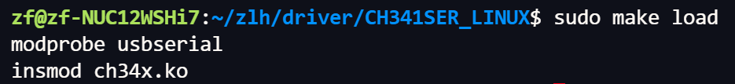

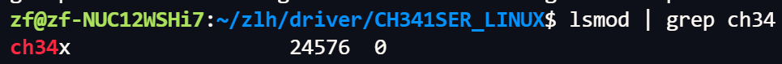

附上其他驱动成功案例

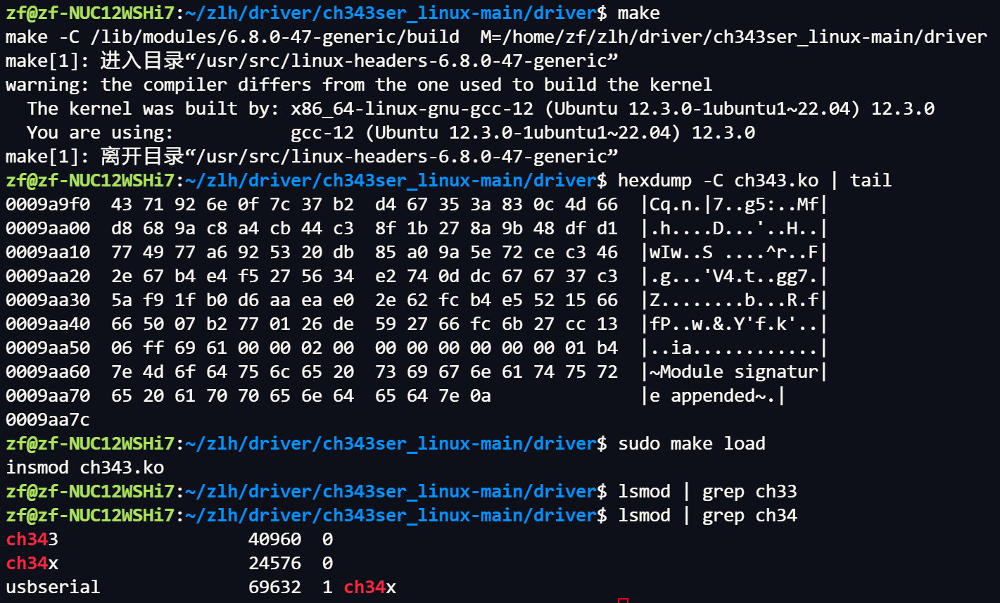

（其他指令）查看USB设备

```bash
lsmod | grep ch34
```

#### 1.2疑难杂症

**1.内核驱动已经打上了，但是就是检测不到串口，明明看到了相关的芯片**


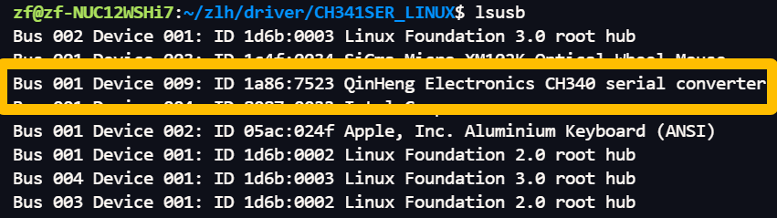

这个时候一定要看内核日志，可以查找出潜在的问题，这里是无障碍服务冲突了 `sudo dmesg | grep -i ch34x`

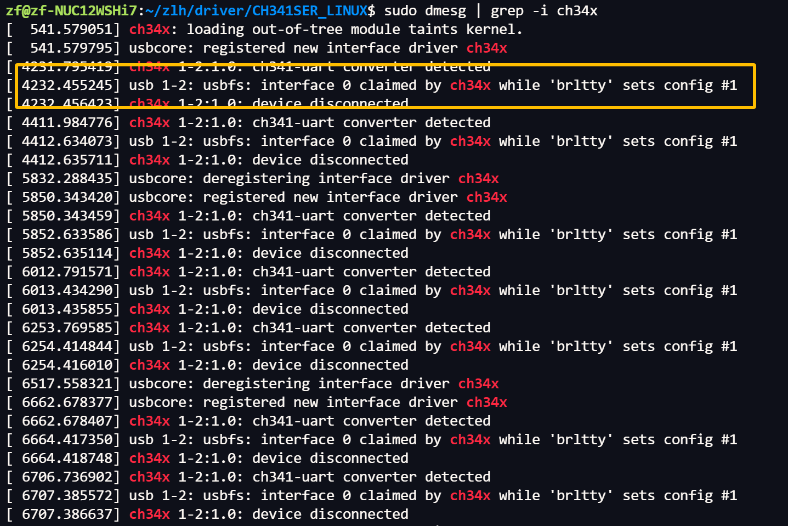

参考文章：[解决使用 CH34x 设备时与 brltty 冲突的问题 - 云梦博客](https://www.fnmqs.work/archives/99/)

1. 停止 `brltty` 服务：

   ```bash
   sudo systemctl stop brltty
   ```

2. 禁止 `brltty` 自动启动：

   ```bash
   sudo systemctl disable brltty
   ```

3. 卸载 `brltty` 软件包：

   ```bash
   sudo apt remove brltty
   ```

4. 清理相关的配置文件和依赖项：

   ```bash
   sudo apt autoremove
   ```

完事以后插拔设备就出来了（这里用到了USB端口映射，后续章节会补充）


**2.明明已经安装了驱动，插入设备的时候查看内核日志也有对应的提示，但就是没有ttyUSB*之类的弹出来**

查看当前用户属于哪些组

```bash
groups $USER
```

确保你的用户属于`dialout`组


添加进 `dialout`组

```bash
sudo usermod -a -G dialout $USER
```

注销后，或重新加载用户组生效

```bash
newgrp dialout
```

后续的实践发现，在编译安装驱动的时候，当下导入进去确实可以，但是重启以后又会找不到驱动，当然也可以再执行一次`sudo make load`，但是很麻烦，我试一下把编译好的去到复制到内核驱动文件夹里面试一下`sudo cp ch34x.ko /lib/modules/$(uname -r)/kernel/drivers/usb/serial/`

#### 1.3别名

​		在后期开发中，我们需要确定下来具体哪个串口对应什么设备，虽然串口芯片识别出来的编号确实可以改，但是很麻烦。我在想Linux本地有没有可以批量设置的规则呢？确实是有的，他通过根据物理上的连接口，来绑定别名，从而无视端口上插的是什么（每个物理口都有固定的对应别名）

物理端口绑定步骤（以公司使用的轮趣9轴IMU为例）：

查看当前插入的USB设备叫什么？`ls /dev/ttyUSB*`


查看当前名字设备的详情信息

`udevadm info --attribute-walk --name=/dev/ttyACM0 | grep "ATTRS{devpath}=="`


他之所以会弹出好几个，是因为不单只是他的编号，还包括父节点的编号，因此需要插入多几个设备，不同设备上都相同的就是父设备，我们写入规则的时候只挑不一样的，比如说


**模板** 

`SUBSYSTEM=="tty",ATTRS{devpath}=="物理编号", MODE:="0777", GROUP:="dialout", SYMLINK+="你想取的别名"`

这个语句需要去到 `cd /etc/udev/rules.d/ ` 目录下，创建 `.rules `文件，在里面编辑才有效

编辑完毕后输入

```bash
sudo udevadm control --reload-rules
```

和 

```bash
sudo udevadm trigger
```

然后重新插拔设备，输入 `ls -l /dev/ttyUSB*`就能看到你设置的映射关系了


**最后附上Intel-NUC工控机的规则和效果作为参考（规则生效后会产生对应的软链接）**

==注意== 一定要加上 `0777` 的权限 你也不想每次端口不变，但权限没有的尴尬吧~

```bash
# 比如说这样，不管什么类型的设备了，插在这个口就只能叫这个名字 分别为：上下的：上1下2 左右：左3右4   
#SUBSYSTEM=="tty",ATTRS{devpath}=="2", MODE:="0777", GROUP:="dialout", SYMLINK+="ttyUSB-1"           
# 这个口以后不直接插设备了，而是连接HUB                                                              
SUBSYSTEM=="tty",ATTRS{devpath}=="3", MODE:="0777", GROUP:="dialout", SYMLINK+="ttyUSB-2"            
SUBSYSTEM=="tty",ATTRS{devpath}=="1", MODE:="0777", GROUP:="dialout", SYMLINK+="ttyUSB-3"            
SUBSYSTEM=="tty",ATTRS{devpath}=="7", MODE:="0777", GROUP:="dialout", SYMLINK+="ttyUSB-4"            
                                                                                                     
# 联想的USB-HUB其实是两个1分4的HUB芯片堆叠出来的                                                     
# 1-4号为一号芯片，但第4号需要给第二号芯片                                                           
# 所以物理上的1-7口，对应的ATTRS{devpath}==特征分别为：                                              
# 2.4    2.3    2.2    2.1.4    2.1.3    2.1.2    2.1.1                                              
SUBSYSTEM=="tty",ATTRS{devpath}=="2.4", MODE:="0777", GROUP:="dialout", SYMLINK+="ttyHUB-1"          
SUBSYSTEM=="tty",ATTRS{devpath}=="2.3", MODE:="0777", GROUP:="dialout", SYMLINK+="ttyHUB-2"          
SUBSYSTEM=="tty",ATTRS{devpath}=="2.2", MODE:="0777", GROUP:="dialout", SYMLINK+="ttyHUB-3"          
SUBSYSTEM=="tty",ATTRS{devpath}=="2.1.4", MODE:="0777", GROUP:="dialout", SYMLINK+="ttyHUB-4"        
SUBSYSTEM=="tty",ATTRS{devpath}=="2.1.3", MODE:="0777", GROUP:="dialout", SYMLINK+="ttyHUB-5"        
SUBSYSTEM=="tty",ATTRS{devpath}=="2.1.2", MODE:="0777", GROUP:="dialout", SYMLINK+="ttyHUB-6"        
SUBSYSTEM=="tty",ATTRS{devpath}=="2.1.1", MODE:="0777", GROUP:="dialout", SYMLINK+="ttyHUB-7" 
```

**JETSON**

```bash
# 4口带供电拓展坞 只能插在带网口一边的Type-C口上 以下配置才能生效
# 最远端为HUB-4 越近越小
SUBSYSTEM=="tty",ATTRS{devpath}=="2.1", MODE:="0777", GROUP:="dialout", SYMLINK+="ttyHUB-4"
SUBSYSTEM=="tty",ATTRS{devpath}=="2.4", MODE:="0777", GROUP:="dialout", SYMLINK+="ttyHUB-3"
SUBSYSTEM=="tty",ATTRS{devpath}=="2.3", MODE:="0777", GROUP:="dialout", SYMLINK+="ttyHUB-2"
SUBSYSTEM=="tty",ATTRS{devpath}=="2.2", MODE:="0777", GROUP:="dialout", SYMLINK+="ttyHUB-1"
```


#### 1.4LibModbus库的安装与使用

[第6章_libmodbus使用 - 韦东山 - 博客园](https://www.cnblogs.com/weidongshan/articles/18275141)

| 寄存器种类     | 读写状态 | 位操作字操作 | 适用功能码                                        |
| -------------- | -------- | ------------ | ------------------------------------------------- |
| 线圈寄存器     | 读/写    | 位           | 01H（读）； 05H（写单个位）； 0FH（写多个位）     |
| 离散输入寄存器 | 只读     | 位           | 02H                                               |
| 保持寄存器     | 读/写    | 字           | 03H（读）； 06H（写单个字节）； 0FH（写多个字节） |
| 输入寄存器     | 只读     | 字           | 04H                                               |

线圈寄存器：可以类比为开关量，每个bit都对应一个信号的开关状态。所以一个字节可以同时控制8路的信号。比如控制外部8路io的高低。 线圈寄存器支持读也支持写，比如控制或者读取电磁阀的开关志状态。对应的功能码有：0x01 0x05 0x0f

离散输入寄存器：离散输入寄存器相当于线圈寄存器的只读模式，每个bit表示一个开关量，而他的开关量只能读取，不能够写入。只能通过外部设定改变输入状态，比如我可以读取外部按键的按下还是松开，但是控制不了按键。对应的功能码有：0x02

保持寄存器：寄存器的单位不再是bit而是两个byte，也就是可以存放具体的数据量的，并且是可读写的。比如我不到那可以读取传感器报警上限下限，也可以设置它的大小。对应的功能码有：0x03 0x06 0x10

输入寄存器：输入寄存器相当于保持寄存器的只读模式，也是只支持读而不能写。一个寄存器也是占据两个字节的空间。比如通过读取输入寄存器获取现在的模拟量采样值。对应的功能码有 0x04


| 功能码 | 名称 | 数据类型 | 作用 |
| ---- | ---- | ---- | ---- |
| 0x01 | 读线圈寄存器 | 位 | 取得一组逻辑线圈的当前状态（ON/OFF ） |
| 0x02 | 读离散输入寄存器 | 位 | 取得一组开关输入的当前状态（ON/OFF ） |
| 0x03 | 读保持寄存器 | 整型、浮点型、字符型 | 在一个或多个保持寄存器中取得当前的二进制值 |
| 0x04 | 读输入寄存器 | 整型、浮点型 | 在一个或多个输入寄存器中取得当前的二进制值 |
| 0x05 | 写单个线圈寄存器 | 位 | 强置一个逻辑线圈的通断状态 |
| 0x06 | 写单个保持寄存器 | 整型、浮点型、字符型 | 把具体二进值装入一个保持寄存器 |
| 0x0f | 写多个线圈寄存器 | 位 | 强置一串连续逻辑线圈的通断 |
| 0x10 | 写多个保持寄存器 | 整型、浮点型、字符型 | 把具体的二进制值装入一串连续的保持寄存器 |


最近发现可以直接安装 (未测试)

```bash
sudo apt-get install libmodbus5 libmodbus-dev
```

开源地址：https://github.com/stephane/libmodbus/

下载：

```bash
git clone https://github.com/stephane/libmodbus.git
```

必要工具

```bash
sudo apt-get install autoconf automake libtool
```

部署流程：

```bash
./autogen.sh
# 正常部署流程 默认工具链和输出路径
./configure
# 指定编译器和路径 并生成静态库
./configure --host=aarch64-linux-gnu CC=aarch64-linux-gnu-gcc CXX=aarch64-linux-gnu-g++ --prefix=/opt/modbusoutput_aarch64 --enable-static
# 安装 (上面的输出文件只是在当前工程下)
sudo make install
```

==注意：当清除构建以后，下方报错会重现==


查看静态库是否生成

```bash
ls /opt/modbusoutput_aarch64/lib
```


- 可能报错：`UT_BITS_ADDRES` 因为常量表达式包含未定义内容，可参考↓，覆盖即可


[const uint16_t UT_BITS_ADDRESS_INVALID_REQUEST_LENGTH = UT_BITS_ADDRESS + 2；-CSDN博客](https://blog.csdn.net/qq_53951823/article/details/144081730)

在这下面


```bash
#ifndef _UNIT_TEST_H_
#define _UNIT_TEST_H_

#define HAVE_INTTYPES_H 1
#define HAVE_STDINT_H 1

#ifdef HAVE_INTTYPES_H
#include <inttypes.h>
#endif
#ifdef HAVE_STDINT_H
# ifndef _MSC_VER
# include <stdint.h>
# else
# include "stdint.h"
# endif
#endif
// clang-format on

#define SERVER_ID         17
#define INVALID_SERVER_ID 18

// Define addresses and constants as compile-time constants
#define UT_BITS_ADDRESS 0x130
#define UT_BITS_NB 0x25
#define UT_BITS_ADDRESS_INVALID_REQUEST_LENGTH (UT_BITS_ADDRESS + 2)

const uint8_t UT_BITS_TAB[] = { 0xCD, 0x6B, 0xB2, 0x0E, 0x1B };

#define UT_INPUT_BITS_ADDRESS 0x1C4
#define UT_INPUT_BITS_NB 0x16
const uint8_t UT_INPUT_BITS_TAB[] = { 0xAC, 0xDB, 0x35 };

#define UT_REGISTERS_ADDRESS 0x160
#define UT_REGISTERS_NB 0x3
#define UT_REGISTERS_NB_MAX 0x20
const uint16_t UT_REGISTERS_TAB[] = { 0x022B, 0x0001, 0x0064 };

// Special registers
#define UT_REGISTERS_ADDRESS_SPECIAL 0x170
#define UT_REGISTERS_ADDRESS_INVALID_TID_OR_SLAVE 0x171
#define UT_REGISTERS_ADDRESS_SLEEP_500_MS 0x172
#define UT_REGISTERS_ADDRESS_BYTE_SLEEP_5_MS 0x173

#define UT_REGISTERS_NB_SPECIAL 0x2

#define UT_INPUT_REGISTERS_ADDRESS 0x108
#define UT_INPUT_REGISTERS_NB 0x1
const uint16_t UT_INPUT_REGISTERS_TAB[] = { 0x000A };

#define UT_REAL 123456.00

const uint16_t UT_IREAL_ABCD[] = {0x47F1, 0x2000};
const uint16_t UT_IREAL_DCBA[] = {0x0020, 0xF147};
const uint16_t UT_IREAL_BADC[] = {0xF147, 0x0020};
const uint16_t UT_IREAL_CDAB[] = {0x2000, 0x47F1};

#endif /* _UNIT_TEST_H_ */
```

- 可能遇到的问题，找不到库文件：


因为LibModbus库的安装位置不在系统的默认路径之下（很多其他库也会这样）：


所以需要手动指定库路径，在这个目录下创建一个配置文件，指向上述位置即可


记得执行`sudo ldconfig`刷新系统链接缓存，再编译就成了


```bash
cd /etc/ld.so.conf.d
sudo touch zlh.conf
sudo vim zlh.conf
/lib/local/lib
:wq
sudo ldconfig
```


#### 后话

在ROS2中我试过很多方法来调用这个库，CMakeLists.txt和package.xml都快被我改烂了，都报找不到这个库或者衍生问题，一气之下把库的所有.c和.h文件全丢进工程来编译，结果通过了并一直用到现在**...o(╥﹏╥)o**

如果你不是使用ROS2结合LibModbus进行开发，因为这个库是纯C实现的，其实有更简单的调用方法，只需要在你的编译指令的最后加上`pkg-config --cflags --libs libmodbus`就可以了（pc管理的一个项目）

### 2. OpenWRT 翻墙配置

进入192.168.X.1，默认没有密码，直接点登录，**选择如图选项卡**


### 3. Git镜像

*目前探索出来的方法，只能一个一个地备份资料：每个Gitea仓库中单独设置Gitlab对应的仓库地址、用户名和秘钥*

这里采用 `gitlab`为镜像站 https://gitlab.com/

Gitea 相关内容说明 [仓库镜像 | Gitea Documentation](https://docs.gitea.com/zh-cn/1.20/usage/repo-mirror)

秘钥设置地址 [Personal access tokens · User Settings · GitLab](https://gitlab.com/-/user_settings/personal_access_tokens)


在Gitlab的上传页中复制出来


仓库地址原样填进去，用户名和密码必须填这个

```bash
oauth2
[GitLab Access Token]
```


==另外，zip方式克隆的仓库不带git==

### 4. WSL

**如果想让WSL本地显示窗口**

参考文档：

[为WSL2配置图形界面GUI_wsl2 图形界面-CSDN博客](https://blog.csdn.net/mumoyan472/article/details/143083858)

[解决QStandardPaths: XDG_RUNTIME_DIR not set, defaulting to ‘/tmp/runtime-root‘问题-CSDN博客](https://blog.csdn.net/yhjahjj1314/article/details/118090251)


**重装**

列出所有已安装的Linux子系统

```bash
wsl --list --verbose
```

卸载你想要移除的Linux发行版

```bash
wsl --unregister 系统名称
```

重新安装

```bash
wsl --install
```

会弹出提示，让你输入下一步的指令+版本号

### 5. 在拥有物理屏的Linux中 使用仅使用远程桌面 断联后物理屏无法显示

查看环境变量 `echo $DISPLAY`

如果没有需要添加

```bash
export DISPLAY=:0
```

查看当前屏幕信息

```bash
xrandr
```

如果有内容，说明正常，启用HDMI屏幕

```bash
xrandr --output HDMI-1 --mode 1920x1080 --rate 60.00
```

别的功能请参考神奇海螺


### 6. Gnome系统界面卡死解决方法

```bash
pkill gnome-session-b
```

### 7. CP2102串口研究

高端的芯片就是不一样，除了能芯片级定义串口，还能修改其他特性

#### 低延时

参考文章 [latency_timer值对usb转串口设备的卡顿、延时性能的影响_latencytimer-CSDN博客](https://blog.csdn.net/bluewhalerobot/article/details/79147278)

感兴趣也可以看看歪果仁的 [关于 Arduino 的 FTDI 延迟的说明 – Project Gus --- Notes on FTDI latency with Arduino – Project Gus](https://www.projectgus.com/2011/10/notes-on-ftdi-latency-with-arduino/)


对于usb转串口设备，它硬件上一般有一个叫做latency_timer的定时器，当这个值设为lt时，表示数据会在设备上至少暂存lt 毫秒后再发送，只有在设备缓存写满的情况下才会忽略这个值而立即发送。latency_timer的取值范围一般为1到255之间，一般由设备驱动设置默认值。一般默认值会是16毫秒，这在高实时性的场景是无法忍受的。

```bash
# 先查看当前值
cat /sys/bus/usb-serial/devices/ttyUSB0/latency_timer
16

#设置为最小值 1 ms 
echo 1 > /sys/bus/usb-serial/devices/ttyUSB0/latency_timer

#重启串口程序，应该就有效果了
```

或者使用工具包

```bash
sudo apt install setserial
setserial /dev/ttyUSB0 low_latency
```

### 8. VScode注释

[VSCODE 使用插件 Doxygen Documentation Generator-CSDN博客](https://blog.csdn.net/my_id_kt/article/details/122852676)


输入，按下回车，就有了

```bash
/**
```


### 9. 文件传输

以前一直都是用`scp`进行文件传输，但是经常会遇到文件被占用的问题

可以在本机和目标机器上安装

```bash
sudo apt-get install rsync
```

远程传输例子

```bash
#!/bin/bash

cd ./build

# 定义变量
LOCAL_FILE="rosbridge_client"           # 本地文件路径
REMOTE_USER="cat"                       # 远程用户名
REMOTE_IP="192.168.2.176"               # 远程 IP 地址
REMOTE_PATH="/home/cat/rbs"             # 远程目标路径
PASSWORD="temppwd"                      # 远程服务器密码

# 使用 sshpass 和 rsync 传输文件
sshpass -p "$PASSWORD" rsync -avz --delete "$LOCAL_FILE" "${REMOTE_USER}@${REMOTE_IP}:${REMOTE_PATH}/"
```

### 10. Systemback系统备份 (未完善)

流程参考博客：

[ubuntu.22.04.1系统利用systemback制作镜像_systemback ubuntu22.04-CSDN博客](https://blog.csdn.net/weixin_45830602/article/details/127205860)

工具出处：

[BluewhaleRobot/systemback: fork of sysmteback, a useful system backup tool](https://github.com/BluewhaleRobot/systemback)


依次安装黄色的依赖，最后安装主程序

```bash
sudo apt install ./xxxxxxxxxxxx
```

### 11. 指定版本CMake安装

https://cmake.org/download/

```bash
# 或者根据指定版本更改链接内容
wget https://github.com/Kitware/CMake/releases/download/v3.14.0/cmake-3.14.0.tar.gz
tar -zxvf cmake-3.14.0.tar.gz
cd cmake-3.14.0
sudo apt-get update
sudo apt-get install -y build-essential
./bootstrap && make
sudo make install
cmake --version
```

### 12. 再生龙系统备份/还原

[使用再生龙CloneZilla进行Linux系统的镜像完全封装和还原 - 知乎](https://zhuanlan.zhihu.com/p/354584111)

在windows查看镜像，需要使用工具：

[Windows下读写Linux分区Ext4的驱动程序：Ext2Fsd v0.68 - 哔哩哔哩](https://www.bilibili.com/opus/693368263193657360)

### 13. Postman

[Postman 汉化教程（小白）配置的具体操作_postman怎么设置中文-CSDN博客](https://blog.csdn.net/zxz_zxz_zxz/article/details/130867975)

附9.12.2版 因为汉化包最高只支持到这里

https://pan.baidu.com/s/1nAX8STujbgBDVfmWQJg76g?pwd=kxje

### 14. GRUB

### 15. dd系统备份还原

[linux使用dd命令备份系统 - 桃花落，闲池阁 - 博客园](https://www.cnblogs.com/peach-blossoms/p/15214180.html)

其他案例可参考 “番职小车还原笔记”

### 16. TF卡拓展空间

很多吧镜像烧录到TF卡的方式，会浪费掉很多原本拥有的空间

有两种方法：
1.在系统SDK中修改对应脚本，使生成出来的镜像大小符合TF卡实际存储空间
2.在烧录后的系统中创建新的磁盘分区，并挂载

运行命令 `df- h` 查看当前磁盘分区和使用情况

```bash
[root@milkv-duo]~# df -h
Filesystem      Size  Used Avail Use% Mounted on
/dev/root       739M  174M  512M  26% /
devtmpfs         15M     0   15M   0% /dev
tmpfs            15M     0   15M   0% /dev/shm
tmpfs            15M   48K   15M   1% /tmp
tmpfs            15M   28K   15M   1% /run
/dev/mmcblk0p1  128M  3.2M  125M   3% /boot
```

根分区 (/dev/root)：752M，已用185M，剩余526M。

运行命令`fdisk -l`查看磁盘和分区的详细信息

```bash
[root@milkv-duo]~# fdisk -l
Disk /dev/mmcblk0: 58.24 GiB, 62534975488 bytes, 122138624 sectors
Units: sectors of 1 * 512 = 512 bytes
Sector size (logical/physical): 512 bytes / 512 bytes
I/O size (minimum/optimal): 512 bytes / 512 bytes
Disklabel type: dos
Disk identifier: 0x5e2e1afb

Device         Boot  Start     End Sectors  Size Id Type
/dev/mmcblk0p1 *         1  262144  262144  128M  c W95 FAT32 (LBA)
/dev/mmcblk0p2      262145 1835008 1572864  768M 83 Linux
```

运行命令 `fdisk /dev/mmcblk0` 启动 fdisk 

```bash
[root@milkv-duo]~# fdisk /dev/mmcblk0

Welcome to fdisk (util-linux 2.39.3).
Changes will remain in memory only, until you decide to write them.
Be careful before using the write command.

This disk is currently in use - repartitioning is probably a bad idea.
It's recommended to umount all file systems, and swapoff all swap
partitions on this disk.


Command (m for help):
```

创建新分区

输入 n 以创建新分区
选择 p 创建主分区
输入分区号 系统默认分配下一个分区 (Enter)
输入起始扇区 系统默认分配下一个扇区 (Enter)
输入结束扇区 系统默认分配最后一个扇区 (Enter)

```bash
Command (m for help): n
Partition type
   p   primary (2 primary, 0 extended, 2 free)
   e   extended (container for logical partitions)
Select (default p): p
Partition number (3,4, default 3): 3
First sector (1835009-122138623, default 1837056):
Last sector, +/-sectors or +/-size{K,M,G,T,P} (1837056-122138623, default 122138623):

Created a new partition 3 of type 'Linux' and of size 57.4 GiB.

Command (m for help):
```

如果出现 `Do you want to remove the signature? [Y]es/[N]o` 选择 N

保存更改

```bash
Command (m for help): w
The partition table has been altered.
Syncing disks.
```

创建文件系统

```bash
mkfs.ext4 /dev/mmcblk0p3
```


挂载分区

```bash
mkdir my
mount /dev/mmcblk0p3 /my
```


### 17. 查看命令的退出状态

有时候我们检查服务又没用正常运行，如 `pulseaudio --check` ，正常来说他不会返回任何内容，但是又不确定他真的正常还是另有其他原因，导致没有输出

这个时候就可以使用 `echo $?` 来检查上一条指令的退出状态 （因为指令也是可执行程序），如

```bash
pulseaudio --check
echo $?
```


图为检查音频服务有没有正常运行

当然，聪明的你肯定想把两条指令连接起来

```bash
pulseaudio --check | echo $?
# 不可以 
# 因为管道 | 会创建一个新的子 shell，这会导致 $? 变量获取的是管道命令（这里是 echo $?）的退出状态码
pulseaudio --check && echo $?
pulseaudio --check; echo $?
# 可以
```


### 18. 在1.99以后的VScode上使用Ubuntu18

==你不单只要更新 binutils bison make 才能安装 glibc patchelf;==
==这个过程你还会遇到 gcc 版本太低导致需要先编译工具链:==
==安装 gmp mpfr mpc isl 后编译 gcc;==
==最后写入了环境变量发现内核指令都用不了了，醒悟过来是内核也要升级，这条路异常难走，慎重！==

让步方法：安装旧版 VScode

gcc 参考 [centos7升级glibc库到glibc-2.28_glibc 2.28-CSDN博客](https://blog.csdn.net/ht3hyc/article/details/137056771)

glibc 参考 [【VSCode】解决VSCode 1.99以后的远程连接问题：远程主机可能不符合 glibc 和 libstdc++ VSCode 服务器的先决条件_远程主机不满足vscode服务器的先决条件-CSDN博客](https://blog.csdn.net/qq_33968692/article/details/146191922)

```bash
# 检查 gcc 版本
gcc -v
-------------------------------------------------------------------------
# 如果版本低于 8.2.0 则需要遵循以下流程 实现本地编译 GCC-8.2.0 否则跳转到正式流程
wget ftp://gcc.gnu.org/pub/gcc/infrastructure/gmp-6.1.0.tar.bz2
wget ftp://gcc.gnu.org/pub/gcc/infrastructure/mpfr-3.1.4.tar.bz2
wget ftp://gcc.gnu.org/pub/gcc/infrastructure/mpc-1.0.3.tar.gz
wget https://libisl.sourceforge.io/isl-0.18.tar.bz2
wget http://mirrors.ustc.edu.cn/gnu/gcc/gcc-8.2.0/gcc-8.2.0.tar.gz
-------------------------------------------------------------------------
# 安装 gmp
tar -jxvf gmp-6.1.0.tar.bz2
cd gmp-6.1.0
./configure --prefix=/usr/.local/opt/gmp-6.1.0
# 如果报 error: No usable m4 说明没有安装m4
sudo apt-get install m4
# 编译安装
make -j32
sudo make install
-------------------------------------------------------------------------
# 安装 mpfr
tar -jxvf mpfr-3.1.4.tar.bz2
cd mpfr-3.1.4
./configure --prefix=/usr/.local/opt/mpfr-3.1.4 --with-gmp=/usr/.local/opt/gmp-6.1.0
# 编译安装
make -j32
sudo make install
-------------------------------------------------------------------------
# 安装 mpc
tar -zxvf mpc-1.0.3.tar.gz
cd mpc-1.0.3
./configure --prefix=/usr/.local/opt/mpc-1.0.3 --with-gmp=/usr/.local/opt/gmp-6.1.0 --with-mpfr=/usr/.local/opt/mpfr-3.1.4
# 编译安装
make -j32
sudo make install
-------------------------------------------------------------------------
# 安装 isl
tar -jxvf isl-0.18.tar.bz2
cd isl-0.18
# 安装前置依赖
sudo apt install libgmp-dev
./configure --prefix=/usr/.local/opt/isl-0.18 --with-gmp=/usr/.local/opt/gmp-6.1.0 --with-mpfr=/usr/.local/opt/mpfr-3.1.4 --with-mpc=/usr/.local/opt/mpc-1.0.3
# 编译安装
make -j32
sudo make install

tar -zxvf gcc-8.2.0.tar.gz
cd gcc-8.2.0
# 安装gcc不能直接在安装包中执行configure，需要创建build文件夹
mkdir build
cd build
# 前置依赖
sudo apt-get install texinfo expect flex bison
# 执行
../configure --prefix=/usr/.local/opt/gcc-8.2.0 --enable-bootstrap --enable-checking=release --enable-languages=c,c++ --disable-multilib --with-gmp=/usr/.local/opt/gmp-6.1.0/ --with-mpfr=/usr/.local/opt/mpfr-3.1.4/ --with-mpc=/usr/.local/opt/mpc-1.0.3/ --with-isl=/usr/.local/opt/isl-0.18
# 临时添加查找目录
export LD_LIBRARY_PATH=$LD_LIBRARY_PATH:/usr/.local/opt/isl-0.18/lib
export LD_LIBRARY_PATH=$LD_LIBRARY_PATH:/usr/.local/opt/mpfr-3.1.4/lib
export LD_LIBRARY_PATH=$LD_LIBRARY_PATH:/usr/.local/opt/gmp-6.1.0/lib
export LD_LIBRARY_PATH=$LD_LIBRARY_PATH:/usr/.local/opt/mpc-1.0.3/lib
-------------------------------------------------------------------------
---------------------------GLIBC编译流程正式开始--------------------------
-------------------------------------------------------------------------
# 升级glibc需要的依赖
wget https://ftp.gnu.org/gnu/binutils/binutils-2.32.tar.gz
wget https://ftp.gnu.org/gnu/bison/bison-3.2.1.tar.gz
wget https://ftp.gnu.org/pub/gnu/make/make-4.3.tar.gz
# glibc-2.28安装包
wget https://ftp.gnu.org/gnu/glibc/glibc-2.28.tar.gz
-------------------------------------------------------------------------
# 安装 binutils
tar -xzvf binutils-2.32.tar.gz
cd binutils-2.32
./configure --prefix=$HOME/.local/opt/binutils-2.32
make -j32
sudo make install
vim ~/.bashrc
export PATH="$HOME/.local/opt/binutils-2.32/bin:$PATH" # binutils 2.32
source ~/.bashrc
-------------------------------------------------------------------------
# 安装 bison
tar -xzvf bison-3.2.1.tar.gz
cd bison-3.2.1
./configure --prefix=$HOME/.local/opt/bison-3.2.1
make -j32
sudo make install
vim ~/.bashrc
export PATH="$HOME/.local/opt/bison-3.2.1/bin:$PATH" # bison 3.2.1
source ~/.bashrc
-------------------------------------------------------------------------
# 安装 make
tar -zxvf make-4.3.tar.gz
cd make-4.3
./configure --prefix=$HOME/.local/opt/make-4.3
make -j32
sudo make install
vim ~/.bashrc
export PATH="$HOME/.local/opt/make-4.3/bin:$PATH" # make 4.3
source ~/.bashrc
-------------------------------------------------------------------------
# 由于安装的只有make，而编译glibc时默认使用的是gmake，所以需要创建链接
ln -s "$HOME/.local/opt/make-4.3/bin/make" "$HOME/.local/opt/make-4.3/bin/gmake"
-------------------------------------------------------------------------
安装 glibc
tar -zxvf glibc-2.28.tar.gz
cd glibc-2.28
../configure --prefix=$HOME/.local/opt/glibc-2.28 --disable-profile --enable-add-ons --disable-werror # 注意需要关闭-Werror 自己指定gcc位置
make -j32
sudo make install
-------------------------------------------------------------------------
安装 patchelf
wget https://github.com/NixOS/patchelf/releases/download/0.18.0/patchelf-0.18.0.tar.bz2
tar -jxvf patchelf-0.18.0.tar.bz2
cd patchelf-0.18.0
./configure --prefix=$HOME/.local/
make -j32
sudo make install
-------------------------------------------------------------------------
vim ~/.bashrc
# 移动到文件最后，按i开启输入，粘贴以下命令，完成后按Esc，然后输入:wq，最后Enter就好啦
export PATH="$HOME/.local/bin:$PATH"
source ~/.bashrc
```


### 19. 子系统播放声音

[WSL2连接windows音频设备_wsl 麦克风-CSDN博客](https://blog.csdn.net/2302_78058012/article/details/144395634)


### 20. 音频调整比特率和采样

[chirlu/sox： SoX，声音处理的瑞士军刀 --- chirlu/sox: SoX, Swiss Army knife of sound processing](https://github.com/chirlu/sox)

libmp3lame是开源mp3编码库，使用MPGLIB解码引擎，专门用于编码 mp3

[使用 libmp3lame 实现高质量 MP3 编码 | Tio Boot Docs](https://www.tio-boot.com/zh/54_native-media/05.html)

```bash
# sox 自带 libmp3lame
sudo apt install ffmpeg sox

ffmpeg -i 1.mp3 -ar 8000 -ac 1 temp.wav
sox temp.wav -r 6000 temp_6k.wav
ffmpeg -i temp_6k.wav -b:a 24k -c:a libmp3lame 2.mp3
```

其他指令

```bash
# 查看音频信息
soxi a.wav
sox a.wav -n stat

# 修改频率、通道数、位深
sox infile.wav -r 48k -c 1 -b 16 outfile.wav

# 两个单通道合成一个立体声
sox -M input.l.wav input.r.wav output.wav


```


### 21. Docker安装与使用

小鱼提供了 `docker` 的安装和辅助换源（需要自己提供节点）

```bash
wget http://fishros.com/install -O fishros && . fishros
```

其他教程可参考

[Docker安装与使用 - 飞书云文档（相当详细）](https://xiaomeng.feishu.cn/wiki/wikcnA2jU2Vfp42lkKJLLuKbKRd)


### 22. QT6环境变量配置

[QT6在线安装与在Linux上的环境变量配置 - DingVero's Blog](https://blog.cxhap.top/2025/01/08/QT6在线安装与在Linux上的环境变量配置/)

```bash
# 使用在线安装器
https://d13lb3tujbc8s0.cloudfront.net/onlineinstallers/qt-online-installer-linux-x64-4.10.0.run

# 安装完成后可执行文件在
./Tools/QtCreator/bin
# 想再次打开安装助手可以
./MaintenanceTool
```


### 23. C++ 线性代数 (类似numpy)

[Eigen库介绍与使用指南-CSDN博客](https://blog.csdn.net/weixin_42849849/article/details/148140815)

[Eigen库学习教程(全)-CSDN博客](https://blog.csdn.net/hongge_smile/article/details/107296658)


```bash
sudo apt-get update
sudo apt-get install libeigen3-dev
# 直接引入头文件即可
#include <Eigen/...>
eg: #include <Eigen/Dense> // 直接包含Eigen库里面所有的函数和类
```


### 24. Markdown语法

[(16 封私信 / 80 条消息) 使用 Typora 画图（类图、流程图、时序图） - 知乎](https://zhuanlan.zhihu.com/p/172635547)


### 25. conda安装

准备

```
wget https://mirrors.tuna.tsinghua.edu.cn/anaconda/miniconda/Miniconda3-latest-Linux-x86_64.sh
bash Miniconda3-latest-Linux-x86_64.sh
# >>> yes/no ？？
一路输入 yes

source ~/.bashrc
conda --version
```


其他指令

```
# 回到默认环境
conda deactivate
# 列出环境
conda env list
# 进入某一个环境
conda activate yolov8
```


### 26. mkdocs

[入门 - MkDocs 文档](https://mkdocs.org.cn/getting-started/)

```
mkdocs serve # 打开本地服务器
```

发布

```
# 克隆原仓库（得到源码分支 main）
mkdir -p ~/dev && cd ~/dev
git clone git@github.com:Robify-Robotics/Robify-Robotics-RobiS.git
cd Robify-Robotics-RobiS
-------------------------------------------------------------------------
# 生成/添加 SSH 密钥
# Linux
ssh-keygen -t ed25519 -C "johnsionFarry" -f ~/.ssh/id_ed25519 -N ""
# 查看刚刚生成的密钥
(base) zlh@Sincerely:~/.ssh$ ls ~/.ssh/
id_ed25519  id_ed25519.pub  known_hosts  known_hosts.old

# Windows
ssh-keygen -t ed25519 -C "johnsionFarry" -f $HOME\.ssh\id_ed25519 -N '""'
# 查看刚刚生成的密钥
用户/你的用户名/.ssh/ 文件夹下
带 .pub的是公钥 复制到github中
不带 .pub的是私钥 用来传递给SourceGit的ssh下载的密钥框中

#需要复制的内容
以 ssh-ed25519 开头 以 johnsionFarry 结尾 一整行
-------------------------------------------------------------------------
# 把公钥复制到剪贴板
cat ~/.ssh/id_ed25519.pub
# 登录 GitHub → Settings → SSH and GPG keys → New SSH key → 粘贴保存

# 本地实时预览
mkdocs serve
# 浏览器打开 http://127.0.0.1:8000 实时看效果

# 构建静态站点
mkdocs build          
# 产物在 site/ 目录

# 创建/初始化 gh-pages 分支
git checkout --orphan gh-pages
git rm -rf .          # 清空暂存区

mv xxxx   # 把编译结果复制到相关文件夹
rm -rf ~/Robify-Robotics-RobiS
mkdir ~/Robify-Robotics-RobiS


echo > .nojekyll      # 禁止 Jekyll 解析（可选）
git add .
git commit -m "docs: init mkdocs site"

# 第一次推送
git push --set-upstream origin gh-pages
# 以后
git push
---------------------------------------------------------
# 日常
# 1. 改文档
vim docs/xxx.md
# 2. 构建
mkdocs build
# 3. 发布
git checkout gh-pages
mv site/* . && rm -rf site
git add -A
git commit -m "docs: update"
git push
```


## 3. ROS2开发

### 0. Autoware.universe保姆级编译教程

前往本地Git获取源码

[ZF-Technology/7-Autoware - 7-Autoware - Gitea: Git with a cup of tea](http://192.168.2.103:3000/ZF-Technology/7-Autoware)

==！！！先换源 系统源和Python源都要 ！！！==

参考：**ROS版本不符时自行辨别**
[Autoware.universe部署01：Ubuntu20.04安装Autoware.universe并与Awsim联调_autoware universe-CSDN博客](https://blog.csdn.net/zardforever123/article/details/132029636)
[源安装 - Autoware Documentation --- Source installation - Autoware Documentation](https://autowarefoundation.github.io/autoware-documentation/main/installation/autoware/source-installation/)

```bash
wget http://fishros.com/install -O fishros && . fishros
tar -xvf autoware-2024.07.tar.gz
sudo mv autoware-2024.07 autoware
cd autoware
./setup-dev-env.sh
# 慢慢来 报错长脑子是很正常的
```


看看梯子有没有炸...源好不好使...


```bash
mkdir src
# 下载源码到本地
vcs import src < autoware.repos
```


```bash
# 因为是以前的版本了 所以警告不用理
source /opt/ros/humble/setup.bash
sudo apt update && sudo apt upgrade
# rosdepc 是鱼香的 rosdep 国内替代版
rosdep update
rosdep install -y --from-paths src --ignore-src --rosdistro $ROS_DISTRO

# 默认的编译
colcon build --symlink-install --cmake-args -DCMAKE_BUILD_TYPE=Release
# 只编译指定包
colcon build --symlink-install --cmake-args -DCMAKE_BUILD_TYPE=Release --packages-select 包名
# 忽略指定包
colcon build --symlink-install --cmake-args -DCMAKE_BUILD_TYPE=Release --packages-ignore 包名
# 遇到编译错误继续编译其他模块
colcon build --symlink-install --cmake-args -DCMAKE_BUILD_TYPE=Release --continue-on-error
```


```
# 自动启动脚本参考其他章节
# 报很多包没完成就多编几次
# 缺什么就装什么 报错问AI 
```


```bash
ros2 launch autoware_launch planning_simulator.launch.xml
# 指定地图路径e.g.
ros2 launch autoware_launch planning_simulator.launch.xml map_path:=$HOME/autoware_map/sample-map-planning vehicle_model:=sample_vehicle sensor_model:=sample_sensor_kit
# 查看话题
ros2 topic echo /control/command/control_cmd --no-daemon
```


### 1. 开发小技巧

#### 1.1 colcon build 参数说明：

- `--event-handlers console_direct+`：这个选项指定了事件处理程序。console_direct+ 表示直接在控制台输出构建事件的详细信息。这样可以更清楚地看到构建过程中的每一步和可能的错误信息。
- `--cmake-args -DCMAKE_BUILD_TYPE=Release`：这个选项传递了额外的 CMake 参数。在这种情况下，-DCMAKE_BUILD_TYPE=Release 设置了 CMake 的构建类型为 Release。这意味着构建将进行优化，适合发布版本，而不是调试版本。

编译后会生成 `build` 文件夹（包含中间文件和目标文件）、`install` 文件夹（包括可执行文件、库文件、头文件和其他资源文件）和 `log` 文件夹（包含编译和运行时生成的日志文件）。

#### 1.2 程序指定依赖某个版本的Python包，但他已经弃用

<u>*deadsnakes PPA 是一个由第三方维护的软件源，主要用于在 Ubuntu 系统中方便地安装和管理不同版本的 Python以及库*</u>

**添加 deadsnakes PPA**

```bash
sudo add-apt-repository ppa:deadsnakes/ppa 
sudo apt update
```

**例如：安装 Python 3.8**

```bash
sudo apt install python3.8
```

如果希望将 Python 3.8 设置为默认的 Python 版本，可以创建一个符号链接：

```bash
sudo ln -sf /usr/bin/python3.8 /usr/bin/python3
```

或者手动指定编译器版本

```bash
sudo ln -sf /usr/local/opt/python-3.8.12/bin/python3.8 /usr/bin/python3
```

### 2. 开发过的模块

#### 2.1 镭神C16

关于网络：默认是单播模式，本机IP 192.168.1.102，目标IP 192.168.1.200

如果忘记了修改成了啥，可以在纯净的网络环境下，使用Wireshark进行网络抓包，雷达默认数据长度为1602


正常的使用流程：按下列顺序打开上位机，选择选项


一般选择单回波，反应比较快，具体讲解参考Git商家提供的模块说明。设置选择如图


#### 2.2 奥比中光AstraProPlus

#### 2.3 HOT-RC 8A 和 SUBS PWM接收机

#### 2.4 DYP-A22 和 E08

A22是每个独立的超声波模块，E08是一拖四盒子，具体的细节参考Git说明

A22可以作为独立的个体工作，此时波特率为9600，当使用E08时，波特率为115200

上位机需要设置为"一拖四受控"，具体原理和普通的触发型超声波模块大同小异，区别在于使用Modbus协议进行传输

关于Modbus，可以参考小车开发章节

#### 2.5 Jetson AGX Xavier

刷机步骤请参考前面的章节

<u>记得看Git里面提供的固件，Ubuntu18 只能刷固件支持的那几个系统，不然USB进入系统桌面后无供电</u>

对于JetPack版本，大版本对应着Ubuntu版本的更迭，4为18 ，5为20


添加  `--archived-versions` 参数，可以显示所有隐藏版本

安装`jtop`进行性能策略、风扇策略和参数查看

```bash
sudo apt install python3-pip
sudo -H pip3 install jetson-stats
sudo systemctl restart jtop.service
sudo jtop
```

或者直接写入转速 （数值越大越快）

```bash
sudo sh -c 'echo 100 > /sys/devices/pwm-fan/target_pwm'
```

[NVIDIA Jetson Xavier NX设备上使用jtop监控GPU、CPU、内存等的使用_jtop内存单位-CSDN博客](https://blog.csdn.net/weixin_41010198/article/details/109804101)

**注意！！自带的硬盘默认只有32G，刷完固件以后只有不到10G，因此需要在命令行下挂载固态硬盘**

[NVIDIA Xavier AGX固态硬盘的安装以及/home的扩展挂载_agx安装固态拓展-CSDN博客](https://blog.csdn.net/qq_42768827/article/details/117073615)

**如果需要接入外设，这些文章可能有用**

[NVIDIA Jetson TX2 内核中添加 CP210x 串口驱动_cp210x 固定结点名称-CSDN博客](https://blog.csdn.net/gzj2013/article/details/77069803)

[How to configure the TX2 Kernel Configuration? - Jetson & Embedded Systems / Jetson TX2 - NVIDIA Developer Forums](https://forums.developer.nvidia.com/t/how-to-configure-the-tx2-kernel-configuration/110093)

[jetsonhacks/buildJetsonTX2Kernel: Build the NVIDIA Jetson TX2 Kernel on the device itself](https://github.com/jetsonhacks/buildJetsonTX2Kernel)

**硬件相关**

[详细介绍](https://blog.csdn.net/weifengdq/article/details/103015638)


#### 2.6 INS622组合导航GNSS


```bash
$GPGGA,000001,3112.518576,N,12127.901251,E,1,8,1,0,M,-32,M,3,0*4B

```

注意上方有换行

在目标设备上开一个空白工程，找到旧版的代码，把这个包丢进去


然后把新的包也丢进去


首先打开Cmakelist，把下列部分先屏蔽（原因：需要先编译出消息文件，后面的代码都依赖他）


输入 `colcon build` 进行编译


提示编译成功，如果报错可能是因为你注释的地方不对？检查一下

然后 `source install/setup.bash` 源化当前工程，把注释去掉（连按两下 ‘ctrl+z')，再编译，就出来了


因为内容变了，所以需要再次源化，然后执行，就能看到节点了

```bash
ros2 launch imu_release ins_data.launch.py
```

对于修改串口，最开始也有给USB的规则文件，我也有写（具体参考 ’员工入门手册‘ 的驱动安装相关章节）

#### 2.7 WHEELTEC_H30

#### 2.8 亚博 ROS-WIFI图传

#### 2.9 亚博 ROS拓展板

#### 2.10 众灵总线舵机

#### 2.11 源地YD-ESP32-S3

#### 2.12 图漾FS820-E1

**接线前注意！！**

引出来之所以是7根线，是因为粗的那根是外壳地线，参考说明：


**因此供电的地要接细的那根**

参数说明 [ROS2 平台 — PercipioDC V 2.6.15 文档](https://doc.percipio.xyz/cam/latest/getstarted/sdk-ros2-compile.html)

运行参数目录为

```bash
/camport_ros2$ vim ./install/percipio_camera/share/percipio_camera/launch/percipio_camera.launch.py
```

如果在.200的机器上，绝对地址为

```bash
vim /home/zf/zlh/camport_ros2/install/percipio_camera/share/percipio_camera/launch/percipio_camera.launch.py
```

**当前相机参数**


model:AP03B04-006AS81X_X_X5_F113_XXL3_DVP_A2;rtl:R1.3.0_0_g6d48514bc5;kernel:R3.11.37-79-g86bb1a483c;tycam:R3.6.5-c873f5f3;gevcam:R3.13.28-0-gbfcc6626


**参数说明** [参数说明 — PercipioDC V 2.6.15 文档](https://doc.percipio.xyz/cam/latest/viewermanual/parameter.html#light-source)

**必看术语** [术语与概念 — PercipioDC V 2.6.15 文档](https://doc.percipio.xyz/cam/latest/getstarted/glossary.html)

话题启动

```bash
ros2 launch percipio_camera percipio_camera.launch.py
```


#### 2.13 矽速 ispeed MaixCAM

最新接口文档 [MaixPy - MaixPy](https://wiki.sipeed.com/maixpy/)

**技术交流** [MaixHub](https://maixhub.com/share)

MaixPY完整教程 [MaixPy 手把手教程说明 - Sipeed Wiki](https://wiki.sipeed.com/soft/maixpy/zh/course/index.html)

底层芯片 [LicheeRV Nano - Sipeed Wiki](https://wiki.sipeed.com/hardware/zh/lichee/RV_Nano/1_intro.html)

本地YOLO训练教程 [MaixHub](https://maixhub.com/share/64)

蓝牙 [MaixHub](https://maixhub.com/share/58)

VScode调试 [MaixHub](https://maixhub.com/share/57)

应用打包补充 [MaixHub](https://maixhub.com/share/50)

#### 2.14 YESENSE IMU

串口修改位置 yesense_node.cpp


#### 2.15 Hawk No.0 开发详解

##### 前情提要

轮毂电机采用的是三相直流有刷无感电机，带霍尔编码器，原理类似单片机上接触的电机

电机控制器采用这款，其实别的也可以

[12/24/36/48/60V480W直流无刷电机驱动器 电流/速度/位置PID控制-淘宝网](https://item.taobao.com/item.htm?id=636937948689&ns=1&pisk=fT7rLeisGzUP-M4IRQ8EuE5gpjYJWU2_zw9Bt6fHNLvkF6AH8tXQwL13e97en6I7wHw-TbQVQ2g7euCn8eT3CRa_5_dWJe21XF_1MYdeTv4BKQx0FjYUlRa_5srkwe10Ca1p6IA612YHqHxmnKdeK4AlKEADNK0kt4AnnSJvte0H-LADmCOHtpYhKmvD_QuoE0vnimAJaevhKecSzeYtCCxu6XULIo0M33JGgl3n8O06qdfDn22GuQy9I_vq-2J-V4BVg_wrWsTRWOR1Fr0PQ1QA3IXg8-8dHMXHTt4tdUI1eNKVMl0cGUJvjKbiE0AwzL-Grnhg61xh0Z85rJnOGsJkbEsbD8tBzTS9B3qYH952F9bymYyXdG1frnWghqWpYGCBTTzrrOjrTvd0eGQd4vmeqId2CSPqtSMf3-oDB4iKv3hvgdNJxDnpqId2CSPqvDK-MIJ_wHf..&priceTId=213e387d17332152803113103edb71&skuId=4692401121990&spm=a21n57.1.item.1.2898523cgVeqcb&utparam={"aplus_abtest"%3A"216c29cbb8ecf469a767833dfad64226"}&xxc=ad_ztc)

只有485/CAN才可以和控制器交互数据，其他的方式只能单方控制电机，而不能读取数据，控制器相关内容请查看

[ZF-Technology/15-Hawk-No.0 - 15-Hawk-No.0 - ZF_Technology](http://192.168.2.102:3000/ZF-Technology/15-Hawk-No.0)

##### 相关知识

[Modbus 通讯协议 （RTU传输模式）_modbus rtu-CSDN博客](https://blog.csdn.net/u011041241/article/details/109240555)

[stephane/libmodbus: A Modbus library for Linux, Mac OS, FreeBSD and Windows](https://github.com/stephane/libmodbus)

##### ROS1工程讲解

[Autoware自动驾驶系统详细指南：从入门到实战 - CSDN文库](https://wenku.csdn.net/doc/6412b74abe7fbd1778d49c52)

在整个话题框架中，我们只需要获得小车的轮子线速度和转向角速度即可，话题位置如图所示


（TODO...)

##### ROS2工程讲解

话题说明 
[ROS 包：autoware_control_msgs](https://index.ros.org/p/autoware_control_msgs/github-autowarefoundation-autoware_msgs/) 
[如何适配调试自己的小车autoware.universe](https://blog.csdn.net/qq_38861347/article/details/139620376)

工程里面也有说明，注释很详细


## 4. ROS1开发

### 1. 常用指令

```bash
1.查找包的路径 rospack find [包名]
2.查找包路径下的文件 rosls roscpp [包名]
3.查看当前运行着哪些节点 rosnode list
4.查看当前节点信息 rosnode info [节点]
5.运行节点 rosrun [包名] [节点]
6.列出所有话题(包括订阅和发布的) rostopic list -v
7.话题监听 rostopic echo [话题]
8.话题类型查看 rostopic type [话题]
9.发布话题 rostopic pub [话题] [消息类型] [发布的内容]
```

###  2. Autoware.ai 源码编译保姆级教程

换源

==请先关闭本地和路由器梯子，以免出现测速错误==

```bash
wget http://fishros.com/install -O fishros && . fishros
选择 [3] 安装小鱼的rosdepc (rosdep增强版)
选择 [5] --> [2] --> [1] 更换系统和 ros 源
选择 [13] 配置 python 源
```

安装系统依赖

```bash
sudo apt-get update
sudo apt-get install -y python-catkin-pkg python-rosdep ros-${ROS_DISTRO}-catkin
sudo apt-get install -y python3-pip python3-colcon-common-extensions python3-setuptools python3-vcstool
pip3 install -U setuptools
```

创建工程

```bash
mkdir -p autoware.ai/src
cd autoware.ai
catkin_init_workspace
```

获取源码

[1-C16-lslidar/src.zip 位于 main - 1-C16-lslidar - ZF_Technology](http://192.168.2.102:3000/ZF-Technology/1-C16-lslidar/src/branch/main/旧的/Autoware自动驾驶客户资料V1.3_20240325/2.Autoware源码/src.zip)

更新

```bash
rosdepc update
```

这些是已知缺少的依赖

```bash
sudo apt install -y ros-melodic-carla-msgs ros-melodic-grid-map-ros ros-melodic-velodyne ros-melodic-lanelet2-maps ros-melodic-automotive-platform-msgs ros-melodic-image-view2 ros-melodic-rosbridge-server ros-melodic-velodyne-pointcloud ros-melodic-velodyne-description ros-melodic-jsk-recognition-msgs ros-melodic-gscam ros-melodic-lanelet2-validation ros-melodic-nmea-msgs ros-melodic-sound-play ros-melodic-jsk-rviz-plugins ros-melodic-qpoases-vendor ros-melodic-lgsvl-msgs ros-melodic-imu-tools ros-melodic-gps-common ros-melodic-velodyne-gazebo-plugins ros-melodic-lanelet2 ros-melodic-velocity-controllers ros-melodic-geodesy ros-melodic-automotive-navigation-msgs ros-melodic-effort-controllers ros-melodic-uvc-camera ros-melodic-nmea-navsat-driver 
```

然后执行，会报这个错误，不用管

```bash
rosdepc install -y --from-paths src --ignore-src --rosdistro $ROS_DISTRO
```


开始编译

```bash
colcon build --cmake-args -DCMAKE_BUILD_TYPE=Release --continue-on-error
```


源化并运行

```bash
cd ~/你的工程目录
source install/setup.bash
roslaunch runtime_manager runtime_manager.launch
```

如果你的终端提示，这是因为没有界面来输入管理员密码，需要去到他的桌面操作才可以


这里我做了一个一键启动的脚本(其实和上面一样的)，建议保存到用户目录，我也写过 [相关内容 ](# 3. 开发规则)

```bash
cd /home/zf/zlh/autoware
source install/setup.bash
roslaunch runtime_manager runtime_manager.launch
```

参考文章（**不要跟他的，看我的步骤**）[像教初恋一样教你安装autoware1.13【无CUDA版本】_autoware1.14 linux-CSDN博客](https://blog.csdn.net/m0_46593147/article/details/140448755)

跑官方DEMO [Autoware自动驾驶平台（第二章）：Autoware官方demo运行-CSDN博客](https://blog.csdn.net/weixin_42441790/article/details/113784687)

### 3. Autoware.ai 开发相关

我发现网上问多版本都不是1.14，他们提供的示例代码头文件长得不一样：

[AutoWare源码解析——twist_filter节点_autoware twist-CSDN博客](https://blog.csdn.net/u014351944/article/details/81205450)

```bash
#include <geometry_msgs/TwistStamped.h>
#include "autoware_msgs/ConfigTwistFilter.h"
```

但我实际尝试出来的是

```bash
#include "geometry_msgs/TwistStamped.h"
#include "autoware_config_msgs/ConfigTwistFilter.h"
```

除了头文件和继承来源改一下，其他别无二致，如果编译报找不到xxx包，安装下即可

另外有一篇文章（系列），也有很大启发

[ROS Learning-027 （提高篇-005 A Mobile Base-03） 控制移动平台 --- Twist 消息 - AoboSir - 博客园](https://www.cnblogs.com/aobosir/p/5928548.html)

配好Autoware.ai后，小车开发额外需要的包

```bash
sudo apt-get install ros-melodic-autoware-msgs
sudo apt-get install ros-melodic-serial
```


### 3. Lslider

#### 3.1基础功能包

```bash

# 测试雷达数据有没有过来 [源头IP]
sudo tcpdump -i any src host 192.168.2.65

# 第一个终端 先编译消息文件 然后打开可视化
catkin_make -DCATKIN_WHITELIST_PACKAGES=lslidar_msgs
rviz
# -----------------------------------------------------------------
# 第二个终端 单独编译16线 然后运行
source devel/setup.bash
catkin_make -DCATKIN_WHITELIST_PACKAGES=lslidar_cx_driver
source devel/setup.bash
# 记得修改 src/lslidar_cx_driver/launch/lslidar_c16.launch 下的雷达IP
roslaunch lslidar_cx_driver lslidar_c16.launch
# -----------------------------------------------------------------
# 第三个终端 单独编译单线 然后运行
source devel/setup.bash
catkin_make -DCATKIN_WHITELIST_PACKAGES=pointcloud_to_laserscan
# 运行 
source devel/setup.bash
roslaunch pointcloud_to_laserscan pointcloud_scan.launch
# 提示有多个同名launch文件 删掉如图这个 再运行
rm ./src/pointcloud_to_laserscan/pointcloud_to_laserscan/launch/pointcloud_scan.launch
roslaunch pointcloud_to_laserscan pointcloud_scan.launch
# -----------------------------------------------------------------
# 第四个终端 雷达建图
前往 src/lslidar_cx_driver/launch/lslidar_c16.launch
修改 <arg name="pcl_type" default="true" />
具体解释参照轮趣工程的.md文件
在工作空间中加入 /适配非wheeltec环境替换文件/melodic/LIO-SAM-master
# 单独编译
catkin_make -DCATKIN_WHITELIST_PACKAGES=lio_sam
```


#### 3.2LIO-SAM

### 4. NAV880

[‌⁠‬⁠‬‌‍‍‍‬⁠⁠‬⁠‍‍⁠⁠NAV680-AG_Datasheet_产品手册 - 飞书云文档](https://xvb5yklhnf.feishu.cn/wiki/FoL6wS7AQiWH04kGWfLcXaI5nHf)

[高精度组合导航NAV680D - 原极科技](https://www.forsense.cn/FSS-NAV680-D.html)


RS232转USB没有找到 电源需要自己准备


### 5. 步进电机

[Emm_V5.0步进闭环驱动说明书Rev1.3_emm42v5-CSDN博客](https://blog.csdn.net/zhangdatou666/article/details/132644047?ops_request_misc=%7B%22request%5Fid%22%3A%22110a2b5b035e463333f133b2f7d8e865%22%2C%22scm%22%3A%2220140713.130102334..%22%7D&request_id=110a2b5b035e463333f133b2f7d8e865&biz_id=0&utm_medium=distribute.pc_search_result.none-task-blog-2~all~top_positive~default-1-132644047-null-null.142^v101^pc_search_result_base8&utm_term=张大头42步进闭环&spm=1018.2226.3001.4187)


## 5.下位机

### 0. RosBridge

起因是我不想在下位机这种性能孱弱的机器上，还要跑一个ROS(即使是精简版)来作为从机，负责硬件控制，所以才开始研究

#### 0.1 科普

[ROSBridge - ROS系统与非ROS外部系统的通信的C++客户端实现-CSDN博客](https://blog.csdn.net/scruffybear/article/details/126284017)

--------------------------------

[古月居 - ROS机器人知识分享社区](https://www.guyuehome.com/detail?id=1825475248363761666)

*在摸索std_msgs的过程中，我弄明白一个机制：ROS的内置类型其实并不是实际存在的，它必须对应到具体语言的内置类型，所以为了跨语言通信，所有Message只能使用Wrapper类型，这就解释了为什么std_msgs包里一堆wrapper了，因为每个msg文件里的内置类型（比如string），都是不存在的，必须对应到Java的String，或Python的str、或C++的std::string，唯独不能对应ROS的string，因为ROS不是一门语言。*


rosbridge_server、rosbridge_library、rosapi就是ROSBridge的代码实现部分

[古月居 - ROS机器人知识分享社区](https://www.guyuehome.com/detail?id=1825475248363761666)

c++对于rosBridge的实现

[ROSBridge - ROS系统与非ROS外部系统的通信的C++客户端实现-CSDN博客](https://blog.csdn.net/scruffybear/article/details/126284017)

创客智造

[rosbridge_suite入门教程-目录 - 创客智造](https://www.ncnynl.com/archives/201702/1374.html)

#### 0.2 服务端配置

ROS1

```bash
# 安装
sudo apt install ros-melodic-rosbridge-suite
# 开启服务器
roslaunch rosbridge_server rosbridge + [TAB]
rosbridge_tcp.launch        rosbridge_udp.launch        rosbridge_websocket.launch
roslaunch rosbridge_server rosbridge_udp.launch
roslaunch rosbridge_server rosbridge_websocket.launch
```

测试

```bash
# 固定值
rostopic pub twist_raw geometry_msgs/TwistStamped -r 10 '{header: {stamp: now, frame_id: ""}, twist: {linear: {x: 3.0, y: 0.0, z: 0.0}, angular: {x: 0.0, y: 0.0, z: 0.5}}}'
# 随机值
while true; do random_x=$(shuf -i -200-200 -n 1); rostopic pub twist_raw geometry_msgs/TwistStamped -r 10 "{header: {stamp: now, frame_id: \"\"}, twist: {linear: {x: $random_x, y: 0.0, z: 0.0}, angular: {x: 0.0, y: 0.0, z: 0.5}}}"; done
```

ROS2

```bash
sudo apt-get install ros-humble-rosbridge-server
ros2 launch rosbridge_server rosbridge_websocket_launch.xml
```

测试

```bash
ros2 topic pub -1 /CAR_Listener std_msgs/msg/String "data: 'w'"
ros2 topic pub -1 /CAR_Listener std_msgs/msg/String "data: 'e'"
# 类似的 懒了
```

#### 0.3 客户端配置

<u>*测试客户端请联系作者获取*</u>

从机开发环境搭建

```bash
sudo apt update
sudo apt install build-essential cmake libwebsocketpp-dev libjsoncpp-dev libboost-all-dev pkg-config
```

参考CMakeLists.txt

```bash
cmake_minimum_required(VERSION 3.10)

# 项目名称
project(ROSbridgeClient)

# 指定C++标准
set(CMAKE_CXX_STANDARD 11)
set(CMAKE_CXX_STANDARD_REQUIRED ON)

# 包含目录
include_directories(${PROJECT_SOURCE_DIR}/src)

# 添加可执行文件
add_executable(rosbridge_client src/main.cpp)

# 查找并链接Boost库
find_package(Boost REQUIRED system thread)
if(Boost_FOUND)
    message(STATUS "Found Boost: ${Boost_INCLUDE_DIRS}")
    message(STATUS "Boost libraries: ${Boost_LIBRARIES}")
else()
    message(FATAL_ERROR "Boost not found")
endif()

# 包含目录和链接库
target_include_directories(rosbridge_client PRIVATE ${Boost_INCLUDE_DIRS})
target_link_libraries(rosbridge_client ${Boost_LIBRARIES})

# 查找并链接WebSocket++库
find_package(websocketpp REQUIRED)
if(websocketpp_FOUND)
    message(STATUS "Found WebSocket++: ${websocketpp_INCLUDE_DIRS}")
    message(STATUS "WebSocket++ libraries: ${websocketpp_LIBRARIES}")
else()
    message(FATAL_ERROR "WebSocket++ not found")
endif()

# 包含目录和链接库
target_include_directories(rosbridge_client PRIVATE ${websocketpp_INCLUDE_DIRS})
target_link_libraries(rosbridge_client ${websocketpp_LIBRARIES})

# 使用pkg-config查找Jsoncpp库
find_package(PkgConfig REQUIRED)
pkg_check_modules(Jsoncpp REQUIRED jsoncpp)

# 包含目录和链接库
target_include_directories(rosbridge_client PRIVATE ${Jsoncpp_INCLUDE_DIRS})
target_link_libraries(rosbridge_client ${Jsoncpp_LIBRARIES})
```

构建步骤

```bash
mkdir build
cd build
cmake .. 
build
./rosbridge_client
```

相关文章
[ROSBridge - ROS系统与非ROS外部系统的通信的C++客户端实现-CSDN博客](https://blog.csdn.net/scruffybear/article/details/126284017?ops_request_misc=%7B%22request%5Fid%22%3A%226793648278c93dc761f7687b337267eb%22%2C%22scm%22%3A%2220140713.130102334..%22%7D&request_id=6793648278c93dc761f7687b337267eb&biz_id=0&utm_medium=distribute.pc_search_result.none-task-blog-2~all~baidu_landing_v2~default-1-126284017-null-null.142^v101^pc_search_result_base8&utm_term=rosbridge c%2B%2B&spm=1018.2226.3001.4187)

[文档预览 - Gitee.com](https://gitee.com/gwmunan/ros2/wikis/pages?sort_id=9551706&doc_id=4855084)

[ROS自学笔记二十二：导航中里程计消息_odometry消息数据结构-CSDN博客](https://blog.csdn.net/m0_71721954/article/details/134150533)


### 1. MicroROS方向 (ESP32)

研究请参考 @同庆 的研究，我的想法是单片机和上位机采用私有协议+配套ROS包的形式

### 2. 裸机开发方向(ESP32)

ESP-IDF 下载链接 https://dl.espressif.cn/dl/esp-idf

安装教程 [VSCode + ESP-IDF 项目搭建及配置_vscode esp-idf-CSDN博客](https://blog.csdn.net/weixin_51358957/article/details/139325676)

实现功能：迁移现有ROS1/2功能包逻辑至单片机；增加车灯控制

[eModbus](https://github.com/eModbus/eModbus)

新的方向 ESP now


### 3. Linux方向(荔枝派)


**前情提要**

比官网好的系列教程！

[尝试从零构建F1C100s开发环境 / 全志 SOC / WhyCan Forum(哇酷开发者社区)](https://whycan.com/t_3138.html)

[全志F1C100s使用记录：资料索引与基础说明-CSDN博客](https://blog.csdn.net/Naisu_kun/article/details/122704052?ops_request_misc=%7B%22request%5Fid%22%3A%220a6c59ac346f5f1b6ab6580df985e820%22%2C%22scm%22%3A%2220140713.130102334..%22%7D&request_id=0a6c59ac346f5f1b6ab6580df985e820&biz_id=0&utm_medium=distribute.pc_search_result.none-task-blog-2~all~top_click~default-1-122704052-null-null.142^v100^pc_search_result_base8&utm_term=F1C100s&spm=1018.2226.3001.4187)


-----------------------------------------------------------------------------------------

[荔枝派Nano (Lichee Pi）玩 Linux 傻瓜教程 (1) --- 烧录，数据线连接登录 - 程晨 - 博客园](https://www.cnblogs.com/chengchen/p/12725056.html)

[荔枝派Nano (Lichee Pi）玩 Linux 傻瓜教程 (2) --- 文件传输 - 程晨 - 博客园](https://www.cnblogs.com/chengchen/p/12725740.html)

[荔枝派Nano (Lichee Pi）玩 Linux 傻瓜教程 (3) --- TF卡扩容 - 程晨 - 博客园](https://www.cnblogs.com/chengchen/p/12727425.html)

[荔枝派Nano (Lichee Pi）玩 Linux 傻瓜教程 (4) --- 安装Python - 程晨 - 博客园](https://www.cnblogs.com/chengchen/p/12727476.html)

[荔枝派Nano (Lichee Pi）玩 Linux 傻瓜教程 (5) --- 虚拟USB网卡，SSH登录 - 程晨 - 博客园](https://www.cnblogs.com/chengchen/p/12738608.html)

[荔枝派Nano (Lichee Pi）玩 Linux 傻瓜教程 (6) --- 程序自启 - 程晨 - 博客园](https://www.cnblogs.com/chengchen/p/12740327.html)

-----------------------------------------------------------------------------------------


[打造f1c100s上最牛系统 / 全志 SOC / WhyCan Forum(哇酷开发者社区)](https://whycan.com/t_3064.html)

其他问题参考下方评论和本站其他帖子

------------------------------

[本站精华帖汇总](https://whycan.com/t_3019.html#p25005)

-------------------

**基础入门**

[嵌入式Linux基础学习笔记（一）：U-Boot、Kernel、RootFS初体验_kernel镜像和rootfs镜像-CSDN博客](https://blog.csdn.net/qq_38940316/article/details/118765167)

------------------

**SPI-FALSH**

[荔枝派nano(f1c100s)的SPI-Flash系统编译创建全过程 / 全志 SOC / WhyCan Forum(哇酷开发者社区)](https://whycan.com/t_2179.html)

--------------------

**RNDIS**

[LicheePi Nano Usb复合设备RNDIS功能问题 / 全志 SOC / WhyCan Forum(哇酷开发者社区)](https://whycan.com/t_2889.html)

-------------------


**RTT分支**

[前言 - Sipeed Wiki](https://wiki.sipeed.com/soft/Lichee/zh/Nano-Doc-Backup/get_started/first_eat.html)

[rt-thread/bsp/allwinner_tina/README.md at master · RT-Thread/rt-thread](https://github.com/RT-Thread/rt-thread/blob/master/bsp/allwinner_tina/README.md)

[新手指导](https://www.rt-thread.org/document/site/#/other/novice-guide/README)

[RT-Thread/rt-thread: RT-Thread is an open source IoT Real-Time Operating System (RTOS).](https://github.com/RT-Thread/rt-thread)


**Linux分支**

[荔枝派Licheepi nano裸机移植ZLG_GUI和3D旋转立方体 - 执念执战 - 博客园](https://www.cnblogs.com/zhinianzhizhan/p/10051013.html)

### 4. Linux方向(鲁班猫A1)


[2. GPIO控制 — 快速使用手册—基于LubanCat-H618系列板卡 文档](https://doc.embedfire.com/linux/h618/quick_start/zh/latest/quick_start/26pin/gpio/gpio.html)

[[野火\]嵌入式Linux驱动开发实战指南——基于LubanCat-全志系列板卡 文档](https://doc.embedfire.com/linux/h618/driver/zh/latest/linux_driver/base/DE_setup/DE_setup.html)

```bash
# 交叉编译前情提要
sudo apt install -y gpiod libgpiod-dev gcc-aarch64-linux-gnu sshpass 
```

## 6. 通用模块

### 1. Can分析仪

#### 1.1 基础知识

##### 入门

[CAN入门教程（1）——总结的最好一版_can入门书-CSDN博客](https://blog.csdn.net/hugh_shaw/article/details/113614635)

[CAN入门书](http://wenku.uml.com.cn/document/qrskf/CAN入门书.pdf)

[八万字解析CAN总线协议·从入门到实战保姆级教学（源码可直接移植使用）_can总线协议详解-CSDN博客](https://blog.csdn.net/MANONGDKY/article/details/143571413)

###### 简介

ISO11898 定义了通信速率为 125 kbps～1 Mbps 的高速 CAN 通信标准，属于闭环总线，传输速率可达1Mbps，总线长度 ≤ 40米。
ISO11519 定义了通信速率为 10～125 kbps 的低速 CAN 通信标准，属于开环总线，传输速率为40kbps时，总线长度可达1000米。


数据帧：用于发送单元向接收单元传送数据的帧。 
遥控帧：用于接收单元向具有相同ID的发送单元请求数据的帧。
错误帧：用于当检测出错误时向其它单元通知错误的帧。
过载帧：用于接收单元通知其尚未做好接收准备的帧。 
帧间隔：用于将数据帧及遥控帧与前面的帧分离开来的帧。 


###### 数据帧

起始  表示数据帧开始的段。
仲裁段  表示该帧优先级的段。
控制段  表示数据的字节数及保留位的段。
数据段  数据的内容，可发送0～8个字节的数据。
CRC 段  检查帧的传输错误的段。
ACK 段  表示确认正常接收的段。
帧结束  表示数据帧结束的段。 

起始表示帧开始的段。1个位的显性位。 


仲裁段表示数据的优先级的段，标准格式和扩展格式在此的构成有所不同。


控制段由6个位构成，表示数据段的字节数。标准格式和扩展格式的构成有所不同。


数据段可包含0～8个字节的数据。从MSB（最高位）开始输出。


CRC段是检查帧传输错误的帧。由15个位的CRC顺序*1和1个位的CRC界定符（用于分隔的位）构成。 


ACK段用来确认是否正常接收。由ACK槽(ACK Slot)和ACK界定符2个位构成。


帧结束是表示该该帧的结束的段。由7个位的隐性位构成。


###### 遥控帧 

接收单元向发送单元请求发送数据所用的帧。遥控帧由6个段组成。遥控帧没有数据帧的数据段。

帧起始（SOF）  表示帧开始的段。
仲裁段  表示该帧优先级的段，可请求具有相同ID的数据帧。
控制段  表示数据的字节数及保留位的段。 
CRC 段  检查帧的传输错误的段。
ACK 段  表示确认正常接收的段。
帧结束  表示遥控帧结束的段。

-------------------------------------

~~详细请上方PDF文档~~  累了不想截图了

##### 容错Can

[一文读懂容错CAN - 珠海创芯科技](https://www.zhcxgd.com/h-nd-36.html)

使用创芯科技的CANalyst-II（顶配版pro 带容错CAN）CAN2通道为容错CAN/高速CAN随时切换，切换为容错CAN时，可直接调试容错CAN总线。需要提醒的是，容错CAN的终端电阻不是接在HL之间，**所以外部是没办法用万用表测量的**。


##### 接地

[如何接好CAN的“地” - 珠海创芯科技](https://www.zhcxgd.com/h-nd-35.html)


分别是电源地、信号地、屏蔽地以及大地四种不同地的常见符号

##### 拓扑

[为什么CAN总线分支在0.3米内是最可靠的？ - 珠海创芯科技](https://www.zhcxgd.com/h-nd-34.html)


### 2. ZLAC8015D

没写就是机子上有


代码正常运行前提


上位机默认参数


| 命令 |   功能   |   类型   | 数据长度 |
| :--: | :------: | :------: | :------: |
|  2F  |   设置   | M->S请求 |  1字节   |
|  2B  |   设置   | M->S请求 |  2字节   |
|  23  |   设置   | M->S请求 |  4字节   |
|  60  | 设置反馈 | S->M确认 |   原文   |
|  40  |   读取   | M->S请求 |  0字节   |
|  80  | 错误反馈 | S->M应答 |  4字节   |

==命令	索引	索引	子索引	数据低	数据高	数据低	数据高==

速度模式

```bash
# 必须按顺序来
2F 60 60 00 03 00 00 00 # 设置速度模式
2B 40 60 00 06 00 00 00 # 使能1
2B 40 60 00 07 00 00 00 # 使能2
2B 40 60 00 0F 00 00 00 # 使能3

23                      # ---> 命令,写4字节 
60 FF                   # ---> 其实是 FF 60,索引号
03                      #---> 子索引号
64 00 64 00 # ---> 其实是两组速度,分别为 00 64 和 00 64
23 FF 60 03 64 00 64 00 # 速度100 100
23 FF 60 03 00 00 00 00 # 速度0   0
23 FF 60 03 64 00 32 00 # 速度100 50
23 FF 60 03 32 00 9C FF # 速度50  -100
```

通用指令

```bash
2B 40 60 00 00 00 00 00 # 停机
2B 40 60 00 80 00 00 00 # 消除故障
40 64 60 01 00 00 00 00 # 读取左电机编码器
40 64 60 02 00 00 00 00 # 读取右电机编码器
40 6C 60 03 00 00 00 00 # 读左右电机速度     单位 0.1RPM
40 77 60 03 00 00 00 00 # 读取左右电机电流   单位 0.1A 
40 3F 60 00 00 00 00 00 # 读取故障码 高16位(左) 低16位(右)
40 31 20 00 00 00 00 00 # 读软件版本
40 32 20 01 00 00 00 00 # 读取左电机温度     单位0.1°C
40 32 20 02 00 00 00 00 # 读取右电机温度     单位0.1°C

2B 17 10 00 E8 03 00 00 # 1000ms的心跳报文
2B 40 60 00 02 00 00 00 # 电机停止并保持使能状态
2B 40 60 00 0F 00 00 00 # 电机使能（解除急停状态）
2B 40 60 00 80 00 00 00 # 消除故障

2B 26 20 01 00 00 00 00 # 开启
2B 26 20 01 01 00 00 00 # 关闭
2B 26 20 01 00 01 00 00 # 保存
# 触发机制：开启此功能 驱动器进入报警之后 会将电机的动力UVW短路 动力线UVW
短路之后电机转动会产生阻力 
# 作用：防止电机报警之后机器人瞬间溜车

2B 26 20 04 01 00 00 00 # 开启
2B 26 20 04 00 00 00 00 # 关闭
# 触发机制：开启此功能 电机输出电流不会超过3A
# 作用：当机器人充电或者待机时 进入此功能 防止电机进入过温保

2B 26 20 05 0A 00 00 00 # 开启
2B 26 20 00 01 00 00 00 # 保存
# 设置范围：0-10 10即十六进制A
# 设置成A 输出转速单位 1/10=0.1RPM 比如 目标速度为100RPM 实际输出为10RPM
# 设置成5 输出转速单位 1/5=0.2RPM  比如 目标速度为100RPM 实际输出为20RPM
# 设置成1 输出转速单位 1/1=1RPM    比如 目标速度为100RPM 实际输出为100RPM


```


### 3. G70配置

第一次启动u-center时会提示msvcr120.dll找不到，需要联系作者获取，或者自行查找949kb版本的


我们要接入差分，所以要按照NMEA语句的流程来配置


### 4. STS飞特舵机

[#飞特STS3215舵机测试与使用记录--附带基础样例-记录笔记-第一章_sts3215 通信协议-CSDN博客](https://blog.csdn.net/qq_22146161/article/details/123336844)


### 5. 图漾 Linux SDK 配置(Python)

参考：[Python (Linux 平台) — PercipioDC V 2.6.19 文档](https://doc.percipio.xyz/cam/latest/getstarted/sdk-python-linux-compile.html)

本节意义：让步骤更加线性，并修复了一些坑（恼）

依赖 NumPy 和 OpenCV

```bash
pip install numpy
pip install opencv-python
```

依赖 SWIG

```bash
# 前往 https://www.swig.org/download.html 下载
tar -xzvf swig-4.3.0.tar.gz
cd ./swig-4.3.0
./configure
make
sudo make install
# 需要留意安装的目录 后面要用
```

（可选）确保Cmake版本处于 `3.14.0` 以上

```bash
wget https://github.com/Kitware/CMake/releases/download/v3.14.0/cmake-3.14.0.tar.gz
tar -zxvf cmake-3.14.0.tar.gz
cd cmake-3.14.0
sudo apt-get update
sudo apt-get install -y build-essential
./bootstrap && make
sudo make install
cmake --version
```

本体 Camport Multi_language SDK

```bash
git clone https://gitee.com/percipioxyz/camport_multi_language.git
cd ./camport_multi_language
```

这里需要指定`SWIG`库的路径，不然`CMake`会查找不到
==（这里官方没有明确说明）==

```bash
set(SWIG_DIR "/usr/local/share/swig/4.3.0")
set(SWIG_EXECUTABLE "/usr/local/bin/swig")
```


继续编译流程

```bash
mkdir build
cd build
cmake ..
make
sudo make install
```

运行==（这里官方给的路径有误）==

```bash
cd /usr/local/pcammls/PYTHON
python3 frame_fetch.py
```


### 6. 蓝牙

```bash
# 显示蓝牙适配器状态
hciconfig
# 扫描蓝牙设备 如果没有 也可以通过以前连接过的设备查询 MAC 地址
hcitool scan
# 连接
sudo rfcomm connect hci0 MAC_ADDRESS
sudo rfcomm connect hci0 84:AC:60:8C:76:30
# 进入蓝牙命令行
bluetoothctl
# 查看信息
info 84:AC:60:8C:76:30
# 信任设备
trust 84:AC:60:8C:76:30
```


表示连接成功，系统已经将本地的 `/dev/rfcomm0` 设备与远程蓝牙设备（地址为 `84:AC:60:8C:76:30`）连接到了通道 1

但蓝牙音频设备一般不能通过串口接收原始的音频文件，需要发送 A2DP 协议的数据才可以

```bash
# 确保不是超级用户
pactl list sinks
```


```bash
# 设置蓝牙设备为默认的音频输出设备
pactl set-default-sink bluez_sink.84_AC_60_8C_76_30.a2dp_sink
# 验证默认音频输出设备
pactl get-default-sink
# 音量
pactl set-sink-volume bluez_sink.84_AC_60_8C_76_30.a2dp_sink 100%
# 播放
sudo apt-get install vlc
vlc 1.mp3
```


如果有问题 可以试试

```bash
# 重新加载蓝牙模块
pacmd list-sinkspulseaudio -k
pulseaudio --start

```


```bash
# 转换为 PCM 文件
ffmpeg -i a.mp3 -f s16le -acodec pcm_s16le -ar 44100 -ac 2 a.pcm
# 播放

```


录音

```bash
# 查看录音设备
pactl list sources
# 设为默认音频输入设备
pactl set-default-source bluez_sink.84_AC_60_8C_76_30.a2dp_sink.monitor
```


### 7. 开关电源

[开关电源 SMPS 基本原理 & 拓扑结构剖析 - UinIO.com 电子技术实验室](http://www.uinio.com/Electronics/Power-Switching/#more)


### 8. 调试器

[ARM 调试工具 UINIO-DAPLink 应用详解 - UinIO.com 电子技术实验室](http://www.uinio.com/Project/UINIO-DAPLink/#more)


### 9. 电机和PID

[闭环控制算法 PID 的原理剖析与实现 - UinIO.com 电子技术实验室](http://www.uinio.com/Embedded/PID/#more)

[直流无刷电机的 PWM 驱动控制原理简述 - UinIO.com 电子技术实验室](http://www.uinio.com/Electronics/Motor-PWM/#more)

相关 `github` 项目


### 10. NFC

[如何设计一枚 NFC 动态标签的天线 - UinIO.com 电子技术实验室](http://www.uinio.com/Electronics/NFC-Antenna/)

[NFC Inductance | RF Design | eDesignSuite | STMicroelectronics](https://eds.st.com/antenna/#/)

[RFID之linux下利用PN532对M1卡(饭卡, - blackhat - 博客园](https://www.cnblogs.com/blackhat520/p/4187505.html)

[玩转 Arduino Uno/Mega 和 ESP8266/32 开源硬件 - UinIO.com 电子技术实验室](http://www.uinio.com/Embedded/Arduino/)


### 11. 仪表

[电子测量仪器基础原理与使用指南 - UinIO.com 电子技术实验室](http://www.uinio.com/Electronics/Instrument/)

[快速上手 UINIO-Logic-24MHz 逻辑分析仪 - UinIO.com 电子技术实验室](http://www.uinio.com/Project/UINIO-Logic-24MHz/)


### 12. 屏幕

#### GC9307C

经验

[液晶屏驱动器GC9307应用干货分享](https://www.sino-lcd.com/newDetails/液晶屏驱动器GC9307应用干货分享.html)

显示方向控制  (芯片缺陷) 

[关于GC9307显示方向的控制-CSDN博客](https://blog.csdn.net/qq_59366189/article/details/147670826)


#### ST7789

LVGL

[ST7789 LCD Controller driver（ST7789液晶控制器驱动程序） — LVGL 文档](https://lvgl.100ask.net/9.0/integration/driver/display/st7789.html)

经验

[TFT驱动ST7789使用总结-CSDN博客](https://blog.csdn.net/qq_28576837/article/details/130694215)

有接口电路参考

[一个适合单片机初学者的娱乐（五、中景园1.83寸LCD屏）_中景园lcd-CSDN博客](https://blog.csdn.net/mobuyu123/article/details/142162114)


#### 通用资料

[运用 U8G2 与 TFT_eSPI 玩转 UINIO-Monitor 显示屏 - UinIO.com 电子技术实验室](http://www.uinio.com/Project/UINIO-Monitor/)


### 13. PCB

[运用 U8G2 与 TFT_eSPI 玩转 UINIO-Monitor 显示屏 - UinIO.com 电子技术实验室](http://www.uinio.com/Project/UINIO-Monitor/)

[PCB 基本设计规范与总体布线原则 - UinIO.com 电子技术实验室](http://www.uinio.com/Electronics/PCB-Principle/)


### 14. 唯创音频

文档询问作者获取

#### 术语补充

[一次性弄懂debounce-CSDN博客](https://blog.csdn.net/weixin_34273479/article/details/88037677)


#### 使用流程

这是上位机软件网站 客服会给注册码

https://wt588f.waytronic.com/

型号要用别的


最好只做3个按键


这里选按键模式 然后进去定义按键的功能


#### 引脚


| Pad Name | Pad No. | ATTR. | Description 描述 |
| -------- | ------- | ----- | ---------------- |
| SPK+     | 1       | OUT   | 外接喇叭         |
| SPK-     | 2       | OUT   | 外接喇叭         |
| COM      | 3       | Bypass| 可以接电容到地（具体参考后续原理图说明），减少高频噪音 |
| PA2      | 4       | I/O   | 忙信号输出/下载器烧写口 |
| PA1      | 5       | I/O   | 两线串口时钟信号输入端/一线串口数据信号输入端/下载器烧写口 |
| PA0      | 6       | I/O   | 两线串口数据信号输入端/下载器烧写口 |
| PA3      | 7       | I/O   | 下载器烧写口     |
| OUT-P    | 8       | OUT   | 音频信号输出     |
| VCC      | 9       | Power | 电源正极         |
| OUT-N    | 10      | OUT   | 音频信号输出     |
| GND      | 11      | Power | 电源负极         |
| VPD      | 12      | Power | 内部功放电源     |
| INP      | 13      | IN    | 音频信号输入     |
| INN      | 14      | IN    | 音频信号输入     |

[嘉立创EDA如何自己画元器件及其封装，如何绑定及解绑_嘉立创自己画元件-CSDN博客](https://blog.csdn.net/qq_45151652/article/details/143811668)

#### 参考电路


```
QFN
HXQFN-32_L4.0-W4.0-H0.5-P0.40-BL-EP2.8

W25QXX
SOIC-8_L5.3-W5.3-H1.9-LS7.9-P1.27

WT1312
SOT23-6_L2.95-W1.6-P0.95-LS2.85

CH32
TSSOP-20_L6.5-W4.4-P0.65-BL
```


#### 音频转换指令

`rm` 转 `mp3`

```bash
ffmpeg -i 2.rm -vn -acodec libmp3lame -b:a 32k -ar 44100 -ac 1 2.mp3
```

重采样参考 `2. 进阶 -> 20. 音频调整比特率和采样率`

#### 疑难解答

Q: 为什么按钮和音频文件的地址要一样？
A: 这样才能知道从哪里开始读、移位

Q: 单曲循环总是用明显间隔
A: 使用 `Audacity` 反复试听 框住删除不要的音频
[audacity/audacity: Audio Editor](https://github.com/audacity/audacity)

Q: 
A: 

Q: 
A: 

Q: 
A: 


### 15. 移远

| 接口         | 描述             |
| ------------ | ---------------- |
| /dev/ttyUSB0 |                  |
| /dev/ttyUSB1 | PCM语音，GPS信号 |
| /dev/ttyUSB2 | 控制命令         |
| /dev/ttyUSB3 |                  |

| 型号           | 网络支持                  | 语音功能 | GPS/北斗 | WiFi  | 分集天线 | 存储配置       | 备注                     |
|----------------|---------------------------|----------|----------|-------|----------|----------------|--------------------------|
| EC20CEFA       | LTE Cat.3 (Rel.9)         | ✔️       | ✔️       | ❌    | ❌       | ❌            | 兼容UC20，3G/4G无缝切换  |
| EC20CEHDLG     | LTE+GSM+GPRS              | ✔️       | ✔️       | ❌    | ❌       | ✔️ | 无线通信应用             |
| EC20CEFAG      | LTE Cat.4 (Rel.11)        | ✔️       | ✔️       | ❌    | ❌       | ❌            | 高速数据传输             |
| EC20CEHC       | 电信/联通/移动 4G/3G/2G   | ❌       | ❌       | ❌    | ❌       | ❌            | 纯数据版本               |
| EC20CEHCLG     | 电信/联通/移动 4G/3G/2G   | ✔️       | ❌       | ❌    | ❌       | ❌            | 带语音功能               |
| EC20CEFDG      | 电信/联通/移动 4G/3G/2G   | ✔️       | ❌       | ✔️    | ❌       | ❌            | 带WiFi功能               |
| EC20CEFDKG     | 电信/联通/移动 4G/3G/2G   | ❌       | ❌       | ❌    | ❌       | ❌            | 纯数据精简版             |
| EC20CEFHKG     | 电信/联通/移动 4G/3G/2G   | ❌       | ❌       | ❌    | ✔️       | ❌            | 带分集天线的数据版       |
| EC20CEFILG     | 电信/联通/移动 4G/3G/2G   | ✔️       | ✔️       | ❌    | ❌       | ❌            | 带定位和语音             |
| EC20CEFDLG     | 电信/联通/移动 4G/3G/2G   | ✔️       | ❌       | ✔️    | ❌       | ❌            | 带WiFi和语音             |
| EC20CEFHLG     | 电信/联通/移动 4G/3G/2G   | ❌       | ❌       | ❌    | ✔️       | ❌            | 带分集天线的精简版       |
| EC20CEFASG     | 电信/联通/移动 4G/3G/2G   | ✔️       | ✔️       | ✔️    | ✔️       | ❌            | 全功能版，支持OpenCPU    |


#### 0. 资料

[LTE Standard EC20-CE | 移远通信-全球物联网整体解决方案供应商](https://www.quectel.com.cn/product/lte-ec20-ce)


#### 1. 具体实用

网上文章收录

[linux下EC20 4G模块驱动移植 - 陈昌雄 - 博客园](https://www.cnblogs.com/ChenChangXiong/p/10858352.html)

*找作者索要出处文章*

----

也可参考野火文章 很详细

[21. 4G — 快速使用手册—基于LubanCat-RK356x系列板卡 文档](https://doc.embedfire.com/linux/rk356x/quick_start/zh/latest/quick_start/wireless/4g/4g.html#id15)

---

*小知识 在指令后加入 `&` 可以使指令在后台运行，而不会占用当前终端*   如


```bash
# 重启模块也需要从新打开端口
cat /dev/ttyUSB2 &

#查询当前网卡的模式
echo -e "AT+QCFG=\"usbnet\"\r\n" >  /dev/ttyUSB2
# +QCFG: "usbnet",3 : RNDIS模式
# +QCFG: "usbnet",1 : ECM模式

#配置为ECM模式(返回：OK 代表配置成功)
echo -e "AT+QCFG=\"usbnet\",1\r\n" >  /dev/ttyUSB2
#配置为RNDIS模式(返回：OK 代表配置成功)
echo -e "AT+QCFG=\"usbnet\",3\r\n" >  /dev/ttyUSB2
#重启模块（重启模块才能生效）
echo -e "AT+CFUN=1,1\r\n" >  /dev/ttyUSB2
# ECM是USB-IF定义的开放标准 采用透传模式，直接将以太网帧封装到 USB 数据包中，无需额外封装或解析头部，减少了数据处理开销
# RNDIS是微软开发的专有协议 需要在数据包中插入44字节的协议头部
```


----

打电话

[MCUZone 野芯科技EC20语音版4G模块的通话测试 - 通讯模块(5G|4G|GSM|GNSS) Mcuzone 野芯科技](http://www.mcuzone.com/forum/forum.php?mod=viewthread&tid=34054)

[EC20 AT指令 - 小樊同学 - 博客园](https://www.cnblogs.com/fw-qql/p/14917303.html)


[安装基于 Quectel EC20 模块的短信及语音转发服务 · Blog](https://blog.wsl.moe/2023/03/安装基于-quectel-ec20-模块的短信及语音转发服务/)

```bash
echo -e "AT+QCFG=\"usbnet\"\r\n" >  /dev/ttyUSB2
echo -e "AT+QCCID\r\n" >/dev/ttyUSB2
echo -e "AT+CSQ\r\n" >/dev/ttyUSB2
echo -e "AT+QNWINFO\r\n" >/dev/ttyUSB2
echo -e "ATD13622872136;\r\n" >/dev/ttyUSB2
```

**外呼**


**被叫**


输入 `ATA` 可以接听  `ATH` 可以挂断

电话挂断后会提示没有载波，不需理会，此时会正常切换到4G数据模式

---

用工具打电话（未成功）

[IchthysMaranatha/Prosk-chan-quectel：Quectel 和 Simcom 模块的 Asterisk 通道驱动程序，与 Asterisk-13+一起使用 --- IchthysMaranatha/asterisk-chan-quectel: Asterisk channel driver for Quectel and Simcom modules, works with Asterisk-13+](https://github.com/IchthysMaranatha/asterisk-chan-quectel)

```bash
apt install asterisk asterisk-dev adb git autoconf automake libsqlite3-dev build-essential libasound2-dev alsa-utils
git clone https://github.com/IchthysMaranatha/asterisk-chan-quectel
cd ./asterisk-chan-quectel/
# 先创建安装目录
sudo mkdir -p /usr/local/lib/asterisk/modules
sudo mkdir -p /usr/lib/asterisk/modules
# 不指定会报错
./configure --with-astversion=16.20 DESTDIR=/usr/local/lib/asterisk/modules
make -j4
sudo make install
```


---

串口交互

```bash
sudo minicom -D /dev/ttyUSB2 -b 115200
# 所有其他操作都是Ctrl+Z 再接其他
# 设置为Ctrl+Z 松开再按 A (回显也在其中)

# 卡插入？
AT+CPIN?
# 开启自动网络注册
AT+CREG=1
# 检查SIM卡状态
AT+CREG?

#APN:
移动："cmnet"
联通："3gnet"
电信："ctnet"
AT+CGDCONT=1,"IP","ctnet"

# 验证设备的 IMEI 是否有效
AT+CGSN
```


---

发短信

```bash
AT+COPS?           //运营商，此处为联通
+COPS: 0,0,"CHN-UNICOM"
AT+CSQ             //查看SIM信号质量
+CSQ: 23,0
OK
AT+CPIN?          //查询状态，模块准备好打印如下
+CPIN: READY
OK
AT+CMGF=1         //将短信息格式设为 TEXT 模式，如果为0 则为PDU格式
OK
AT+CSCS="GSM"     //设置字符格式为 GSM 模式
OK
                  //有的说在发短信之前要设置短信中心号码示例：AT+CSCA=”+86138XXXXXXXX”，，但是我的没有设置就可以发短信，示例如下
at+cmgs="13007110996"         //输入手机号
> zhouyou,hello!              //出现>后输入短信内容，之后不是enter键输入，切记是按ctrl+z，如果错了可按esc返回
+CMGS: 36
OK                    //发送成功的标志
ATD13007110996;       //打电话，注意后面的分号不能掉，拨号成功返回OK，插上带话筒的耳机就可以通话了
OK
ATH        //挂电话命令，成功后返回OK
OK
RING       //来电话时，会不断打印RING
RING
ATA        //接听命令，成功后返回OK
OK
ATH
OK
```


#### 2. 指令总结


#### 3. 文章收集

**电话、短信**

[AT指令集 —— EC20 4G模块短信的收发与管理（短信服务命令）_at+csms-CSDN博客](https://blog.csdn.net/weixin_45121946/article/details/107183613)

[PDU短信编解码格式说明（找来找去个人认为这一篇还是比较靠谱的）_怎么知道pdu格式是中文还是英文-CSDN博客](https://blog.csdn.net/alan00000/article/details/17010647)

[linux下利用GPRS模块发短信、打电话 - wssheng - 博客园](https://www.cnblogs.com/thinkinglife/p/3986006.html)

[实现4G模块EC20在linux系统下的拨号上网_移远ec20 linux下安装驱动及开机自动拨号上网-CSDN博客](https://blog.csdn.net/wwt18811707971/article/details/54291747)

[Linux串口编程短信篇（一） ——— 串口通信初始化_busybox microcom-CSDN博客](https://blog.csdn.net/weixin_45121946/article/details/107316656)

[Linux串口编程短信篇（二） ——— PDU编码（详解 UTF-8 转 Unicode）_pdu编码转换-CSDN博客](https://blog.csdn.net/weixin_45121946/article/details/107319031?spm=1001.2014.3001.5501)

[在demo板上用串口和AT指令调试GPRS模块及microcom使用 - shanyu20 - 博客园](https://www.cnblogs.com/shanyu20/p/15133593.html)


**上古固件可能不支持4G卡**

[求助！移远EC20模块sim卡无服务-4G 5G CPE以及未来的5.5G、6G 客户终端设备-恩山无线论坛](https://www.right.com.cn/FORUM/thread-8417548-1-1.html)


**固件升级**

[物联网基础：移远EC20固件升级-CSDN博客](https://blog.csdn.net/qq_42965739/article/details/107076548)


**上网**

[实现4G模块EC20在linux系统下的拨号上网_移远ec20 linux下安装驱动及开机自动拨号上网-CSDN博客](https://blog.csdn.net/wwt18811707971/article/details/54291747)


### 16. Simcom

[linux4.1.4上移植ME909s-821,MU609 4G模块驱动 - 陈昌雄 - 博客园](https://www.cnblogs.com/ChenChangXiong/p/10852177.html)

https://lingshunlab.com/book/arduino/arduino-uno-sim900-gsm-gprs-call-phone


### 17. 压力传感

技术原理

[HX711高精度称重传感器芯片-CSDN博客](https://blog.csdn.net/hudoudoudechuntain/article/details/78832314)

[(15 封私信 / 80 条消息) 应变片基本原理以及连接 - 知乎](https://zhuanlan.zhihu.com/p/524477808)


---

相关项目

[无线定量称 - 立创开源硬件平台](https://oshwhub.com/duhaiyue/wireless-quantifier)

[称重柜子主板 - 立创开源硬件平台](https://oshwhub.com/yooyu_iot/cheng-zhong-gui-zi-zhu-banhx711)

[高精度AD采集模块 称重模块 电子称模块 - 立创开源硬件平台](https://oshwhub.com/smile_jd/new-project_2023-11-05_11-45-28)

[AD620称重放大器 - 立创开源硬件平台](https://oshwhub.com/cold_frost/ad620-cheng-zhong-fang-tai-qi)

[1kg可充电电子称 - 立创开源硬件平台](https://oshwhub.com/zengxianhui/1kg-dian-zi-chen)


---

[(15 封私信 / 80 条消息) 应变片基本原理以及连接 - 知乎](https://zhuanlan.zhihu.com/p/524477808)

虽然这个不是直接压力传感器的项目 但是很有参考意义

[3D打印机压力热床传感器 - 立创开源硬件平台](https://oshwhub.com/cxg01/3d-printer-weighing-hot-bed-sensor)


---

芯片真不一定比模块便宜（充放电管理也是这样）

1.9

[HX711模块/称重传感器专用AD模块/单片机 压力传感器-淘宝网](https://item.taobao.com/item.htm?id=44574340646&pisk=gcErcNw_6gIrdEc-roie_78jk3i-RD5_ZkGIKJ2nFbckAzaEKWNyNza7KvmUiW6-NJf8Tkl0pz6-R_pUu7eiPWydevc3tWlQPZs_e8nKx11FfGw8ltpnv7-ntjXnLAThh4XBxD4ix111YE9my_i3OHO0QKYmBjDoKHxl3qDZKDDoZDXqivktt3V3ttumLYDHE3xko-DtiHxnE3DmiAHH-HD3t-Xqpjcnx4V3nApYxu-qa4X0HF0Ejw7SRf2ogHxwBYuk4RTBV3_-e4ciojtnhokrzf2ubOmXwxqb0VgXdsm0BrNo3cSXrc24-5zg9NTx4J4u9qPRMElbouent4JHX-P4Kmqu7px330l-Jk0vaslg2-qtmqsGQ-qYN8E4dpjnh5G0eumFjOnrqbmqHk1vqXz0-ug-vQfsyJ44gYoG43dKnh64vzRH84Dx3f6V39wy2rC0TsReJe3cHxl1QO8pJ4Dx3f6V3eLKotHq1OWN.&spm=a1z10.3-c-s.w4002-25397723726.9.1e365f90diTsQR)

1.2

[迷你型 HX711模块/称重传感器专用AD模块/单片机-淘宝网](https://item.taobao.com/item.htm?id=36851388432&pisk=gCjjD40Vgjcf94-tCE2rAsaCH0K1h8rFDA9OKOnqBnKxBl15p-Xq0-q1P9f6gR4D0aO1w_Ox0-4DWC1Da1oN3G_of9XG0-xannXDjhFUTkr1ntxM9Gv9zGtRepvLbcpxknx8A99qikrFnTM2HJW8YGoTdX9xWcC9kUHJKQptXdC92Tp6wmptDhd8FQAJHqp9M3hJBpDxM1dxyYpeCmhtXCdJyQv9XCC9X8tJZdH1D09TlpBbdmf_QvoZatOSXcIWe5AdhzmehgvfJB6AccnTIKTX9td7M4H3rUBM5GDifFXA-1vdMjFeoOQ5NKt_4qKdFNCBEiEEGLbVe9RRdvnd3ns5VNL7HoBWcITFqeMZon_OiGTclA2henCl-BYYr7v50M86tUG8MTWWMe_1g7m9gw6RNeSraD-GZNC9C_hf4JmeOMuS5YTnfLOUF8giStNjaMRRifVkkLvbT8wSiVYvELOUF8giSEpkhWy7Fj0G.&spm=a1z10.3-c-s.w4002-25397723726.11.501a5f908c1EYR)


### 18. 充放电管理

文章

[“TP4056 vs. IP5306：锂电池充放电方案终极对决！小白必看的选型指南“_tp5306-CSDN博客](https://blog.csdn.net/2301_81431262/article/details/145668629)

[(15 封私信 / 80 条消息) 便携式设备-电源芯片篇（IP5306） - 知乎](https://zhuanlan.zhihu.com/p/654737324)


---

项目

我用IP5306作为念佛机的供电模块 实测可以 资料联系我（25.7）

芯片成本有点高1.7 优信电子的成品模块是2.2

[某宝上的CD42充电放电一体板用的是IP5306 2.1A充电2.4A放电IC. - 创意DIY 数码之家](https://www.mydigit.cn/thread-113594-1-1.html)

信泰微还是香1.9

[高精度5V2A充放电一体模块 Type-C输入 兼容4.2V 锂电池-淘宝网](https://item.taobao.com/item.htm?abbucket=11&detail_redpacket_pop=true&id=743050821605&ltk2=1752542177219a31k7myidxhudxgbldxim&ns=1&priceTId=214783a617525411531874013e1cc5&query=充放电模块&skuId=5297827539841&spm=a21n57.1.hoverItem.9&utparam={"aplus_abtest"%3A"22714e6cf8f7c4ea8e45c437cc8e29f0"}&xxc=taobaoSearch)

1.6还有高手！

[实用5V2A/2.4A冲放电锂电充电模块 type-c口可输入输出 输出常开-淘宝网](https://item.taobao.com/item.htm?abbucket=11&detail_redpacket_pop=true&id=686908951605&ltk2=1752544601918a4eu1yzptbk7djrj2txvvh&ns=1&priceTId=214783a617525411531874013e1cc5&query=充放电模块&skuId=4900840001563&spm=a21n57.1.hoverItem.35&utparam={"aplus_abtest"%3A"bcaa15880a800d6e2d5f40b42f43bd55"}&xxc=taobaoSearch)


### 19. 对讲机

[基于BK4802的迷你对讲机：灵犀LXB - 立创开源硬件平台](https://oshwhub.com/qwqoffice/lxb-nano-radio-based-bk4802)

[灵犀LXB对讲机软件使用帮助文档](https://www.qwqoffice.com/product/lxb/guide.html)


### 20. 电源

[(15 封私信 / 80 条消息) 隔离电源和非隔离电源入门必看 - 知乎](https://zhuanlan.zhihu.com/p/402024072)

[精密5V700mA(3.5W)隔离开关电源模块/AC-DC降压模块 220V转5V-淘宝网](https://item.taobao.com/item.htm?id=38953413801&pisk=ga9Ec_tXkvHeHdQdtd6zuW-sj0WdKTuX-L_5q3xlAwb3FBOPqUTURBOBqgXySUidR30pzL7M2BidN2Ey_eKcOU--vgbkrU7WOfMXvHBREqgrhxtL_WATMeyut5mlcgsnf6m7ETAcEqgjU5ZG926kPz6dIlVGDNjhq8bob1jlDTjhtMmNSgSArJYkrcWGDi2hqajhIljfSJ4utMbGjgs8rafHr1mN2NblE6YkjAdwEpyN86mM78X28cohXZxh7824DMCnUHN7F8iOx6bcsNylfdSFTZxH3mX_JGv6Qs1_VVXMDCThbtk_ttxwZERDyjNOL3AHy18KW576spKlr6ruHh8wqOvHgu2kb97dwLfT8V7DphvAI1Mm0hv9RHpwVuDlfE_MvpXrnmBFKwXNXLgTKaRMZp1dey0f93Aw7MWc48URj-iweBzua6jObZiZb0tUpC3MzVzzw7CiXG7j0mP8w6jObZiZb7FRscINlmoV.&spm=a1z10.3-c-s.w4002-25397723726.9.2cc25f90QnkghW)


### 21. U盘

[扩容U盘（缩水U盘）量产恢复方法——以CBM2099E主控为例 - 哔哩哔哩](https://www.bilibili.com/opus/766480675598499846)

[芯邦CBM2099E OV U盘量产提高读写速度教程-芯邦量产教程-U盘量产网](https://www.upantool.com/jiaocheng/liangchan/Chipsbank/13332.html)

[FC3379-BB6_QFN32_FPC板（仿黑胶体） - 立创开源硬件平台](https://oshwhub.com/708845a/fc3379-bb6_qfn32_fpc-ban-fang-hei-jiao-ti)


### 22. TTL

https://github.com/YUNYIsa/ESP8266_TTL/tree/main


### 23. 蓝牙

技术细节

[蓝牙BLE从机Peripheral讲解一（广播间隔和连接间隔） - SweetTea_lllpc - 博客园](https://www.cnblogs.com/gscw/p/16117392.html)


### 24. TF (SD)

[SD卡学习（SDIO和SPI模式）_sdio spi-CSDN博客](https://blog.csdn.net/chenwr2018/article/details/94869646)


### 25. 开关/按钮

**拨轮开关**

TM-2024A

这个要注意触点顺序，因为器件手册给的是触点面的示意图，而立创下看到的是另一面的俯视图，也就是 `1 C T 2` 排布的，`VCC`  不要接错了 (已踩过坑)


**MSK12C02**


其中通过 拨动开关Q 上下来控制线路导通:
向上的时候，1和2导通。
向下的时候，2和3导通:
实物图如下


## 7. 通用软件

### 0. 通用交叉编译 --未成功

经过了众多第三方库的移植以后，发现每次都要：下载源码->配置路径和工具链->出问题/不出问题->。。。 ->生成静态或者动态库

很麻烦，于是乎开始另辟蹊径

我们平时用的清华源等很多都是单架构源（意思是一个源链接只对应一个架构，并不是说清华源只支持一个架构），这个时候就要用到支持多架构的源，比如说ubuntu官方的。

为了方便切换，我们这里使用了 [一键脚本使换源更简单 - LinuxMirrors](https://linuxmirrors.cn/)

```bash
su root 或者 sudo su
# 切换为国内速度快的源 没测试默认为单架构
bash <(curl -sSL https://linuxmirrors.cn/main.sh)
# 切换为当前Linux发行版默认的源 支持多架构
bash <(curl -sSL https://linuxmirrors.cn/main.sh) --use-official-source true
```


```bash
# 添加目标架构
sudo dpkg --add-architecture arm64
# 移除目标架构
sudo dpkg --remove-architecture arm64
```

当你的源不支持多架构 那么他会报错

```bash
Ign:15 https://mirrors.kernel.org/ubuntu noble-backports/main arm64 Packages 
Err:5 https://mirrors.kernel.org/ubuntu noble/main arm64 Packages   404  Not Found [IP: 147.75.48.161 443]
72% [19 Contents-arm64 store 0 B] [Waiting for headers] [Waiting for headers]           24.9 MB/s 5sE: Transaction https://mirrors.kernel.org/ubuntu/dists/noble/InRelease was already aborted and is aborted again
```

这个时候就要看当前启用了哪些额外的架构 再重新 `sudo apt update` 才可以 ==换源是解决不了的==

```bash
# 查看主架构
dpkg --print-architecture
> amd64
# 查看额外架构
dpkg --print-foreign-architectures
> i386
# 去除不要的架构 如
sudo dpkg --remove-architecture arm64
```


### 1. Boost 库交叉编译

入门文章 [Boost 快速入门 - 1.87.0 - Boost C++ 函数库](https://boost.ac.cn/doc/libs/1_87_0/more/getting_started/index.html) **右下角选择系统类型**

参考文章 [boost交叉编译安装（aarch64）_boot交叉编译aarch64-CSDN博客](https://blog.csdn.net/wanchengkai/article/details/133773664)

Boost为第三方库，需要手动编译对应架构的库，因此如果目标平台为瑞芯微或全志时，需要使用 `aarch64-linux-gnu-gcc` 作为交叉编译工具链

工具链历史版本 [Linaro Releases](https://releases.linaro.org/components/toolchain/binaries/)

```bash
sudo apt-get update
sudo apt-get install gcc-aarch64-linux-gnu
aarch64-linux-gnu-gcc -v # 查看bin文件路径 待会要用
```

工具链部署后，选择boost库的版本 [Boost Version History](https://www.boost.org/users/history/)

作者平时用的是1.65.1 使用下方链接下载

```bash
wget https://archives.boost.io/release/1.65.1/source/boost_1_65_1.tar.gz
tar -zxvf boost_1_65_1.tar.gz
cd boost_1_65_1
./bootstrap.sh --show-libraries # 查看可选库
# 可以仅编译指定的库 不指定就编译所有 但工具必须先指定gcc
./bootstrap.sh --with-libraries=filesystem,system,thread --with-toolset=gcc
./bootstrap.sh --with-toolset=gcc
```


修改配置文件

```bash
vim project-config.jam
using gcc : arm : /usr/bin/aarch64-linux-gnu-gcc ;
```


编译 安装

```bash
./b2
./b2 install --prefix=./aarch64_install
```

### 2. ESP32刷固件

[esp32-s3板子刷固件_esp32s3固件下载-CSDN博客](https://blog.csdn.net/bingzhua/article/details/128697216)

如果不好使，就插拔

### 3. Jsoncpp 库交叉编译

```bash
git clone https://github.com/open-source-parsers/jsoncpp.git
cd ./jsoncpp-master
mkdir build && cd build
# 指定交叉编译工具链 安装路径 禁止运行测试程序(不同架构的你也测试不了)
cmake .. -DCMAKE_BUILD_TYPE=Release \
        -DBUILD_STATIC_LIBS=ON \
        -DBUILD_SHARED_LIBS=OFF \
        -DCMAKE_CROSSCOMPILING=ON \
        -DCMAKE_SYSTEM_PROCESSOR=aarch64 \
        -DCMAKE_C_COMPILER=/usr/bin/aarch64-linux-gnu-gcc \
        -DCMAKE_CXX_COMPILER=/usr/bin/aarch64-linux-gnu-g++ \
        -DCMAKE_INSTALL_PREFIX=/usr/local/aarch64 \
        -DJSONCPP_WITH_TESTS=OFF
# 看你自己的实力了
make -j24
sudo make install
# 验证
ls /usr/local/aarch64/lib | grep jsoncpp
file /usr/local/aarch64/lib/libjsoncpp.a
```

[如何判断一个静态库（.a文件）所支持的架构（平台）_current ar archive-CSDN博客](https://blog.csdn.net/koupoo/article/details/6872678)


### 4. Libusb 库交叉编译

==后面实践发现ZGL的Can分析仪依赖的是libusb-compat-0.1.5==

==需要完整走完本章节所有内容==

```bash
git clone https://github.com/libusb/libusb.git
cd libusb
./autogen.sh
./configure --host=aarch64-linux-gnu --prefix=/usr/local/aarch64 \
            CC=aarch64-linux-gnu-gcc CXX=aarch64-linux-gnu-g++ \
            --enable-static \
            LDFLAGS="-L/usr/local/aarch64/lib" \
            CPPFLAGS="-I/usr/local/aarch64/include/libusb-1.0"
sudo make install
```

--disable-udev 

`udev` 是 Linux 系统中用于管理设备节点的守护进程。它负责动态创建和删除 `/dev` 目录下的设备文件，并且可以触发设备相关的事件（例如插入或拔出 USB 设备）。
在 `libusb` 中，`udev` 支持允许库直接与系统设备管理器交互，从而更高效地访问 USB 设备。

在某些情况下，你可能希望禁用 `udev` 支持，原因包括：

1. **目标系统没有 udev**：如果你的嵌入式系统或交叉编译的目标环境不支持 `udev`，则需要禁用它。
2. **简化依赖**：禁用 `udev` 可以减少对系统级服务的依赖，使库更加独立。
3. **静态编译**：在静态编译场景中，禁用 `udev` 可以避免动态链接 `udev` 相关库，从而减少运行时依赖。

--enable-static 用于启用静态库的生成


这是一个关于 `ar` 工具的警告，表示 `u` 修饰符被忽略了，因为默认行为已经是 `D`。这通常是一个无害的警告，不会影响编译或安装过程。如果你希望避免这个警告，可以在编译时指定 `ARFLAGS` 环境变量，例如：

```bash
export ARFLAGS="D"
```

拓展：[GCC之编译(8)AR打包命令_gcc编译选型 ar-CSDN博客](https://blog.csdn.net/Once_day/article/details/145359366)

==libusb-compat-0.1.5==

```bash
wget https://sourceforge.net/projects/libusb/files/libusb-compat-0.1/libusb-compat-0.1.5/libusb-compat-0.1.5.tar.bz2
tar -jxvf libusb-compat-0.1.5.tar.bz2
cd libusb-compat-0.1.5
# libusb-compat-0.1 在编译时依赖于 libusb-1.0 要手动指定
./configure --host=aarch64-linux-gnu \
            --prefix=/usr/local/aarch64 \
            CC=aarch64-linux-gnu-gcc CXX=aarch64-linux-gnu-g++ \
		   --enable-static \
		   LDFLAGS=" -L/usr/local/aarch64/lib" \
            CPPFLAGS="I/usr/local/aarch64/include/libusb-1.0"
sudo make install
```

### 5. Openssl 库交叉编译

==OpenSSL是 **libcurl** 库的前置依赖==

参考文章 [openssl交叉编译安装(arm-linux-gnueabihf) - 流逝的轻风 - 博客园](https://www.cnblogs.com/cqwo/p/15002705.html)

https://www.openssl.org/source/

```bash
# 仅供参考
wget --no-check-certificate https://github.com/openssl/openssl/releases/download/openssl-3.5.0/openssl-3.5.0.tar.gz
tar -zxvf ./openssl-3.5.0.tar.gz
cd ./openssl-3.5.0/
# no-asm:  在交叉编译过程中不使用汇编代码代码加速编译过程
# shared: 生成动态连接库
# no-async: 交叉编译工具链没有提供GNU C的ucontext库
# –prefix=: 安装路径
# –cross-compile-prefix= 交叉编译工具 这样可以自动匹配 gcc g++
# 安装到工程内
./config no-asm shared no-async --prefix=$(pwd)/install --cross-compile-prefix=aarch64-linux-gnu-
# 安装到交叉编译工具链默认依赖路径
./config no-asm shared no-async --prefix=/usr/local/aarch64 --cross-compile-prefix=aarch64-linux-gnu-
make -j32
```

如果出现以下问题 把所有 `-m64` 参数


```bash
vim Makefile
# 查找指定关键字 一共就两个
ESC + /-m64
# 再删除即可
ESC + i
make -j32
sudo make install
```

附上成功截图


移植库到工程

```bash
# 假设你的工程存放编译好的第三方库路径为
zlh@Sincerely:~/sw/lib/openssl$ ls
include  lib
# 那么可以
# 复制头文件
cp -r ~/openssl-3.5.0/install/include/openssl ~/sw/lib/openssl/include/
# 复制库文件
cp ~/openssl-3.5.0/install/lib64/libcrypto.a ~/sw/lib/openssl/lib/
cp ~/openssl-3.5.0/install/lib64/libcrypto.so* ~/sw/lib/openssl/lib/
cp ~/openssl-3.5.0/install/lib64/libssl.a ~/sw/lib/openssl/lib/
cp ~/openssl-3.5.0/install/lib64/libssl.so* ~/sw/lib/openssl/lib/
# OpenSSL 是带命令行的 因此可选复制对应工具
cp ~/openssl-3.5.0/install/bin/openssl ~/sw/lib/openssl/bin/
cp ~/openssl-3.5.0/install/ssl/openssl.cnf ~/sw/lib/openssl/ssl/
```


### 6. Libcurl 库交叉编译

参考文档 [linux curl编译 arm交叉编译_arm linux curl 交叉编译-CSDN博客](https://blog.csdn.net/whatday/article/details/104426573)

下载 [curl downloads](https://curl.se/download/)

```bash
tar -xzvf curl-8.13.0.tar.gz
cd ./curl-8.13.0
CPPFLAGS="-I/home/zlh/openssl-3.5.0/install -I/home/zlh/openssl-3.5.0/install/include" LDFLAGS="-L/home/zlh/openssl-3.5.0/install/lib64" LIBS="-ldl" ./configure --host=arm-linux CC=aarch64-linux-gnu-gcc CXX=aarch64-linux-gnu-g++ --with-ssl --enable-shared --enable-static --disable-dict --disable-ftp --disable-imap --disable-ldap --disable-ldaps --disable-pop3 --disable-proxy --disable-rtsp --disable-smtp --disable-telnet --disable-tftp --disable-zlib --without-ca-bundle --without-gnutls --without-libidn --without-librtmp --without-libssh2 --without-nss --without-zlib --without-libpsl --prefix=/home/zlh/curl-8.13.0/build
```


```bash
make -j32
sudo make install
```


查看文件结构


### 7. Libvlc 库交叉编译


### 8. FFmpeg 库交叉编译

```bash
git clone https://git.ffmpeg.org/ffmpeg.git ffmpeg
tar -xjf ffmpeg-snapshot.tar.bz2
cd ffmpeg
./configure --prefix=/home/zlh/FFmpeg-master/build \
--target-os=linux --arch=aarch64 \
--enable-cross-compile \
--cross-prefix=aarch64-linux-gnu- \
--cc=aarch64-linux-gnu-gcc \
--cxx=aarch64-linux-gnu-g++ \
--extra-cflags="-fpic" \
--enable-shared --disable-static
```


### **9. PortAudio 库交叉编译**

```bash
git clone https://github.com/PortAudio/portaudio.git
cd ./portaudio/
./configure --host=arm-linux CC=aarch64-linux-gnu-gcc CXX=aarch64-linux-gnu-g++ --prefix=/home/zlh/portaudio/build
make
```


### 15. 内核相关

编译工具

```bash
sudo apt-get update
sudo apt-get install build-essential libelf-dev bison flex libssl-dev bc dwarves
```

内核源码下载

```bash
https://cdn.kernel.org/pub/linux/kernel/v5.x/linux-X.Y.ZZZ.tar.xz
# 例如 wget https://cdn.kernel.org/pub/linux/kernel/v5.x/linux-5.4.125.tar.xz
```

编译内核头文件

```bash
tar -xvf linux-5.4.125.tar.xz
cd linux-5.4.125
make mrproper
cp /boot/config-$(uname -r) .config
make oldconfig
make headers_install INSTALL_HDR_PATH=/usr/src/linux-headers-5.4.125
sudo ln -s /usr/src/linux-headers-5.4.125 /lib/modules/$(uname -r)/build
```


### 16. 音频输出

[【音频应用】Linux之ALSA音频应用编程_alsa音频驱动框架编程-CSDN博客](https://blog.csdn.net/m0_61737429/article/details/130297466)


```bash
ffmpeg -i Asuro - starborn.mp3 -acodec pcm_s16le -ar 44100 -ac 2 output.wav
aplay -Dhw:0,0 output.wav
```

**hciconfig** 

该命令将显示蓝牙适配器的状态，包括设备名称、MAC地址等信息。确保蓝牙适配器已启用并可用


### 17. rsync交叉编译

前情提要：这个是配合sshpass使用的，sshpass只需要发送者安装了就行，但rsync需要两边都有

```bash
# Tina T113-S3 交叉编译工具链
alias agcc='/home/zlh/Tina-Linux/prebuilt/gcc/linux-x86/riscv/toolchain-thead-glibc/riscv64-glibc-gcc-thead_20200702/bin/riscv64-unknown-linux-gnu-gcc'
alias ag++='/home/zlh/Tina-Linux/prebuilt/gcc/linux-x86/riscv/toolchain-thead-glibc/riscv64-glibc-gcc-thead_20200702/bin/riscv64-unknown-linux-gnu-g++'
```

流程

```bash
wget https://download.samba.org/pub/rsync/src/rsync-3.4.1.tar.gz
tar -xzf rsync-3.4.1.tar.gz
cd rsync-3.4.1
./configure --host=riscv64-unknown-linux-gnu --prefix=/hmoe/root/lib/srync \
    CC=/home/zlh/Tina-Linux/prebuilt/gcc/linux-x86/riscv/toolchain-thead-glibc/riscv64-glibc-gcc-thead_20200702/bin/riscv64-unknown-linux-gnu-gcc \
    CXX=/home/zlh/Tina-Linux/prebuilt/gcc/linux-x86/riscv/toolchain-thead-glibc/riscv64-glibc-gcc-thead_20200702/bin/riscv64-unknown-linux-gnu-g++ \
    --enable-debug
```


### 20. 文件一键传输

```bash
sudo apt-get update
sudo apt-get install sshpass rsync
sshpass -p 'your_password' scp local_file.txt cat@192.168.2.176:/remote/path/
```

```bash
#!/bin/bash

cd ./build

# 定义变量
LOCAL_FILE="rosbridge_client"           # 本地文件路径
REMOTE_USER="cat"                       # 远程用户名
REMOTE_IP="192.168.2.176"               # 远程 IP 地址
REMOTE_PATH="/home/cat/rbs"            # 远程目标路径
PASSWORD="temppwd"                      # 远程服务器密码

# # 使用 sshpass 和 scp 传输文件
# sshpass -p "$PASSWORD" scp "$LOCAL_FILE" "${REMOTE_USER}@${REMOTE_IP}:${REMOTE_PATH}"

# 使用 sshpass 和 rsync 传输文件
sshpass -p "$PASSWORD" rsync -avz --delete "$LOCAL_FILE" "${REMOTE_USER}@${REMOTE_IP}:${REMOTE_PATH}/"
```

前提是你已经在当前设备ssh连接过远程设备


### 21. TTS

https://github.com/coqui-ai/TTS


### 22. 视频处理：推拉流/媒体库/MIPI

[首页 | ZLMediaKit](https://docs.zlmediakit.com/zh/)


[coqui-ai/TTS: 🐸💬 - a deep learning toolkit for Text-to-Speech, battle-tested in research and production](https://github.com/coqui-ai/TTS)


[MIPI CSI-2 虚拟通道](https://mp.weixin.qq.com/s/2lUBFFZ9jKNpRuaQb1gCcA)


[jenly1314/WeChatQRCode: ⛄ 基于OpenCV开源的微信二维码引擎移植的二维码扫码识别库](https://github.com/jenly1314/WeChatQRCode)


### 23. 心率显示

[项目首页 - HeartRateMonitor:基于pyqt5和BLR心率协议的心率监测器 - GitCode](https://gitcode.com/lin15266115/HeartBeat)

[直播实时显示心率（OBS-HeartRate） | Dio的小破站](https://www.dioye.com/D/58ccf5b8.html)

[[BLE\] Heart Rate Protocol - Sensor_ble 心率服务-CSDN博客](https://blog.csdn.net/weixin_44336913/article/details/138419344#:~:text=Heart Rate,Protocol（心率协议）是一种基于GATT的标准协议，心率收集设备可以通过心率协议从心率传感器收集设备。 在心率协议中，设备有两种角色：Collector和Sensor。 Sensor可以测量心率并将数据发送给Collector；Collector可以从Sensor获取心率数据和其它数据。)

[HoshinoSuzumi/HeartBeatCat: 蓝牙心率广播设备采集器、桌面悬浮窗和推流插件](https://github.com/HoshinoSuzumi/HeartBeatCat)

[Saga-Kerman/BLE-Heartrate-Monitor: This is an example.](https://github.com/Saga-Kerman/BLE-Heartrate-Monitor)

[Your Soul, Your Beats! —— 小米手环实时心率采集 - Light Cube](https://github.red/miband-heart-rate/#:~:text=本文主要介绍了作者如何使用 Go 编写程序，通过蓝牙连接小米手环，实时采集和展示心率数据。 文章首先描述了作者的背景和动机，然后详细讲解了如何获取小米手环的 Auth,Key，以及如何使用 MacBook 和 Go 语言开发一个实时心率数据采集程序。 最后，作者分享了项目的完整代码和心得体会，并对未来进行了展望。)


---

网上的绝大多数教程和项目，都是在告诉你如何接受广播，但没有教你怎么发送广播，这背后的一切，都指向了一个协议 `GATT`

[深入了解Bluetooth GATT服务、特征和描述符_bluetoothgatt-CSDN博客](https://blog.csdn.net/yuan_fang123/article/details/141888425)

[蓝牙GAtt详解_qt 低功耗蓝牙ble 接收广播-CSDN博客](https://blog.csdn.net/gmq_syy/article/details/70231047)

[[蓝牙协议栈\]GATT服务和特征-CSDN博客](https://blog.csdn.net/qq_39258454/article/details/139549411)

[【蓝牙技术精通指南】：掌握GATT协议，实现高效物联网通信 - CSDN文库](https://wenku.csdn.net/column/2igw3zdttf)


### 24. Gst (Gstreamer)

教程

[GStreamer系列 - 基本介绍 - John.Leng - 博客园](https://www.cnblogs.com/xleng/p/10948838.html)

[gstreamer 中文教程 - O-ll-O - 博客园](https://www.cnblogs.com/O-ll-O/p/17438361.html)


官方

[在 Linux 上安装](https://gstreamer.freedesktop.org/documentation/installing/on-linux.html?gi-language=c)

```bash
# 安装
sudo apt-get install libgstreamer1.0-dev libgstreamer-plugins-base1.0-dev libgstreamer-plugins-bad1.0-dev gstreamer1.0-plugins-base gstreamer1.0-plugins-good gstreamer1.0-plugins-bad gstreamer1.0-plugins-ugly gstreamer1.0-libav gstreamer1.0-tools gstreamer1.0-x gstreamer1.0-alsa gstreamer1.0-gl gstreamer1.0-gtk3 gstreamer1.0-qt5 gstreamer1.0-pulseaudio

# 例程
git clone https://gitlab.freedesktop.org/gstreamer/gstreamer

# 更多请查看链接
```


### 25. 烧录软件

文章收集

[请问 PhoenixCard 烧卡软件的 【量产卡】与 【启动卡】菜单有什么区别呢？ | 全志在线开发者论坛](https://bbs.aw-ol.com/topic/1010/请问-phoenixcard-烧卡软件的-量产卡-与-启动卡-菜单有什么区别呢)


### 26. 获得微软付费应用

[Microsoft Store - Generation Project (v1.2.3) [by @rgadguard & mkuba50\]](https://store.rg-adguard.net/)


### 27. 串口软件

[(15 封私信 / 80 条消息) sscom的来历是怎样的？ - 知乎](https://www.zhihu.com/question/263417667)


### 28. LVGL

框架教程

[Introduction（介绍） — LVGL 文档](https://lvgl.100ask.net/9.0/intro/index.html)

UI收集

[fbiego (Felix Biego)](https://github.com/fbiego)


## 8. 芯片

### 1. 全志T113s3

[全志T113s3工业开发板文章汇总 - 韦东山 - 博客园](https://www.cnblogs.com/weidongshan/p/18367008)

[DongshanPI/100ASK_T113-Pro_TinaSDK: Allwinner T113s3 Tina4SDK](https://github.com/DongshanPI/100ASK_T113-Pro_TinaSDK)


## 9. 平台

### 0. WSL2

```bash
[1Panel Log]: =================感谢您的耐心等待，安装已完成==================
[1Panel Log]:
[1Panel Log]: 请使用您的浏览器访问面板:
[1Panel Log]: 外部地址:  http://141.11.79.172:38955/zlh
[1Panel Log]: 内部地址:  http://192.168.50.195:38955/zlh
[1Panel Log]: 面板用户:  zlh
[1Panel Log]: 面板密码:  zf123456
[1Panel Log]:
[1Panel Log]: 官方网站: https://1panel.cn
[1Panel Log]: 项目文档: https://1panel.cn/docs
[1Panel Log]: 代码仓库: https://github.com/1Panel-dev/1Panel
[1Panel Log]: 前往 1Panel 官方论坛获取帮助: https://bbs.fit2cloud.com/c/1p/7
[1Panel Log]:
[1Panel Log]: 如果您使用的是云服务器，请在安全组中打开端口 38955
[1Panel Log]:
[1Panel Log]: 为了您的服务器安全，离开此屏幕后您将无法再次看到您的密码，请记住您的密码。
[1Panel Log]:
[1Panel Log]: ================================================================
```


### 1. 鲁班猫A1 (全志H618)

更改设备树

```bash
cd /boot/dtb/sunxi/overlay/
ls
cat@link:/boot/dtb/sunxi/overlay$ ls
h618-lubancat-i2c2-overlay.dtbo  h618-lubancat-spi1-overlay.dtbo
h618-lubancat-i2c4-overlay.dtbo  h618-lubancat-uart2-overlay.dtbo
h618-lubancat-pwm1-overlay.dtbo  h618-lubancat-uart5-overlay.dtbo
# 去这里查看支持哪些 然后去这里写入
cd /boot/
vim uEnv.txt
```


### 2. 鲁班猫2 (瑞芯微RK3566)

```bash
[1Panel Log]: =================感谢您的耐心等待，安装已完成==================
[1Panel Log]:
[1Panel Log]: 请使用您的浏览器访问面板:
[1Panel Log]: 外部地址:  http://141.11.79.172:41088/cat
[1Panel Log]: 内部地址:  http://192.168.50.133:41088/cat
[1Panel Log]: 面板用户:  cat
[1Panel Log]: 面板密码:  zf123456
[1Panel Log]:
[1Panel Log]: 官方网站: https://1panel.cn
[1Panel Log]: 项目文档: https://1panel.cn/docs
[1Panel Log]: 代码仓库: https://github.com/1Panel-dev/1Panel
[1Panel Log]: 前往 1Panel 官方论坛获取帮助: https://bbs.fit2cloud.com/c/1p/7
[1Panel Log]:
[1Panel Log]: 如果您使用的是云服务器，请在安全组中打开端口 41088
[1Panel Log]:
[1Panel Log]: 为了您的服务器安全，离开此屏幕后您将无法再次看到您的密码，请记住您的密码。
[1Panel Log]:
[1Panel Log]: ================================================================
```


#### 1. QT6

[5. 交叉编译Qt库(Qt6) — [野火\]嵌入式Qt应用开发实战指南—基于LubanCat-RK开发板 文档](https://doc.embedfire.com/linux/rk356x/Qt/zh/latest/lubancat_qt/install/install_arm_3.html)

他这个是在Debian10下进行演示的 和我ubuntu22的依赖包名有出入 这是调整后的

```bash
# 更新软件源
sudo apt update

# 安装 x11 相关库（已调整不兼容的包名）
sudo apt-get install -y libx11-dev freetds-dev libsqlite3-dev libpq-dev libiodbc2-dev firebird-dev \
   libxcb1 libxcb1-dev libx11-xcb1 libx11-xcb-dev  \
   libxcb-keysyms1 libxcb-keysyms1-dev libxcb-image0 libxcb-image0-dev libxcb-shm0 libxcb-shm0-dev \
   libxcb-icccm4 libxcb-icccm4-dev libxcb-sync1 libxcb-sync-dev libxcb-render-util0 \
   libxcb-render-util0-dev libxcb-xfixes0-dev libxrender-dev libxcb-shape0-dev libxcb-randr0-dev \
   libxcb-glx0-dev libxi-dev libdrm-dev libxcb-xinerama0 libxcb-xinerama0-dev libatspi2.0-dev \
   libxcursor-dev libxcomposite-dev libxdamage-dev libxss-dev libxtst-dev libpci-dev libcap-dev \
   libxrandr-dev libdirectfb-dev libaudio-dev libxkbcommon-x11-dev

# 安装 GStreamer 1.0 相关库
sudo apt-get install -y libgstreamer1.0-0 gstreamer1.0-plugins-base \
   gstreamer1.0-plugins-good gstreamer1.0-plugins-bad gstreamer1.0-plugins-ugly \
   gstreamer1.0-libav gstreamer1.0-doc gstreamer1.0-tools libunwind-dev

# 安装其他必要库（已调整不兼容的包名）
sudo apt-get install -y libfreetype-dev libicu-dev libsqlite3-dev libasound2-dev libnss3-dev \
   libxss-dev libxtst-dev libpci-dev libcap-dev libsrtp2-dev libxrandr-dev libdirectfb-dev libaudio-dev \
   libavcodec-dev libavformat-dev libswscale-dev libts-dev libfontconfig1-dev

# 安装图形和系统相关库（已调整不兼容的包名）
sudo apt-get install -y libssl-dev libdbus-1-dev libglib2.0-dev libegl1-mesa-dev \
   libgbm-dev libgles2-mesa-dev mesa-utils rsyslog libjpeg-dev
   
# 手动补齐的库
sudo apt-get install -y libxml2 libxml2-dev
sudo apt-get install -y libxslt1-dev libxslt1.1
sudo apt-get install -y build-essential cmake git libz-dev libboost-all-dev
sudo apt-get install -y install nodejs
```

建立克隆目录

[gcc交叉编译时设置了“--sysroot“会产生哪些影响-CSDN博客](https://blog.csdn.net/zvvzxzko2006/article/details/110467542)

```bash
# 在虚拟机上,创建sysroot目录
mkdir -p ~/sysroot/usr
mkdir -p ~/sysroot/lib
cd ~
# sshpass参考其他章节 连接前请确保至少连接过一次
# sshpass -p 'temppwd' rsync -avz --rsync-path="sudo rsync" --delete cat@192.168.50.133:/lib sysroot

/lib (这是一个软连接 指向/usr/lib)
/usr/include (比较小)
/usr/lib (很大，且包含很多软链接)
# 鲁班猫的root账号是没有密码的 所以才可以直接在rsync中使用root用户 否则要在环境变量中配置

# ------------废弃
# 原版这里有问题 根目录下的lib是软连接文件 rsync并不能识别到对应的目录
# 同时拷贝前后的绝对地址不一致 但软链接的指向是不变的
# 要拷贝的目录有
# 设置环境变量
export RSYNC_RSH="sshpass -p 'temppwd' ssh -o StrictHostKeyChecking=no -o UserKnownHostsFile=/dev/null"
export GZIP="-n -1"
# ------------废弃
rsync -avz --rsync-path="sudo rsync" --delete cat@192.168.50.133:/lib sysroot
rsync -avz --rsync-path="sudo rsync" --delete cat@192.168.50.133:/usr/include sysroot/usr
rsync -avz --rsync-path="sudo rsync" --delete cat@192.168.50.133:/usr/lib sysroot/usr
```

构建 我名字改了 注意鉴别

```bash
# 正常配置
cmake -GNinja -DCMAKE_BUILD_TYPE=RelWithDebInfo -DINPUT_opengl=es2 -DQT_BUILD_EXAMPLES=OFF -DQT_BUILD_TESTS=OFF -DCMAKE_INSTALL_PREFIX=/home/zlh/QT6.2.4/qt6Host
# 要示例的话需带上 -DQT_BUILD_EXAMPLES=ON
cmake --build . --parallel 32
cmake --install .
# <可选> 清除Cmake缓存以重新构建
rm -rf CMakeCache.txt CMakeFiles/ cmake_install.cmake install_manifest.txt
```

疑难杂症

[ubuntu安装qt报错：”XKB_KEY_dead_lowline” was not declared in this scope_xkb qt-CSDN博客](https://blog.csdn.net/zengxiaolingzi/article/details/145628707)

第一个问题很好解决，如果报了这个

```bash
const Element& a = GetRequiredElement(scope,"a",&el);
```

需要在VScode中跳转到 

```bash
qt3d/src/3rdparty/assimp/src/code/AssetLib/FBX/FBXBinaryTokenizer.cpp
qtquick3d/src/3rdparty/assimp/src/code/AssetLib/FBX/FBXBinaryTokenizer.cpp
```

在所有头文件之前添加

```bash
#include <cstdint>
#include <limits> 
```

编译过程中如果遇到缺依赖 首先尝试`apt`安装后重新编译 如果依旧报错 就需要清除`cmake`缓存 重新执行`cmake`初始化 再构建


这样就成功了 安装

```bash
cmake --install .
```

交叉编译QT6

原版配置

```bash
# 编译配置
cmake ../qt-everywhere-src-6.2.4/ -GNinja -DCMAKE_BUILD_TYPE=Release  -DINPUT_opengl=es2 \
-DQT_BUILD_EXAMPLES=OFF -DQT_BUILD_TESTS=OFF -DQT_HOST_PATH=$HOME/qt/qt6Host -DCMAKE_STAGING_PREFIX=$HOME/sysroot/opt/prefix \
-DCMAKE_INSTALL_PREFIX=$HOME/sysroot/opt/prefix -DCMAKE_TOOLCHAIN_FILE=$HOME/qt/lubancat_toolchain.cmake  \
-DQT_QMAKE_TARGET_MKSPEC=devices/linux-lubancat-g++ -DQT_FEATURE_xcb=ON -DFEATURE_xcb_xlib=ON \
-DQT_FEATURE_xlib=ON -DFEATURE_qtwebengine_build=OFF
```

我的配置

```bash
# <可选> 清除Cmake缓存以重新构建
rm -rf CMakeCache.txt CMakeFiles/ cmake_install.cmake install_manifest.txt

cmake ../qt-everywhere-src-6.2.4/ \
  -GNinja \
  -DCMAKE_BUILD_TYPE=Release \
  -DINPUT_opengl=es2 \
  -DQT_BUILD_EXAMPLES=OFF \
  -DQT_BUILD_TESTS=OFF \
  -DQT_HOST_PATH=$HOME/QT6.2.4/qt6Host \
  -DCMAKE_STAGING_PREFIX=$HOME/sysroot/opt/prefix \
  -DCMAKE_INSTALL_PREFIX=$HOME/sysroot/opt/prefix \
  -DCMAKE_TOOLCHAIN_FILE=$HOME/QT6.2.4/qt6-cross/qt-everywhere-src-6.2.4/lubancat_toolchain.cmake \
  -DQT_QMAKE_TARGET_MKSPEC=devices/linux-lubancat-g++ \
  -DQT_FEATURE_xcb=ON \
  -DFEATURE_xcb_xlib=ON \
  -DQT_FEATURE_xlib=ON \
  -DFEATURE_qtwebengine_build=OFF \
  -DCMAKE_FIND_DEBUG_MODE=ON
```

别的尝试（缓存）

```bash
cmake ../qt-everywhere-src-6.2.4/ \
  -GNinja \
  -DCMAKE_BUILD_TYPE=Release \
  -DINPUT_opengl=es2 \
  -DQT_BUILD_EXAMPLES=OFF \
  -DQT_BUILD_TESTS=OFF \
  -DQT_HOST_PATH=$HOME/QT6.2.4/qt6Host \
  -DCMAKE_STAGING_PREFIX=$HOME/sysroot/opt/prefix \
  -DCMAKE_INSTALL_PREFIX=$HOME/sysroot/opt/prefix \
  -DCMAKE_TOOLCHAIN_FILE=$HOME/QT6.2.4/qt6-cross/qt-everywhere-src-6.2.4/lubancat_toolchain.cmake \
  -DQT_QMAKE_TARGET_MKSPEC=/home/zlh/QT6.2.4/qt6-cross/qt-everywhere-src-6.2.4/qtbase/mkspecs/devices/linux-lubancat-g++/qmake.conf \
  -DQT_FEATURE_xcb=ON \
  -DFEATURE_xcb_xlib=ON \
  -DQT_FEATURE_xlib=ON \
  -DFEATURE_qtwebengine_build=OFF \
  -DCMAKE_FIND_DEBUG_MODE=ON
```

/home/zlh/QT6.2.4/qt6-cross/qt-everywhere-src-6.2.4/qtbase/mkspecs/devices/linux-lubancat-g++/qmake.conf

/home/zlh/QT6.2.4/qt6-cross/qt-everywhere-src-6.2.4/qtbase/mkspecs/devices/linux-lubancat-g++/qmake.conf

### 3. 鲁班猫3 (瑞芯微RK3567)

### 4. 鲁班猫4 (瑞芯微RK3588S2)

[Toybrick Wiki](https://t.rock-chips.com/wiki.php)


### 5. 荔枝派Nano (全志F1C100s/200s)

[小白自制Linux开发板(F1C200s)整理系列，持续更新中 / 全志 SOC / WhyCan Forum(哇酷开发者社区)](https://whycan.com/t_7275.html)


### 6. t113

查看作者教程

[Linux-T113开发文档-索引](https://www.yuque.com/zhangjinfeng-sja3x/nt0aga/gl58abnr25m941d7#《Linux-T113开发文档-索引》)

交叉编译工具链位于 `BingPi-M2\6_带lvgl&QT&SDK虚拟机（密码123456）\单独SDK`

```bash
# 由于 SDK 较大，可以使用 pv 查看解压进度
sudo apt install pv
pv Tina-Linux.20250223.tar.gz | tar -xzf -
```

ubuntu20/22镜像

```bash
https://pan.baidu.com/s/1JDU_Vr0g5B-VpEHXzozeKA 提取码: ppw2
# 工具链
sudo apt install gcc-arm-linux-gnueabihf g++-arm-linux-gnueabihf
# 叫这个
arm-linux-gnueabihf-gcc arm-linux-gnueabihf-g++
```

很多工具下不了

```bash
# 安装 software-properties-common 包 验证 
sudo apt install software-properties-common
add-apt-repository --help
# 启用 universe 源
sudo add-apt-repository universe
sudo apt update
sudo apt install network-manager
```

其他

```bash
# 设备树
/sys/firmware/devicetree/base/
# 支持的外设
/sys/class/
# 播放视频
ffmpeg -i 1.mp4 -pix_fmt bgr24 -f fbdev /dev/fb0 -hwaccel vaapi -hwaccel_output_format yuv420p
ffmpeg -i 1.mp4 -pix_fmt bgra -f fbdev /dev/fb0 -f hw:0,0
ffmpeg -i 1.mp4 -pix_fmt bgra -f fbdev /dev/fb0 -f hw:0,0 -hwaccel vaapi
```

tplayer

```bash
### 帮助说明
这是一个简单的媒体播放器，启动后，你可以输入命令来控制它执行相应操作。
- **基本使用方式**
    - 播放单个文件：运行`./tplayerdemo /path/to/mediafile`，例如`./tplayerdemo /mnt/UDISK/test.mp4`，其中`/mnt/UDISK/test.mp4`为媒体文件在系统中的实际路径。
    - 播放多个文件：运行`./tplayerdemo /path/to/file1 /path/to/file2`，例如`./tplayerdemo /mnt/UDISK/test1.mp4 /mnt/UDISK/test2.mp4`，播放器会按顺序依次播放这些文件。
    - 播放目录下所有文件：运行`./tplayerdemo /path/to/directory`，例如`./tplayerdemo /mnt/UDISK/`，播放器会播放该目录下的所有媒体文件。
- **命令使用规则**：命令和参数之间用冒号分隔，部分参数可选。例如：`Command[: Param]`。
- **具体命令介绍**
    - **帮助信息**：
        - **help**：显示此帮助信息，让你随时了解播放器支持的命令及其用法。
    - **播放控制**：
        - **set url:**：设置媒体文件的路径，例如`set url: ~/testfile.mkv`，将媒体文件路径设置为用户主目录下的`testfile.mkv`。
        - **prepare**：准备要播放的媒体文件，在播放前执行此命令进行初始化等操作。
        - **play**：开始播放已准备好的媒体文件。
        - **pause**：暂停当前正在播放的媒体文件。
        - **stop**：停止播放，将播放状态重置到初始状态。
        - **seek to:**：跳转到指定的播放位置，位置单位为秒。例如`seek to: 100`，会从当前播放的媒体文件中跳转到第100秒的位置继续播放。
        - **reset**：重置播放器，清除当前播放状态和设置，回到初始状态。
    - **信息查看**：
        - **show media info**：显示当前播放的媒体文件的详细信息，如文件格式、编码信息等。
        - **show duration**：显示媒体文件的总时长。
        - **show position**：显示当前播放的位置，单位为秒。
        - **get volume**：获取当前设置的软件音量。
        - **get display framerate**：显示实际的显示帧率，帮助了解视频播放的流畅度。
    - **音频相关**：
        - **switch audio:**：切换音频轨道，例如`switch audio: 2`，会切换到音频轨道编号为2的轨道播放，轨道编号从0开始计数。
    - **音量设置**：
        - **set volume:**：设置软件音量，取值范围是0 - 40。例如`set volume:30`，将音量设置为30。
    - **循环播放设置**：
        - **set loop:**：设置循环播放标志，`1`表示开启循环播放，`0`表示关闭循环播放。例如`set loop:1`，会使媒体文件在播放结束后自动重新开始播放。
    - **视频缩放设置**：
        - **set scaledown:**：设置视频缩放比例，有效取值为2、4、8。`2`表示将视频缩小为原来的1/2，`4`表示缩小为原来的1/4，`8`表示缩小为原来的1/8。例如`set scaledown:2`，视频画面会缩小为原始大小的一半。
    - **快进和快退**：
        - **fast forward:**：快进播放，有效取值为2、4、8、16。`2`表示2倍速快进，`4`表示4倍速快进，以此类推。例如`fast forward:4`，播放速度会变为正常速度的4倍。
        - **fast backward:**：快退播放，有效取值同样为2、4、8、16。`2`表示2倍速快退，`4`表示4倍速快退等。例如`fast backward:8`，播放速度会变为正常速度的8倍进行快退。
    - **视频显示设置（较高级设置）**：
        - **set src_rect**：设置显示源裁剪矩形，用于调整视频源的显示区域。
        - **set dst_rect**：设置显示输出矩形，用于调整视频输出到屏幕上的显示区域。
    - **退出播放器**：
        - **quit**：退出此播放器程序。 
```

百问网

官方教程 [项目实战 — 百问网LVGL中文教程文档 文档](https://lvgl.100ask.net/8.2/100ask_project/index.html)

问题解决 [问题记录：fatal error: dbus/dbus.h: 没有那个文件或目录-CSDN博客](https://blog.csdn.net/qq_34752070/article/details/123705795)

```bash
git clone --recurse-submodules https://github.com/100askTeam/lv_100ask_linux_desktop.git
cd lv_100ask_linux_desktop
make -j32 
# 大概率会报错
sudo apt-get install libdbus-1-dev
cd /usr/include
sudo ln dbus-1.0/dbus/ -s dbus
sudo apt install plocate
locate dbus-arch-deps.h
eg. > /usr/lib/x86_64-linux-gnu/dbus-1.0/include/dbus/dbus-arch-deps.h
cd /usr/include/dbus
sudo cp /usr/lib/x86_64-linux-gnu/dbus-1.0/include/dbus/dbus-arch-deps.h ./
# 但此方法只适合本地编译 如果是交叉编译 dbus 为第三方库 需要手动移植 >_<
```


#### 部署

[Tina-Linux: Tina-Linux](https://gitee.com/xiaobocwb/Tina-Linux)

```bash
tar -xzvf ./Tina-Linux.20250223.tar.gz
cd ./Tina-Linux/
tar xzvf ../prebuilt.tar.gz
# 解压分卷压缩
cat ../dl.tar.gz* | tar -xzv
# 添加时间戳
date +%s > version.date

# 每次在新的窗口都要这样输入才可以
source build/envsetup.sh
# You're building on Linux
# Lunch menu... pick a combo:
#      1. d1_mq_pro-tina
#      2. d1_nezha_min-tina
#      3. d1_nezha-tina
#      4. f133_evb1-tina
#      5. f133_mq_r-tina
#      6. t113_evb1-tina
#      7. t113_mq_r-tina
lunch 7
# 进入配置界面
make menuconfig
```

#### WIFI型号 瑞昱8188ftv

make menuconfig -> Kernel modules -> Wireless Drivers 选中板载 wifi 模块，取消其它，wifi 模块一般还有依赖的固件，在驱动中选中后会根据依赖自动选中，其目录在 menuconfig -> Firmware


####  OPENSSL

[tina环境布局与ssh篇 - 悠闲的小莫 - 博客园](https://www.cnblogs.com/recodemo/p/17518907.html)


### 7. Milk-duo (RISC-V CV1800B )


### 8. STM/GD/ESP32 or Uno

简单实例

[意法半导体 UINIO-MCU-STM32F103 标准库典型实例 - UinIO.com 电子技术实验室](http://www.uinio.com/Embedded/STM32F103/#more)

[兆易创新 UINIO-MCU-GD32F350 固件库开发指南 - UinIO.com 电子技术实验室](http://www.uinio.com/Project/UINIO-MCU-GD32/#more)

[UINIO-MCU-ESP32 系列核心板电路设计 - UinIO.com 电子技术实验室](http://www.uinio.com/Project/UINIO-MCU-ESP32/)

[基于 HAL 与 LL 的 UINIO-MCU-STM32F401 开发实践 - UinIO.com 电子技术实验室](http://www.uinio.com/Embedded/STM32F401/)

[玩转 Arduino Uno/Mega 和 ESP8266/32 开源硬件 - UinIO.com 电子技术实验室](http://www.uinio.com/Embedded/Arduino/)


### 9. 沁恒

#### 参考工程

[CH32X033 开发板 - 立创开源硬件平台](https://oshwhub.com/azunya/ch32x033f8p6)

[CH32X033F8P6最小系统开发板 - 立创开源硬件平台](https://oshwhub.com/thelight/ch32x033-zui-xiao-xi-tong-kai-fa-ban)


#### 使用方法

[专项01.CH59x入门指南——下载及仿真_ch592f通过usb下载程序-CSDN博客](https://blog.csdn.net/liujiahao_/article/details/146354103)


V003默认使用外部晶振 修改为内部可参考

[避坑CH32V003_PA1_PA2_PD7配置成普通输入输出引脚_ch32v003 pd7-CSDN博客](https://blog.csdn.net/colin988/article/details/144292585)


#### 其他资料

[史上最全CH32V003资料汇总，看了这个就不需要别的资料了！【更新至2024.10.31】 - 沁恒USB蓝牙MCU官方技术支持论坛](https://bbs.21ic.com/icview-3410872-1-1.html)

[一起学习CH32V003教程——降维打击替代STM8的方案 - 沁恒USB蓝牙MCU官方技术支持论坛](https://bbs.21ic.com/icview-3259064-1-1.html)

[国产MCU专栏 第71期： 48篇沁恒CH32X035测评笔记，开启PDUSB创意应用 - 沁恒USB蓝牙MCU官方技术支持论坛](https://bbs.21ic.com/icview-3345038-1-1.html)


#### 拓展阅读

Dieshot

[WCH 微控制器 CH551，CH552，CH554，CH559 --- WCH Mikrocontroller CH551, CH552, CH554, CH559](https://www.richis-lab.de/CH55x.htm)


#### 牛逼项目

[tvlad1234/linux-ch32v003: Linux on a $0.15 RISC-V microcontroller](https://github.com/tvlad1234/linux-ch32v003)

[位操作 LCD + 触摸屏 + USB 在 ch32v003 上 | Bit Banging LCD + Touch + USB on the ch32v003_哔哩哔哩_bilibili](https://www.bilibili.com/video/BV1NTkTY6EYa/?spm_id_from=333.337.search-card.all.click&vd_source=00fe280cdfc4a645876630b6c032bf30)


#### 项目部署

[在WSL2下编译与调试(CH32V103 and WCH-Link) - Blog - Embedded IDE Forum](https://discuss.em-ide.com/blog/367-wsl2ch32v103-and-wch-link)

[沁恒CH32V103C8T6(二): Linux RISC-V编译和烧录环境配置 - Milton - 博客园](https://www.cnblogs.com/milton/p/16486681.html)

`usbpid` 这个指令是旧版的了，参考我的

另外，这两个参考文章都是V1.50版本的了，链接不可访问，我下载官网最新的发现文件结构目录不对了，还在研究ing…

以下 `mk` 仅供参考 还在研究

[(15 封私信 / 80 条消息) WSL2连接USB存储设备（保姆级教程，真正做到你奶奶来了也能成功） - 知乎](https://zhuanlan.zhihu.com/p/661175117)

```bash
# 管理员powershell
usbipd list

# 找到这行
# 1-2  1a86:8010  WCH-LinkRV, WCH-Link SERIAL (COM25)    Notshared

# 将它附加到WSL
usbipd bind --busid 1-2
# 如果你安装了可以产生虚拟USB的软件 则需要加上强制后缀
usbipd bind --force --busid 1-2

# Linux想要附加USB 需要安装对应软件
sudo apt update
sudo apt install linux-tools-common linux-tools-generic hwdata

# Linux有集成开发环境和工具链 选择工具链
wget https://file-oss.mounriver.com/tools/MRS_Toolchain_Linux_x64_V210.tar.xz?sign=50882aecb3ab5abab5f0007a7d9b682e&time=1984fb46381&from=14.212.40.142&resId=1896834987200692226

```

最新发现 火绒的防修改保护会影响USB的使用


```bash
# 绑定后Win本身无法继续使用 需要解绑定
usbipd detach --busid 1-2

# 如果你发现解除不了 那么你需要拔掉设备 并且再usbipd list 你会看到
```


因为 “usbipd 会保留已绑定（persisted）设备的记录，即使它们当前并未连接到系统”

```bash
# 这个时候结合GUID 输入
usbipd unbind --guid 19559f25-5abd-4421-9fef-37ff204f0f19
# 插入设备 再查看发现已经解除
```


#### 蓝牙

[专项01.CH59x入门指南——下载及仿真_ch592f通过usb下载程序-CSDN博客](https://blog.csdn.net/liujiahao_/article/details/146354103)

[fbiego/ch592f-lvgl: CH592F RISC-V MCU LVGL 9 test on OLED display](https://github.com/fbiego/ch592f-lvgl)

[沁恒TMOS系统详解-CSDN博客](https://blog.csdn.net/Taoyukai/article/details/116609126)


沁恒自带的例程里面，也有相当大的篇幅用来示范蓝牙服务作为各种设备 相关术语TMOS GATT


#### 疑难解答

[CH32V003 下载一次后无法再次下载问题 - 沁恒USB蓝牙MCU官方技术支持论坛](https://bbs.21ic.com/icview-3261958-1-1.html)


```
Q: 这CH592和CH582的差别在哪儿？好像差不多吧
A: GPIO的数量会有区别，582最多48pin，592最多32pin。RAM有区别。同时592多出段式LCD功能。
其他区别可以参考链接描述。
https://www.wch.cn/products/productsCenter/mcuInterface?categoryId=63&tName=%E9%9D%92%E7%A8%9ERISC-V%E8%93%9D%E7%89%99
```


#### 手册阅读

X003需要注意手册19页


例程里面也有说明GPIO的模式限制


### 10. 合宙

[⚡ IoT Power - CC - LuatOS 文档](https://wiki.luatos.com/iotpower/cc/index.html)


## 10. 通用协议

### 电路仿真

[Circuitjs web 在线电路模拟器](https://cc.xiaogd.net/)

[从零开始打造一台简易计算机 · 从零开始打造一台简易计算机](https://spcp.xiaogd.net/)

[<<编码: 隐匿在计算机软硬件背后的语言>>书本示例电路简介 · <<编码: 隐匿在计算机软硬件背后的语言>> 在线交互电路示例](https://book.xiaogd.net/code-hlchs-examples/)

[<穿越计算机的迷雾>示例电路简介 · <<穿越计算机的迷雾>> 在线交互电路示例](https://book.xiaogd.net/cyjsjdmw-examples/)

[Circuitjs 应用介绍 · CircuitJs 在线电路模拟器的使用](https://book.xiaogd.net/usage-of-circuitjs/circuitjs-an-online-circuit-simulator-intro.html)


### 1. S.Bus

收集的资料

[开源工具包 - GitCode](https://gitcode.com/open-source-toolkit)

[GitCode - S.Bus](https://gitcode.com/open-source-toolkit/73471/tree/main)

==Linux解析(PX4 未研究成功)==

[Devguide/zh/tutorials/linux_sbus.md at master · baumanta/Devguide](https://github.com/baumanta/Devguide/blob/master/zh/tutorials/linux_sbus.md)

```bash
sudo git clone https://github.com/PX4/Firmware.git
# 作者发现 linux_sbus 已经不见了 所以检查了git更新日志
git log -- src/drivers/ | grep "linux_sbus"
# 提交日志中提到：“purge drivers/linux_sbus”，这表明 linux_sbus 相关的代码已经被完全移除。
# 原因是：“rc_input now provides reliable parsing for SBUS on Linux platform. linux_sbus can be fully removed.”，即 rc_input 现在已经提供了可靠的 S.Bus 解析功能，因此 linux_sbus 不再需要。
```


==Linux解析 asm/termios结构体方案 (成功！)==

参考代码 [libc0607/set-sbus: Set UART to 100000,8E2 (S.BUS) in Linux](https://github.com/libc0607/set-sbus)

这个工程只用C语言，实现了最简单的打开，而且结构体配置不知道为什么不能正常读取，应该是配置不完善，后续借助AI的帮助，我实现了完整的10通道数据解析

(代码联系作者获取)

遇到的问题，如果你的工程使用了POSIX标准的termios则会报错，可以参考：

[Linux下串口非标准波特率——使用termios2结构体修改波特率-CSDN博客](https://blog.csdn.net/qq_45811143/article/details/119462210?fromshare=blogdetail&sharetype=blogdetail&sharerId=119462210&sharerefer=PC&sharesource=2301_76760393&sharefrom=from_link)

```bash
<termios.h>  // 标准终端 I/O 控制（优先使用标准头文件）Boost依赖
<asm/termios.h>   // 架构相关的终端 I/O 控制
```


termios2还有一个点，就是可能查看的时候并没有<asm/termbit.s>而是在<asm-generic/terbits.h>这个头文件里，使用方法是相同的

grep  -r  "termios2"  /usr/include用这个命令可以查到路径


```bash
# 我这个编译器是通过 APT 下载的 如果采用野火提供的工具链 需要修改目录
sudo apt install g++-aarch64-linux-gnu gcc-aarch64-linux-gnu
sudo vim /usr/aarch64-linux-gnu/include/asm-generic/termbits.h
# 注释掉
//struct termios {
//	tcflag_t c_iflag;		/* input mode flags */
//	tcflag_t c_oflag;		/* output mode flags */
//	tcflag_t c_cflag;		/* control mode flags */
//	tcflag_t c_lflag;		/* local mode flags */
//	cc_t c_line;			/* line discipline */
//	cc_t c_cc[NCCS];		/* control characters */
//};
```


### 2. I2S PCM TDM PDM

骚操作

[一文搞懂如何通过SPI+PWM模拟I2S_spi模拟i2s-CSDN博客](https://blog.csdn.net/xue745146527/article/details/134793882)

正常文章

[瑞芯微 | I2S-音频基础 -1 - 一口Linux - 博客园](https://www.cnblogs.com/yikoulinux/p/18061822)

[【音频】I2S协议时序及使用粗解_i2s时序-CSDN博客](https://blog.csdn.net/q2519008/article/details/80413695)

[数字分频器设计方案比较研究--中国期刊网](http://www.chinaqking.com/yc/2021/2921050.html)

[esp32笔记[5\]-基于I2S协议实现音频播放 - qsBye - 博客园](https://www.cnblogs.com/qsbye/p/17558894.html)

[Android Audio基础（54）——数字音频接口 I2S、PCM（TDM） 、PDM_i2s音频接口-CSDN博客](https://yinyingcai.blog.csdn.net/article/details/143483692?spm=1001.2101.3001.6650.1&utm_medium=distribute.pc_relevant.none-task-blog-2~default~YuanLiJiHua~PaidSort-1-143483692-blog-139429848.235^v43^pc_blog_bottom_relevance_base7&depth_1-utm_source=distribute.pc_relevant.none-task-blog-2~default~YuanLiJiHua~PaidSort-1-143483692-blog-139429848.235^v43^pc_blog_bottom_relevance_base7&utm_relevant_index=1)

[41. I2S—音频播放与录音输入 — [野火\]STM32库开发实战指南——基于野火挑战者开发板 文档](https://doc.embedfire.com/mcu/stm32/f429tiaozhanzhe/std/zh/latest/book/I2S.html)

### 3. MIPI & LVDS

[2. MIPI DSI — ScreenDockingGuide master 文档](https://doc.sophgo.com/cvitek-develop-docs/master/docs_latest_release/CV180x_CV181x/zh/01.software/MPI/Screen_Docking_Guide/build/html/2_MIPI_DSI.html#id1)


### 4. NMEA

[NMEA 文库 --- NMEA library](https://nmea.sourceforge.net/)


### 5. Can

[控制器区域网络 CAN 总线协议图解 - UinIO.com 电子技术实验室](http://www.uinio.com/Electronics/CAN/#more)


### 6. MQTT

[小议 MQTT 物联网传输协议 - UinIO.com 电子技术实验室](http://www.uinio.com/Embedded/MQTT/)


### 7. I2C/I3C

[IIC (一) -- 协议和基础知识介绍_数字i2c输出单位是什么-CSDN博客](https://blog.csdn.net/uleemos/article/details/131276925?spm=1001.2101.3001.10752)

[IIC (二) -- SMBus协议和基础知识介绍-CSDN博客](https://blog.csdn.net/uleemos/article/details/131490012)

[IIC (三) -- I2C系统驱动程序模型_i2c驱动程序-CSDN博客](https://blog.csdn.net/uleemos/article/details/131491607?spm=1001.2101.3001.10796)

---

[(15 封私信 / 80 条消息) 什么是I3C总线？它和I2C和SMBus是什么关系？ - 知乎](https://zhuanlan.zhihu.com/p/201075632)


### 8. USB

#### 接口定义

USB1.x/2.0接口的引脚定义及颜色

| 引脚 | 名称 | 电缆颜色 | 描述           |
| ---- | ---- | -------- | -------------- |
| 1    | VBUS | Red      | +5 V，电源     |
| 2    | D−   | White    | Data −，数据线 |
| 3    | D+   | Green    | Data +，数据线 |
| 4    | GND  | Black    | Ground，接地   |

USB3.0接口及以上的引脚定义及颜色

| 引脚 | A型连接器                                                  | B型连接器  | 线缆颜色 | 描述                                                         |
| ---- | ---------------------------------------------------------- | ---------- | -------- | ------------------------------------------------------------ |
| 1    | VBUS                                                       | 红色       | 红色     | 供电                                                         |
| 2    | D-                                                         | D-         | 白色     | 2.0数据差分对                                                |
| 3    | D+                                                         | D+         | 绿色     | 2.0数据差分对                                                |
| 4    | GND                                                        | GND        | 黑色     | 电源地                                                       |
| 5    | StdA_SSRX−                                                 | StdB_SSTX− | 蓝色     | [高速](https://www.usbzh.com/article/detail-852.html)数据差分对-接收 |
| 6    | StdA_SSRX+                                                 | StdB_SSTX+ | 黄色     | [高速](https://www.usbzh.com/article/detail-852.html)数据差分对-接收 |
| 7    | GND_DRA[IN](https://www.usbzh.com/article/detail-450.html) | N/A        | N/A      | 信号地                                                       |
| 8    | StdA_SSTX−                                                 | StdB_SSRX− | 紫色     | [高速](https://www.usbzh.com/article/detail-852.html)数据差分对-发送 |
| 9    | StdA_SSTX+                                                 | StdB_SSRX+ | 橙色     | 高速数据差分对-发送                                          |

Type-A/TYPE-B接口引脚定义及颜色

| 引脚 | 名称 | 线缆颜色         | 描述      |
| ---- | ---- | ---------------- | --------- |
| 1    | VBUS | 红色 或者 / 橙色 | +5V供电   |
| 2    | D-   | 白色 或者 / 金色 | 差分数据- |
| 3    | D+   | 绿色 / 绿色      | 差分数据+ |
| 4    | GND  | 黑色 / 蓝色      | 地        |

Mini/Micro-A/B 引脚定义及颜色

Mini USB除了第4针外，其他接口功能皆与标准USB相同。第4针成为ID，地线在mini-A上连接到第5针，在mini-B可以悬空亦可连接到第5针。

| 引脚 | 名称 | 线缆颜色 | 描述                                                         |
| ---- | ---- | -------- | ------------------------------------------------------------ |
| 1    | VBUS | 红色     | +5V供电                                                      |
| 2    | D-   | 白色     | 差分数据-                                                    |
| 3    | D+   | 绿色     | 差分数据+                                                    |
| 4    | ID   | N/A      | 区分另一端接口类型 A 接口（主机）：接地 B接口（设备）：不连接 |
| 5    | GND  | 黑色     | 地                                                           |

Type-C接口接线定义


TYPE类型接口定义

|  |  |
| :----------------------------------------------------------: | ------------------------------------------------------------ |
|  |  |


Mini类型接口定义

|                                                              |                                                              |                                                              |
| ------------------------------------------------------------ | ------------------------------------------------------------ | ------------------------------------------------------------ |
|  |  |  |

Micro类型

|                                                              |                                                              |                                                              |
| ------------------------------------------------------------ | ------------------------------------------------------------ | ------------------------------------------------------------ |
|  |  |  |


#### 硬件

[TYPE-C 6P 16P 24P_type-c-6p smt原理图-CSDN博客](https://blog.csdn.net/weixin_48848862/article/details/123333255)

==D+ 和 D- 不可以反接！==

6P可以识别快充协议 (上下拉电阻) 但无法传输数据


---

#### 软件

```bash
# lsusb
Bus 002 Device 003: ID 12d1:1f01 Huawei Technologies Co., Ltd. E3372 LTE/UMTS/GSM HiLink Modem/Networkcard
总线 设备 vid:pid (厂家ID:设备ID) 
```


### 9. u.2/m.2

[家用环境如何使用大船货硬盘——u.2接口简介&使用方法_哔哩哔哩_bilibili](https://www.bilibili.com/video/BV1xL4y1L7JV?buvid=Y048D40DAFDDCCB745B2AD8BC386A25A2AA1&is_story_h5=false&mid=Eq2%2FUPltSAIJtNnfgkeIQw%3D%3D&plat_id=116&share_from=ugc&share_medium=iphone_i&share_plat=ios&share_session_id=659626BE-DE0F-488E-8446-1BC93F9D2113&share_source=COPY&share_tag=s_i&spmid=united.player-video-detail.0.0&timestamp=1752658960&unique_k=W4y4hbi&up_id=699421&vd_source=00fe280cdfc4a645876630b6c032bf30)


### 99. 待研究总线

#### FlexIO


#### mikroBUS™


#### Pmod™


#### *DNP


#### FRDM


#### LPI2C


#### LPSPI


#### LPLUART


#### FS USB


#### CAN-FD

[一文搞懂CAN和CAN FD总线协议_fdcan-CSDN博客](https://blog.csdn.net/mengenqing/article/details/132583180)


## 11. 硬核文章

### 0. 基础

[CPU体系结构 - 知乎](https://zhuanlan.zhihu.com/p/472840233)

[kernel源代码标记：mainline 、longterm、stable、linux-next、snapshot的含义 - 心哲 - 博客园](https://www.cnblogs.com/linuxbo/p/4304935.html)

[linux 启动过程 GRUB 引导流程 - redrobot - 博客园](https://www.cnblogs.com/rebrobot/p/18525360)

[万字讲解你写的代码是如何跑起来的？ - 知乎](https://zhuanlan.zhihu.com/p/607142856)

[嵌入式Linux基础学习笔记（一）：U-Boot、Kernel、RootFS初体验_kernel镜像和rootfs镜像-CSDN博客](https://blog.csdn.net/qq_38940316/article/details/118765167)

[【韦东山】嵌入式全系统：单片机-linux-Android对硬件操作的不同侧重点 - 韦东山 - 博客园](https://www.cnblogs.com/weidongshan/p/13083991.html)

[单片机知识是Linux驱动开发的基础之一 - 韦东山 - 博客园](https://www.cnblogs.com/weidongshan/p/8515770.html)

[ARM版本系列及家族成员梳理 - 韦东山 - 博客园](https://www.cnblogs.com/weidongshan/p/9962296.html)

==[事隔五年之后，开启第2版DSP数字信号处理和CMSIS-NN神经网络教程，同步开启三代示波器，更至50章（2021-11-01） - STM32H7 - 硬汉嵌入式论坛 - Powered by Discuz!](https://www.armbbs.cn/forum.php?mod=viewthread&tid=94547)==

### 1. 输入输出子系统

[tty初探 — uart驱动框架分析 - 韦东山 - 博客园](https://www.cnblogs.com/weidongshan/p/11008809.html)

观后感 ==这篇文章中引用的多篇文章，都很有价值，在能力允许的条件下，细细品尝==

[Linux 下Input系统应用编程实战 - 韦东山 - 博客园](https://www.cnblogs.com/weidongshan/p/10938538.html)

观后感 ==包含较多示例，可以参考一下==

### 2. 实时操作系统

[韦东山freeRTOS系列教程：入门文档教程+进阶视频教程(全部免费的freeRTOS系列教程、freeRTOS学习路线) - 韦东山 - 博客园](https://www.cnblogs.com/weidongshan/articles/15624083.html)

### 3. falsh

[外设位宽为8、16、32时，CPU与外设之间地址线的连接方法 - 韦东山 - 博客园](https://www.cnblogs.com/weidongshan/p/7602430.html)

### 4. 裸机开发

[2440ARM裸机维基教程 - 文章分类 - 韦东山 - 博客园](https://www.cnblogs.com/weidongshan/category/1171660.html)

### 5. RTOS

[RTOS - 文章分类 - 韦东山 - 博客园](https://www.cnblogs.com/weidongshan/category/2198855.html)

### 6. 绘画

[linux 中banner、toilet、figlet命令用法-CSDN博客](https://blog.csdn.net/qq_23564667/article/details/108165584)


### 7. 天线

**文章**

[《如何设计 NFC 动态标签的天线》电子读物 - 知乎](https://zhuanlan.zhihu.com/p/575851244)

[UinIO.com 电子技术实验室](http://www.uinio.com/)


**工具**

[eDesignSuite - Design, Circuit and Simulation Tools - STMicroelectronics](https://www.st.com/content/st_com/en/support/resources/edesign.html)

[NFC Inductance | RF Design | eDesignSuite | STMicroelectronics](https://eds.st.com/antenna/#/)

[NFC Tuning Circuit | eDesignSuite | STMicroelectronics](https://eds.st.com/nfc-tuningcircuit/)


### 8. 模/数电

[瞬态电压抑制二极管 TVS 选型简述 - UinIO.com 电子技术实验室](http://www.uinio.com/Electronics/TVS/#more)

[硬件电路设计当中 の 常用分立元器件选型 - UinIO.com 电子技术实验室](http://www.uinio.com/Electronics/Element/#more)

[常见 LDO 线性稳压芯片的对比选型 - UinIO.com 电子技术实验室](http://www.uinio.com/Electronics/LDO/)

[《电路分析导论》读书笔记 - UinIO.com 电子技术实验室](http://www.uinio.com/Electronics/Introduct-Analysis/)

[《实用电子元器件与电路基础》读书笔记 - UinIO.com 电子技术实验室](http://www.uinio.com/Electronics/Practical-Electronics/)

[简明厄要的《电路理论》读书笔记 - UinIO.com 电子技术实验室](http://www.uinio.com/Electronics/Simple-Analysis/)

[模拟电子技术原理与综合运用 - UinIO.com 电子技术实验室](http://www.uinio.com/Electronics/Analog-Mooc/)

[电路分析经典理论与习题手记 - UinIO.com 电子技术实验室](http://www.uinio.com/Electronics/Analysis-Mooc/)


------

[现代数字逻辑电子技术概论 - UinIO.com 电子技术实验室](http://www.uinio.com/Electronics/Digital/)


### 9. 电池

[锂离子电池技术参数简明选型指南 - UinIO.com 电子技术实验室](http://www.uinio.com/Electronics/Battery/#more)


### 10. 数学

[代数学中的常用公式与函数图像汇总 - UinIO.com 电子技术实验室](http://www.uinio.com/Math/Algebra/)


### 11. Vim

[简明厄要的《电路理论》读书笔记 - UinIO.com 电子技术实验室](http://www.uinio.com/Electronics/Simple-Analysis/)


### 12. 英语

[理工科学生的《新概念英语》第 1 册教程 - UinIO.com 电子技术实验室](http://www.uinio.com/English/NCE-1/)


### 13. QT

安装

```
sudo apt install libxcb-cursor0 libxcb-cursor-dev

```

[Qt 5 桌面应用程序开发指南 - QtWidgets 篇 - UinIO.com 电子技术实验室](http://www.uinio.com/C&C++/Qt-Widgets/)


### 14. 屏幕

[Linux显示（三）：DRM子系统(以及LCDC/Panel/Backlight驱动) - ArnoldLu - 博客园](https://www.cnblogs.com/arnoldlu/p/17978715)

[RockChip的RGA硬件图像处理加速器使用小例子 - 知乎](https://zhuanlan.zhihu.com/p/551568841)

[Toybrick-开源社区-TB-RK3399ProD-RK3399Pro入门教程（5）图形加速引擎RGA的使用](https://t.rock-chips.com/forum.php?mod=viewthread&tid=333)


-----

[基于QEMU模拟器搭建Builtroot下的QT开发环境 - ArnoldLu - 博客园](https://www.cnblogs.com/arnoldlu/p/17250728.html)

==退出QEMU界面，需要按下组合键Ctrl+Alt+G==

[嵌入式Linux GUI收集 - ArnoldLu - 博客园](https://www.cnblogs.com/arnoldlu/p/17257782.html)


------

[Linux显示（一）：Framebuffer子系统 - ArnoldLu - 博客园](https://www.cnblogs.com/arnoldlu/p/18031068)

[Linux显示（二）：基于Framebuffer的图形框架和测试工具 - ArnoldLu - 博客园](https://www.cnblogs.com/arnoldlu/p/17952361)

[Linux显示（三）：DRM子系统(以及LCDC/Panel/Backlight驱动) - ArnoldLu - 博客园](https://www.cnblogs.com/arnoldlu/p/17978715)

[Linux显示（四）：libdrm及相关测试工具 - ArnoldLu - 博客园](https://www.cnblogs.com/arnoldlu/p/18031048)

[Linux显示（五）：QT显示插件(LinuxFB)及其依赖的驱动(DRM/Framebuffer)记录 - ArnoldLu - 博客园](https://www.cnblogs.com/arnoldlu/p/17267914.html)

[Linux显示（六）：基于Buildroot的QT显示（mesa3d+opengl+libdrm） - ArnoldLu - 博客园](https://www.cnblogs.com/arnoldlu/p/18020670)

-----


### 15. 加密

[安全加解密引擎基础(TRNG/HASH/HMAC) - ArnoldLu - 博客园](https://www.cnblogs.com/arnoldlu/p/16134900.html)

[安全加解密引擎基础(PKE DSA) - ArnoldLu - 博客园](https://www.cnblogs.com/arnoldlu/p/16145031.html)

[安全加解密引擎基础(PKE RSA) - ArnoldLu - 博客园](https://www.cnblogs.com/arnoldlu/p/16142020.html)

[安全加解密引擎基础(PKE ECC/ECDH/ECDSA) - ArnoldLu - 博客园](https://www.cnblogs.com/arnoldlu/p/16145623.html)

[安全加解密引擎基础(PKE SM2) - ArnoldLu - 博客园](https://www.cnblogs.com/arnoldlu/p/16148275.html)

[安全加解密引擎基础(SKE DES/3DES) - ArnoldLu - 博客园](https://www.cnblogs.com/arnoldlu/p/16167297.html)

[安全加解密引擎基础(SKE AES) - ArnoldLu - 博客园](https://www.cnblogs.com/arnoldlu/p/16142011.html)

[安全加解密引擎基础(SKE SM4) - ArnoldLu - 博客园](https://www.cnblogs.com/arnoldlu/p/16168017.html)

[安全加解密引擎基础 - ArnoldLu - 博客园](https://www.cnblogs.com/arnoldlu/p/16169040.html)

[SM2/3/4：gmssl命令行、gmssl-python、openssl等验证 - ArnoldLu - 博客园](https://www.cnblogs.com/arnoldlu/p/18522523)


### 16. 编译原理

[C语言编译过程详解 - CarpenterLee - 博客园](https://www.cnblogs.com/carpenterlee/p/5994681.html)

让我们先写一段程序

```bash
#include <stdio.h>
int main()
{
   printf("Hello, World!\n");
   return 0;
}
```

编译

```bash
gcc ./1.c -o 2
```

1.预处理(Preprocessing), 2.编译(Compilation), 3.汇编(Assemble), 4.链接(Linking)

---

让我们看看第一步预处理实现了什么

```bash
gcc -E ./1.c -o 2
cat ./2
```


具体的含义可以参考

[C/C++预处理过程详细梳理（预处理步骤+宏定义#define/#include+inline函数+宏展开顺序+条件预处理+其它预处理定义）](https://blog.csdn.net/luolaihua2018/article/details/124067982)

[gcc编译inline函数报错：未定义的引用_inline函数未定义-CSDN博客](https://unlockdoc.smain.cn/online/2025-06-13/77de7c02ddd597eddd03610fc93064f7.html)

---

[(16 封私信 / 80 条消息) 一文搞懂怎么用C实现封装、继承、多态 - 知乎](https://zhuanlan.zhihu.com/p/622242039)

```c++
#include <stdio.h>

typedef struct human
{
   int age;
   char sex;
   void (*set_age)(struct human *p, int age);
   int (*get_age)(struct human *p);
   void (*set_sex)(struct human *p, char sex);
   char (*get_sex)(struct human *p);
} Human;

void set_age(Human *p, int age)
{
   p->age = age;
}

int get_age(Human *p)
{
   return p->age;
}

void set_sex(Human *p, char sex)
{
   p->sex = sex;
}

char get_sex(Human *p)
{
   return p->sex;
}

int main()
{
   Human p;
   p.set_age = set_age;
   p.set_sex = set_sex;
   p.set_sex(&p, 'M');
   p.get_age = get_age;
   printf("age: %d\n", p.get_age(&p));
   p.get_sex = get_sex;
   printf("sex: %c\n", p.get_sex(&p));

   return 0;
}
```

---

[(16 封私信 / 80 条消息) C语言&汇编混合编程 - 知乎](https://zhuanlan.zhihu.com/p/455686605)

显示厂商

```c++
#include <stdio.h>
#include <string.h>

void get_cpu_model(char *model) {
    // 利用 CPUID 指令获取 CPU 信息（x86 架构）
    // eax=0 时，CPUID 会返回厂商信息
    unsigned int eax, ebx, ecx, edx;
    
    // 调用 CPUID 指令
    asm volatile (
        "cpuid"
        : "=a"(eax), "=b"(ebx), "=c"(ecx), "=d"(edx)
        : "a"(0)  // 输入：eax=0
        : "memory"
    );
    
    // 将寄存器中的厂商信息拼接成字符串
    *((unsigned int*)model) = ebx;
    *((unsigned int*)(model + 4)) = edx;
    *((unsigned int*)(model + 8)) = ecx;
    model[12] = '\0';  // 字符串结束符
}

int main() {
    char cpu_model[13];
    get_cpu_model(cpu_model);
    printf("CPU 厂商: %s\n", cpu_model);  // 可能输出：GenuineIntel 或 AuthenticAMD 等
    return 0;
}

```

加法

```c++
#include <stdio.h>

int main() {
    int a = 10, b = 20, result;
    
    // 嵌入汇编：result = a + b
    asm volatile (
        "addl %1, %0"  // 汇编指令：将 %1（b）加到 %0（result）
        : "=r" (result)  // 输出：result 存储在某个寄存器中
        : "r" (b), "0" (a)  // 输入：b 存储在某个寄存器，a 存储在与 result 相同的寄存器
        : "cc"  // 通知编译器条件码寄存器被修改
    );
    
    printf("结果: %d\n", result);  // 输出：30
    return 0;
}
```


### 17. 在FB设备上显示浏览器页面

安装 chromium

```
sudo apt install chromium-browser
```


编译两个版本 加了 `-s` 的是剔除了符号表和调试信息的

```bash
 gcc ./1.c -o 2
 gcc ./1.c -o 1 -s
```


查看他们


或者你可以更详细的查看

```bash
 readelf -s ./2				    # 查看符号表
 readelf --debug-dump=info ./2	 # 查看调试信息（DWARF 格式）
 readelf -S ./2  			    # 查看节头表（Sections）
 objdump -d -M intel ./2         # 反汇编代码并显示符号
 objdump -g ./2                  # 提取调试信息
```


## 12. 问题收集

### 1. WSL更改为中文后出现的问题

[Ubuntu 18.04 出现GLIBC_2.28 not found的解决方法(亲测有效)_ubuntu18.04安装glibc2.28崩溃-CSDN博客](https://blog.csdn.net/Youning_Yim/article/details/129343107)

### 2. 使用conda后出现的问题


要在conda的环境变量之前定义自己的东西


### ==3. WSL 安装 locate 时卡在安装进度条==

[WSL2安装locate命令一直显示Initializing mlocate database； this may take some time，进度一直卡在60%_initializing plocate database; this may take some -CSDN博客](https://blog.csdn.net/qq_15969343/article/details/129189584)


### 4. VScode连接WSL失败


网上说是环境变量有无效地址（以后也有可能是这个问题），但我目前不是

我把WSL配置文件发给AI改了 

原来是`root = /mnt`这行被我以前不小心删掉了

```bash
[boot]
systemd=true       # systemd 标志位

[automount]
enabled=true       # 启用Windows驱动器自动挂载
root = /mnt        # 设置挂载根目录
options = "metadata,umask=22,fmask=11"  # 可选配置

[interop]
enabled=true       # 启用WSL与Windows的交互
appendWindowsPath=false  # 防止PATH环境变量过度膨胀
```

参考文章

[wsl - 解决 路径不对的问题 <3>WSL (280) ERROR: UtilTranslatePathList:2671: Failed to translate D:\softwares - 申思维的技术站点-ruby/rails/titanium/敏捷方法论/测试驱动/自动化/全栈攻城狮/jquery/极客/直男](https://siwei.me/blog/posts/wsl-3-wsl-280-error-utiltranslatepathlist-2671-failed-to-translate-d-softwares)

[WSL（11）错误：UtilTranslatePathList：2671：无法翻译·问题#9360 · microsoft/WSL --- WSL (11) ERROR: UtilTranslatePathList:2671: Failed to translate · Issue #9360 · microsoft/WSL](https://github.com/microsoft/WSL/issues/9360)

关于 `systemd` 标志位的事情 可以参考

[Systemd 支持现在在 WSL 中可用！- Windows 命令行 --- Systemd support is now available in WSL! - Windows Command Line](https://devblogs.microsoft.com/commandline/systemd-support-is-now-available-in-wsl/)

[wsl2 中可以成功安装1panel,在wsl中 docker 是正常运行的，面板中docker 提示docker未启动 - 1Panel - 社区论坛 - FIT2CLOUD 飞致云](https://bbs.fit2cloud.com/t/topic/412/6)

[Docker安装与使用 - 飞书云文档](https://xiaomeng.feishu.cn/wiki/wikcnA2jU2Vfp42lkKJLLuKbKRd)

---


### 5. WSL安装1Panel无法访问

查看 `C:\Users\xxx\.wslconfig` 有没有加上 `hostAddressLoopback=true`

作用: 允许 WSL 2 通过`localhost`访问 Windows 主机上的服务 在 WSL 中访问`localhost:8080`会直接转发到 Windows 主机上的 8080 端口，无需手动配置端口转发

```bash
[experimental]
autoMemoryReclaim=gradual
networkingMode=mirrored
dnsTunneling=true
firewall=true
autoProxy=true
hostAddressLoopback=true
```


### 6. 显示主控

#### GC9307C

显示方向控制  (芯片缺陷) 

[关于GC9307显示方向的控制-CSDN博客](https://blog.csdn.net/qq_59366189/article/details/147670826)


## 13. 番职小车

镜像恢复

用户名和密码都是 aliyun

```bash
sudo -i 
# 如果这条不对 要鼠标指着 15GB 盘 查看具体的位置 
cd /media/aliyun/d92eebcc-bf5f-40b5-8fd5-8f0464f267cb2/boot/extlinux
# 切换引导
sudo cp extlinux-emmc.conf extlinux.conf
sudo reboot
```

镜像文件
https://pan.baidu.com/s/1XDG6XeVIOmd8fOK3KXGjvg?pwd=qutd 

用户名 wheeltec 密码 dongguan

```bash
sudo -i 
# 我没有参考原版使用U盘的方法，而是直接ssh远程访问其他计算机
# 参考指令
ssh zlh@192.168.2.175 "gunzip -c /home/zlh/aliyun0915.img.gz" | sudo dd of=/dev/sda1 bs=64k
# ---结束后---
# 切换引导
cd /boot/extlinux
sudo cp extlinux-ssd-sda1.conf extlinux.conf
sudo reboot
```

（可选) 新开一个终端监视进度

```bash
sudo watch -n 5 pkill -USR1 -n -x dd
```


### 


## 14. AI小玩具

```bash
# 文字转语音 GET
www.zhengfeiai.com:5219/AudioMake?input=语音内容

# 返回
{
  "code": 200,
  "data": "http://www.zhengfeiai.com:8082/audio/2fbc7b9f3add8dd6ff6597bedd98b27fb7ed83d6fbf53af8743ab506cf4ca2c3/audio"
}

# 语音转文字 POST
www.zhengfeiai.com:5001/audio/recognition
参数 audio 类型 file 参数值 音频文件

# 返回
{
    "text": "🎼 简单点，说话的方式简单点。🎼递经的情绪请省略，你又不是个演员，别及些情节。我只想看看你怎么远。😔🎼观众一眼能看见。和最爱你的人即兴表演。什么时候我们开始收集了底线，顺应时代的改变，看那些拙劣的表演。🎼可你曾经那么爱我干嘛演出细节，我该变成什么样子才能眼缓厌倦？😊原来当爱放下防背后的这些那些才是考验。🎼你想怎样，我都随便。不用说感言分开就平淡谢。🎼爱你的人举心表演，什么时候我们开始没有了底线，顺着别人的谎言被动就不显得可怜。😊曾经那么爱我干嘛演出细节，我该变成什么样子才能配合出演。用来当爱放下放背后的这些那些。🎼都有个期限，台观众。其实我也看出你有点不舍，场景也习惯我们来回拉扯，还计较着什。🎼即实说分不开的也不见得，其实感情最怕的就是拖着。越演到终场戏，越哭不出来，是否还值得该配合演出的我请你表演。🎼像情感节目里的嘉宾任人挑选，如果还能看出我有爱你的那面。请剪掉那些情节，让我看上去体面。可你曾经那么爱我，干嘛演出细节，不在意的样子是我最后的表演。😊🎼是因为爱你，我才选择表演这种成全。"
}
```


## 15. 鲁班猫讨论记录


```bash
Q: 有大佬知道，鲁班猫5接入摄像头后，经常发生设备编号变化是什么原因吗?设置了udev规则文件都没有用
Q: 说明发生了一次驱动退出，而且退出不完整，便又进入了一次驱动
Q: 那该怎么处理可以防止退出不完整呢
-------------------------------------------------------------------------------
Q: 话说批量生产可以用盘中孔吗？
A: 当然，都什么年代了 生产工艺增加塞孔就行 多花一点点小钱
-------------------------------------------------------------------------------
Q: RTL8211F-CG、RTL8211FS-CG、RTL8211FSI-VS-CG请问以太网芯片的后缀不一样是有什么区别？看功能都一样的嘛
A: CG商用 FS增强版 FSI工业级 VS精准时间协议支持
-------------------------------------------------------------------------------
Q: 请教一下大家，rk3576支持 4k edp的屏吗？基于鲁班猫3开发的edp的屏，现在屏点亮了，雪花点比较多 edp能加大驱动能力吗？
A: 是不是接的vp接口不对，只有vp0才能4k
Q: 是用的hdmi复用的 接的是mini hdmi这个口上的 
A: 默认HDMI就分配的vp0
Q: 这种问题，你遇到过吗
A: 没有，一般就遇到屏幕完全不亮的，输出不了读取到的edid的频率，要改内核强制输出指定频率和时序才行，没有遇到花屏的
-------------------------------------------------------------------------------
Q: 二维码有什么项目
A: zxing，但很慢
-------------------------------------------------------------------------------
A: linux做嵌入式设备很多都是直接关电不操作关机那一套，fat32很容易出现那种删都删不掉的损坏文件
A: ext4给flash跑太费空间和寿命了
A: flash需要先擦后写，不同型号擦除扇区大小还不一样，文件系统不太通用。有的像擦除扇区一次是64K，你像ext4/fat32/ntfs啥的一样，压根没法用，平常格式化文件系统都是4k8k的，变一个字节擦上64k，flash寿命框框掉
A: jffs2啥的这种就是根据flash特性设计的文件系统，所以flash还是得用专用的文件系统的
-------------------------------------------------------------------------------
Q: 法拉电容防掉电可以吗
A: 可以，你需要能探测到电源状态，然后去执行相应的同步关机操作。这段时间就是靠法拉电容撑着了
A: 我们有个项目也是这么做的。
A: 芯片采了一下外部电源，就比较器转了个电平信号，然后有个法拉电容，探测到电平有问题就关机，然后关机同步过程靠法拉电容
A: 外部电源可能是28/12v啥的，法拉电容就输出5v就够了，容量根据功耗算，根据功耗和想延长续航的时间算，做好充电限流就行
-------------------------------------------------------------------------------
Q: 群里的大佬们，有没有推荐的关于使用鲁班猫或者其他rk开发板驱动mipi摄像头的教程，最好是从零基础入门的那种
A: 没有绝对没有
A: 请自己去官网查阅mipi手册，然后买个示波器量波形，自己决定是使用哪个sensor，画一块板画一画对mipi接口加深理解，然后联系你要使用的镜头厂商，拿一份手册，再拿一个驱动源码，然后自己调试，调试过程中自己解决问题加强印象。
A: 各种网站有视频的，但是还是自己做才深刻
-------------------------------------------------------------------------------
Q: 我手上有个摄像头（叫做事件相机），它有点奇葩，他与普通摄像头的差距有些大，他输出的不是帧图像数据而是一个个事件数据，镜头厂商告诉我可以把它当做普通摄像头来使用，唯一的区别就是需要读取cif节点的数据，而不是ISP的，摄像头厂商给的驱动代码的Linux的驱动代码对应的Linux内核版本好像是5点几的，我看rk3568鲁班猫2的内核代码的版本是4.19的，我直接拿厂商给的代码直接编译是会报错的，用不了，所以才想着找一个基础教程之类的看一看，熟悉一下这个流程过后才开始着手代码移植[捂脸]。
Q: 确实移完过后没工作就很头疼，我在此之前已经调了一个学期了，马上期末放假了。目前的进度就是在probe函数了用i2c能读到芯片id，但是mipi这边没有数据，我查看日志发现它显示的是csi2-dphy1：no link between dphy and sensor，所以就觉得肯定是我代码的不对，要么就是在设备树代码的编写，要么就是在Linux源码的移植上
A: 你dts不对 pipeline没通 
A: 别看dts了，去看rk spi调试文档看懂了就改dts[旺柴]
-------------------------------------------------------------------------------
Q: 瑞芯薇具体有没有一个专门的网页来存放这些资料我就不知道，我的这些文档大多数都是那个野火的百度网盘资料里有一个“rockchip官方文档”文件夹会有，有的文档我是直接在浏览器里面搜的
A: 有啊，专门给下游开发商的，开案5w一个账户
-------------------------------------------------------------------------------
Q: 各位大佬有没有rtsp的开源推荐项目
A: https://docs.zlmediakit.com/zh/
-------------------------------------------------------------------------------
Q: 突然想到一个骚操作，鲁班猫把MIPI DSI接入到MIPI  CSI，然后VLC拉流，出来的是桌面，这样不需要VNC这种东西了，另类的远程访问，不过这样子鲁班猫本身还是需要外接键鼠
A: 不需要这么麻烦，随便使能个显示接口，然后rtsp推流就行 不需要dsi接csi 直接读dsi图像推流就行
Q: 如何读dsi图像呢
A: gst
Q: gst可以读到最后合成的送到显示器的数据么
A: gst直接通过kmssrc取显示接口数据就行 可以直接取屏幕数据哦 屏幕显示啥，它取出来就是啥 HDMI  mipi dp啥的，哪怕不接显示器，直接软件使能输出 然后kmssrc取图就行 毕竟buildroot想装vnc啥的还是有些麻烦，不如rtsp来的方便
Q: 这么牛，UI跟播放视频混合后也可以抓出来？
A: 本就是抓的屏幕，所以显示结果肯定和屏幕一致 屏幕显示啥，推流出来就是啥
-------------------------------------------------------------------------------
Q: v4l2和mpp好像不是一套流程，mpp带硬件加速似乎会快一些
A: mipi是不会变化的，启动按照设备树节点顺序注册，多个video接口可以看下这个，https://www.usbzh.com/article/detail-1344.html  
uvc_driver.c 把 uvc_meta_register(stream); 这一行注释掉就不会有多个了
-------------------------------------------------------------------------------
Q: 我的程序里面使用的是MQTT协议下载的是.zip的文件夹，整个下载过程在该程序内部完成，下载过程中还要上报下载进度给云端，.zip文件夹里面包含.db配置文件（.txt配置同理）和可执行固件（可执行固件需要读取配置文件信息），我的想法是在/firmwire/OTA/ 目录下创建A/B两个分区对应的文件夹，最开始时固件在A文件夹下执行，当云端一次OTA触发，新固件及配置文件被下载到B文件夹，解压缩，然后后续开机自启时，直接启动B文件夹下的可执行文件，当再有云端OAT消息触发时，先清空A文件夹，再将新固件压缩包下载到A,如此循环往复
A: 写个启动脚本就好了啊 为什么要用mqtt啊？直接tcpip就好了啊
Q: 问一下这样是否可行，是使用的mqtt获取到下载的URL，然后用http下载，mqtt是用于与云端通信的主体
A: (群主) 没啥问题 注意校验就好
-------------------------------------------------------------------------------
Q: RK3568 VCCI04 Domain VCCIO域的电压是由外部PMIC供电的1.8V决定的还是软件配置决定的？软件可以配置1.8V或者3.3V
A: 软件可以配置1.8V或者3.3V
Q: 鲁班猫2 的启动过程是  启动先用generic设备数然后 /etc/init.d脚本里面再更新用rk3568-lubancat-2设备树 对于VCCIO4 generic设备树配置的是3.3V 猫2 的设备树配置的是1.8V
A: 硬件用1.8V就配1.8V，3.3V就3.3V 配错了会损坏IO
Q: 那就是短时间不匹配可以撑一会？
A: 测试为准，异常了那个bank的Io 都不会输出
Q: 从结果看，这个切换过程也没有导致硬件不能用
-------------------------------------------------------------------------------
Q: 佬们，请问
1. 烧录时PhoenixCard和balenaEtcher有什么区别？
2.有些TF卡，在板卡上烧Linux可以跑，但安卓不行；有些是两种系统都不行，是因为这些TF卡不支持特定的分区或者指令吗
A: PhoenixCard等芯片厂商的烧录工具，是按分区表烧录，把指定分区烧录到对应的地址。balenaEtcher是一比一的把镜像装进SD卡，这个镜像文件在制作时就已经把各个分区对齐到相应地址了。
-------------------------------------------------------------------------------

-------------------------------------------------------------------------------

-------------------------------------------------------------------------------

-------------------------------------------------------------------------------

-------------------------------------------------------------------------------

-------------------------------------------------------------------------------
```


## 16. YOLOv8 (结合鲁班猫)

[11. YOLOv8 — [野火\]嵌入式AI应用开发实战指南—基于LubanCat-RK系列板卡 文档](https://doc.embedfire.com/linux/rk356x/Ai/zh/latest/lubancat_ai/example/yolov8.html)

### 1. 安装

```
# 使用conda创建虚拟环境
conda create -n yolov8 python=3.9
conda activate yolov8

# 安装YOLOv8，直接使用命令安装
pip install ultralytics -i https://pypi.tuna.tsinghua.edu.cn/simple

# 或者通过拉取仓库然后安装
git clone https://github.com/ultralytics/ultralytics
cd ultralytics
pip install -e .

# 安装成功后，使用命令yolo简单看下版本
(yolov8) llh@anhao:/$ yolo version
8.2.96
```

### 2. 简单测试

```
# 创建一个目录，然后获取官方仓库的权重（https://github.com/ultralytics/ultralytics/tree/main），
# 或者不手动下载，后面使用yolo命令会自动下载。
wget https://github.com/ultralytics/assets/releases/download/v0.0.0/yolov8n.pt

# 获取测试图片，可以下面位置获取，可能会失败，也可以从配套例程获取
wget https://ultralytics.com/images/bus.jpg


```


## 17. 蓝牙

[ESP32教程第二章讲义 - 哔哩哔哩](https://www.bilibili.com/opus/697239519074713670)


## 末尾

### 1. 小寄巧

**贴片电容容值表**


| 1pF   | 10pF(100) | 100pF(101) | 1nF(102)  | 10nF(103) | 100nF(104) | 1uF(105)  |
|-------|-----------|------------|-----------|-----------|------------|-----------|
| 1.2pF | 11pF(110) | 120pF(121) | 1.2nF(122)| 12nF(123) | 120nF(124) | 2.2uF(225)|
| 1.5pF | 12pF(120) | 150pF(151) | 1.5nF(152)| 15nF(153) | 150nF(154) | 4.7uF(475)|
| 1.8pF | 13pF(130) | 180pF(181) | 1.8nF(182)| 18nF(183) | 220nF(224) | 10uF(106) |
| 2pF   | 15pF(150) | 200pF(201) | 2nF(202)  | 20nF(203) | 330nF(334) | 22uF(226) |
| 2.2pF | 16pF(160) | 220pF(221) | 2.2nF(222)| 22nF(223) | 470nF(474) | 47uF(476) |
| 2.5pF | 20pF(200) | 300pF(301) | 3nF(302)  | 33nF(333) |            |           |
| 2.7pF | 22pF(220) | 330pF(331) | 3.3nF(332)| 39nF(393) |            |           |
| 3pF   | 24pF(240) | 360pF(361) | 3.9nF(392)| 47nF(473) |            |           |
| 3.3pF | 25pF(250) | 390pF(391) | 4.7nF(472)| 56nF(563) |            |           |
| 3.6pF | 27pF(270) | 430pF(431) | 5.1nF(512)| 68nF(683) |            |           |
| 3.9pF | 30pF(300) | 470pF(471) | 5.6nF(562)| 82nF(823) |            |           |
| 4pF   | 33pF(330) | 500pF(501) | 6.8nF(682)|           |            |           |
| 4.3pF | 36pF(360) | 510pF(511) | 8.2nF(822)|           |            |           |
| 4.7pF | 39pF(390) | 560pF(561) |           |           |            |           |
| 5pF   | 43pF(430) | 680pF(681) |           |           |            |           |
| 5.6pF | 47pF(470) | 820pF(821) |           |           |            |           |
| 6pF   | 50pF(500) |            |           |           |            |           |
| 6.2pF | 51pF(510) |            |           |           |            |           |
| 6.8pF | 56pF(560) |            |           |           |            |           |
| 7pF   | 68pF(680) |            |           |           |            |           |
| 8pF   | 75pF(750) |            |           |           |            |           |
| 8.2pF | 82pF(820) |            |           |           |            |           |
| 9pF   | 91pF(910) |            |           |           |            |           |


#### 1.1 好看的博客

[奇妙的 Linux 世界](https://www.hi-linux.com/)

[Hexo](https://eecoder-dyf.github.io/)

[之路教程](https://www.onitroad.com/)

[吴恩达老师的深度学习课程笔记及资源](https://github.com/fengdu78/deeplearning_ai_books)

[ESP32 – 凌顺实验室](https://lingshunlab.com/category/book/esp32)

[ZHILI](https://www.zhililab.cn/)

[AoboSir - 博客园](https://www.cnblogs.com/aobosir)

[MAXshiro](https://ver.maxshiroi.top/)

#### 1.2 学习网站

[MaixHub](https://maixhub.com/app)

[MaixCAM -- 快速落地 AI 视觉、听觉项目 - Sipeed Wiki](https://wiki.sipeed.com/hardware/zh/maixcam/index.html)

[Git简明教程](https://learngitbranching.js.org/?demo=&locale=zh_CN)

#### 1.3 工具

[朋友圈转发截图生成工具](https://akarin.dev/WechatMomentScreenshot/#)

[ASCII画图](https://asciiflow.com/?spm=5176.28103460.0.0.252e5d27vUwQd8#/)

[单片机仿真](https://wokwi.com/)

[跨平台 串口调试助手 网络调试助手](https://github.com/Neutree/COMTool)

[多文档友好的静态文档网站生成工具](https://github.com/teedoc/teedoc)

[小众软件官方论坛 - 小众软件](https://meta.appinn.net/)

#### 1.4 ESP32

[01Studio](https://docs.01studio.cc/esp32/quickref.html#uart-serial-bus)

[极客侠GeeksMan](https://docs.geeksman.com/esp32/MicroPython/14.esp32-micropython-uart.html#硬件电路设计)

[乐鑫科技](https://docs.espressif.com/projects/esp-idf/zh_CN/latest/esp32s3/get-started/index.html)

[ESP32 使用RS485模块实现Modbus通信（eModbus） – 凌顺实验室](https://lingshunlab.com/book/esp32/esp32-use-rs485-model-to-modbus-by-library-emodbus)

[ESP32-S3 引脚参考大全 – 凌顺实验室](https://lingshunlab.com/book/esp32/esp32-s3-pin-reference)

[ESP32 使用FreeRTOS的多线程 – 凌顺实验室](https://lingshunlab.com/book/esp32/esp32-multi-task-dual-core-freertos)

[ESP32 串口不够用？硬串口重定义，解锁UART1串口 – 凌顺实验室](https://lingshunlab.com/book/esp32/esp32-redefine-uart-communication-pins)

[软件串行的实现](https://github.com/plerup/espsoftwareserial)

[esp32-idf_Ciaran-byte的博客-CSDN博客](https://blog.csdn.net/qq_41741344/category_11013278.html)

[适用于 VS Code 的 ESP-IDF 扩展介绍](https://github.com/espressif/vscode-esp-idf-extension/blob/master/README_CN.md)

[在VSCode下利用PlateFormIO开发Arduino的MicroROS遇到的一些问题_controller is taking too long to execute trajector-CSDN博客](https://blog.csdn.net/joyopirate/article/details/131126200)

#### 1.5 知识补充

绕过浏览器拒绝安装敏感插件方法 [如何安装浏览器扩展？ | 油小猴](https://www.youxiaohou.com/zh-cn/crx.html?spm=1732671328223)

在Win11启用本地组策略编辑器，命名为.bat，再管理员运行即可

```bash
@echo off
pushd "%~dp0"
dir /b %systemroot%\Windows\servicing\Packages\Microsoft-Windows-GroupPolicy-ClientExtensions-Package~3*.mum >gp.txt
dir /b %systemroot%\servicing\Packages\Microsoft-Windows-GroupPolicy-ClientTools-Package~3*.mum >>gp.txt
for /f %%i in ('findstr /i . gp.txt 2^>nul') do dism /online /norestart /add-package:"%systemroot%\servicing\Packages\%%i"
pause
```

浏览器黑科技 https://www.youxiaohou.com/

#### 1.6 开发效率工具

快速开启C++工程 模版 [Cmake + Kconfig](https://github.com/Neutree/c_cpp_project_framework/tree/master)


#### 2.1 Linux下解压分卷压缩 zip

*假设要解压的分卷文件是file.zip file.z01, file.z02 file.z03，(其他情况可类推)*
*将分卷文件合成一个完整的压缩文件hana.zip，然后在使用unzip解压file.zip即可。*
*注意：cat里面文件顺序不能乱，不然解压会失败。*

```bash
cat file.z01 file.z02 file.z03 file.zip > hana.zip
unzip hana.zip
```

#### 2.2 交叉编译避免反复输入密码

```bash
sudo apt install sshpass
```

```bash
EXECUTABLE := demo
TARGET_IP := 192.168.10.108
TARGET_USER := cat
TARGET_PATH := /home/cat/demo
PASSWORD := temppwd
send:
	sshpass -p $(PASSWORD) scp $(EXECUTABLE) $(TARGET_USER)@$(TARGET_IP):$(TARGET_PATH)
```

#### 2.3 Vim 如何强制保存只读文件？

在使用 `vim` 的时候，当以普通用户打开一个只有 `root` 用户才有权限操作的文件时，在编辑完成之后保存时发现，这个文件没有权限修改。好不容易把文件编辑完了，却无法保存，就只能放弃，然后退出，再以 `root` 权限打开，重新编辑，是在痛苦！那有没有好的方法来解决这个问题呢？咳咳咳，肯定是有的。

```bash
# Vim命令模式下执行即可强制保存
# w: 表示保存文件
# !: 表示执行外部命令
# tee: 表示把数据重定向到给定文件和屏幕上
# %: 在执行外部命令时，%会扩展成当前文件名
:w !sudo tee %
```

上述方式非常完美的解决了不能保存只读文件的问题，但毕竟命令还是有些长，为了避免每次输入一长串的命令，可以将它映射为一个简单的命令加到 `.vimrc` 中。这样，简单的运行 `:w!!` 即可，命令后半部分 `> /dev/null` 作用为显式的丢掉标准输出的内容。

```bash
" Allow saving of files as sudo when I forgot to start vim using sudo.
cmap w!! w !sudo tee > /dev/null %
```

#### 2.4 工作模式理解

`sudo` 表示 `“superuser do”`，它允许已验证的用户以其他用户的身份来运行命令。其他用户可以是普通用户或者超级用户。然而，大部分时候我们用它来提权运行命令，以替代直接使用 `root` 用户的操作。`sudo` 命令与安全策略配合使用，安全策略可以通过文件 `/etc/sudoers` 来配置。其安全策略具有高度可拓展性，支持插件扩展。默认情况下 `/etc/sudoers` 是不能被任何人直接编辑的，因为它的权限是 `440`，虽然也可以对其赋予写权限后再编辑，但推荐使用 `visudo` 命令编辑该文件。

**[1] 理解 sudo 命令的工作流程**

- `sudo` 会读取和解析 `/etc/sudoers` 文件，查找调用命令的用户及其权限。
- 然后提示调用该命令的用户输入密码，或者也可以通过 `NOPASSWD` 标志来跳过密码验证。
- 之后，`sudo` 创建一个子进程，调用 `setuid()` 来切换到目标用户。
- 最好，它会在上述子进程中执行参数给定的 `shell` 或命令。

**[2] 理解 sudo 命令授权配置**

- **USER/GROUP HOST=(USER[:GROUP]) [NOPASSWD:] COMMANDS**
- `USER/GROUP`: 表示需要被授权的用户或者组；如果是组则需要以 % 开头
- `HOST`: 表示允许从哪些主机登录的用户运行 sudo 命令；ALL 表示允许从任何终端、机器访问
- `(USER[:GROUP])`: 表示使用 sudo 可切换的用户或者组，组可以不指定；ALL 表示可以切换到系统的所有用户
- `NOPASSWD`: 如果指定，则该用户或组使用 sudo 时不必输入密码
- `COMMANDS`: 表示运行指定的命令；ALL 表示允许执行所有命令

```bash
# 允许 sudo 组执行所有命令
%sudo ALL=(ALL:ALL) ALL

# 允许用户执行所有命令，且无需输入密码
escape ALL =(ALL) NOPASSWD: ALL

# 仅允许用户执行 echo, ls 命令
escape ALL =(ALL) NOPASSWD: /bin/echo /bin/ls

# 运行本机的用户执行关机命令
escape localhost=/sbin/shutdown -h now

# 允许 users 用户组中的用户像 root 用户一样使用 mount、unmount、chrom 命令
%users ALL=/sbin/mount /mnt/cdrom, /sbin/umount /mnt/cdrom
```

**[3] 配置 Defaults 选项**

```bash
# 指定用户尝试输入密码的次数，默认值为3
Defaults passwd_tries=5

# 设置密码超时时间，默认为 5 分钟
Defaults passwd_timeout=2

默认 sudo 询问用户自己的密码，添加 targetpw 或 rootpw 配置可以让 sudo 询问 root 密码
Defaults targetpw

# 指定自定义日志文件
Defaults logfile="/var/log/sudo.log"

# 要在自定义日志文件中记录主机名和四位数年份，可以加上 log_host 和 log_year 参数
Defaults log_host, log_year, logfile="/var/log/sudo.log"

# 保持当前用户的环境变量
Defaults env_keep += "LANG LC_ADDRESS LC_CTYPE COLORS DISPLAY HOSTNAME EDITOR"
Defaults env_keep += "ftp_proxy http_proxy https_proxy no_proxy"

# 安置一个安全的 PATH 环境变量
Defaults secure_path="/usr/local/sbin:/usr/local/bin:/usr/sbin:/usr/bin:/sbin:/bin"
```

 **2.5 如何让 sudo 会话时间随心所欲？**

其中 `sudo` 命令是权限委派的命令，在生产环境中是非常常用的，默认情况下 `sudo` 命令会话时间是在 `15` 分钟。要设置 `sudo` 密码超时的值，需要使用 `passwd_timeout` 参数进行设置。

可以以分钟设置为你所需的任何时间，它会在超时之前一直等待。 如果要为每个执行的 `sudo` 命令弹出密码提示，你也可以将时间设置为 `0`，或者通过设置值 `-1` 永久禁用密码提示。

```bash
# 设置timeout时间
# 意味着sudo密码提示将会在用户使用20分钟后过期
Defaults        env_reset,timestamp_timeout=20
```

 **2.6 如何解决 sudo 命令找不到环境变量？**

我们日常在使用 `sudo` 命令的时候，常常会遇到，当切换用户之后，发现之前设置的环境变量怎么不见了呢？这是因为，我们执行 `sudo` 命令之后会切换用户，如果保留环境变量会有一定的安全问题，系统会默认重置环境变量为安全的环境变量。先前设置的变量都会失效，只有少数配置文件中指定的环境变量能够保存下来。

我们可以看一下 `sudo` 配置文件 `/etc/sudoers` 来找找作用原因。我们执行如下命令之后，可以看到如下输入(有可能和我这里的不一样)。其中 `env_reset` 表示默认会重置环境变量，因此我们自定义的变量会在 `sudo` 命令执行之后失效，也就不会正确获取变量值了。而 `env_keep` 则表示用于保留部分环境变量不被重置，需要保留的变量就写入双引号之中，可自行追加需要保留的变量。最后就是 `secure_path` 变量，其作用就是包含的路径将被当做 `sudo` 环境的 `PATH` 变量来使用。如果在 `sudo` 环境无法找到某些命令，那么可以将这些命令的路径加入该配置项之中。

```bash
$ sudo sed '/^#/d;/^$/d' /etc/sudoers
Defaults    env_reset
Defaults    env_keep =  "COLORS IDSPLAY HOSTNAME HISTSIZE LS_COLORS"
Defaults    env_keep += "MAIL PS1 PS2 QTDIR USERNAME LANG LC_ADDRESS"
Defaults    secure_path="/usr/local/sbin:/usr/local/bin:/usr/sbin:/usr/bin:/sbin:/bin:/snap/bin"
```

我们知道原因之后，就可以针对上述情况作出不用的处理方式，来解决 `sudo` 命令找不到环境变量的问题。

第一种解决方法，就是在使用的时候，使用 `-E` 参数。加上 `-E` 选项后，用户可以在 `sudo` 执行时保留当前用户已存在的环境变量，不会被 `sudo` 重置。另外，如果用户对于指定的环境变量没有权限，则会报错。需要注意的是，在内部测试机器中，安全性要求不高的情况下使用。

```bash
$ sudo sudo -E
```

第二种解决方法，就是修改 `sudo` 配置文件。可以通过修改 `/etc/sudoers` 文件的 `env_keep` 和 `secure_path` 配置项，来指定 `sudo` 环境中需要保留的环境变量和路径。当然，我们也可以把配置文件的变量 `!env_reset` 给去掉，这样就不会有限制了。

```bash
$ sudo vim /etc/sudoers
Defaults !env_reset
```

#### 2.5 退出conda

```bash
conda deactivate
```


### 2. 后话

[韦东山老师百度贴吧问答精彩集锦 - 韦东山 - 博客园](https://www.cnblogs.com/weidongshan/p/7885053.html)


## 


# 全志 T113 开发笔记

## 笔记

### 配置

```bash
source /etc/profile
vi /etc/config/network
/home/zlh/Tina-Linux/prebuilt/gcc/linux-x86/arm/toolchain-sunxi-musl/toolchain/bin/arm-openwrt-linux-gcc

find ./ -name "libtplayer.*" | xargs ls -l
```


### 网络

```bash
config interface 'loopback'
        option ifname 'lo'
        option proto 'static'
        option ipaddr '127.0.0.1'
        option netmask '255.0.0.0'

config globals 'globals'
        option ula_prefix 'fd78:2a29:f6e0::/48'

config interface 'wan'
        option ifname 'eth0'
        option proto 'static'
        option ipaddr '192.168.50.233'
        option netmask '255.255.255.0'
        option gateway '192.168.50.1'
        option dns '8.8.8.8 114.114.114.114'
        option ip6assign '60'
```


### 内核配置原理

```bash
tar -xzvf Tina_Linux_t113.xxx.tar.gz
cd Tina-Linux
tar xzvf ../prebuilt.tar.gz
cat ../dl.tar.gz* | tar -xzv
date +%s > version.date

source build/envsetup.sh
lunch 7
```

[Linux内核编译配置（Menuconfig图形化方式）、制作文件系统的步骤 - 多弗朗强哥 - 博客园](https://www.cnblogs.com/chendeqiang/p/14221075.html)

[[开源\]kconfiglib_tool实现宏定义配置图形化选项菜单 - 开发环境 - 硬汉嵌入式论坛 - Powered by Discuz!](https://www.armbbs.cn/forum.php?mod=viewthread&tid=121757)


### 已有的程序

```bash
root@TinaLinux:~# ls /usr/bin/
4G-quectel-CM       cg_diff             l2test              sbcinfo
MtpTools            cg_merge            ld                  sdptool
addr2line           ciptool             ld.bfd              seq
alsamixer           curl                ldd                 shairplay
alsaucm             cut                 logger              shairport
amixer              dbus-launch         lsusb               size
analogclock         dbus-launch.real    lua                 smartlink_demo
aplay               dbus-uuidgen        luci-bwc            ssh-keygen
ar                  diff                lv_examples         strace
arecord             dirname             man                 strip
as                  du                  md5sum              time
awk                 easy_install-3.5    meshctl             top
basename            easy_install3       mpris-proxy         tplayerdemo
bccmd               elfedit             ms_print            tr
bdaddr              env                 nm                  ts_calibrate
bluealsa            etf                 obexd               ts_finddev
bluealsa-aplay      find                objcopy             ts_harvest
bluemoon            free                objdump             ts_print
bluetooth-meshd     gatttool            pip3                ts_print_mt
bluetoothctl        gprof               pip3.5              ts_print_raw
bluetoothd          hciattach           python3             ts_test
brcm_patchram_plus  hciconfig           python3-config      ts_test_mt
bt_test             hcidump             python3.5           ts_verify
btattach            hcitool             python3.5-config    valgrind
btmgmt              hex2hcd             qt-easing           valgrind-di-server
btmon               hexdump             ranlib              valgrind-listener
c++filt             iperf3              rctest              vgdb
callgrind_annotate  iwinfo              readelf             wc
callgrind_control   jshn                readlink            wget
candump             jsonfilter          rfcomm              which
cansend             killall             sbcdec              xargs
cg_annotate         l2ping              sbcenc
```


### 播放

[T113 录音没声音 - 未分类 - 嵌入式开发问答社区](https://forums.100ask.net/t/topic/5191/2)

```bash
# 参考录音小节
aplay -D hw:audiocodec -vvv /root/test.wav
```

-----

```bash
帮我用c++实现访问这个接口，并播放
www.zhengfeiai.com:5219/AudioMake?input=全民制作人们大家好，我是蔡徐坤，喜欢唱，跳，RAP，篮球，MUSIC~坤坤才是顶流！！

他返回的数据是这个
{
    "code": 200,
    "data": "http://www.zhengfeiai.com:8082/audio/9064c9b1a64df3c2fc3451f7097edc26855e9c609e2c992d738748e36e2dccc7/audio  "
}

data里面的链接是wav格式的音频链接

我不想你依赖除c/c++标准库以外的库，其他功能你可以通过合成指令的方式在目标板卡上调用：我想你用curl完成网络请求、c++字符串比较实现json解析、 aplay实现音频播放，请你实现完整的程序
```

### 录制

[【全志T113-S3_100ask】9-音频输入与输出（amixer、aplay、arecord）_aplay命令-CSDN博客](https://blog.csdn.net/qq_46079439/article/details/126127325)

[T113-Pro开发板声卡播放录音 - Allwinner / T113s3-PRO - 嵌入式开发问答社区](https://forums.100ask.net/t/topic/425)

```bash
amixer -h

amixer controls 用于查看音频系统提供的操作接口
amixer contents 用于查看接口配置参数
amixer cget + 接口函数
amixer cset + 接口函数 + 设置值

root@TinaLinux:~# amixer controls
# 音量控制相关参数
numid=17,iface=MIXER,name='Headphone volume'  # 耳机音量控制，调整耳机输出的音量大小
numid=30,iface=MIXER,name='Headphone Switch'  # 耳机开关，控制耳机输出是否启用
numid=12,iface=MIXER,name='FMINL gain volume' # 左声道FM输入增益，调整FM信号输入的增益
numid=13,iface=MIXER,name='FMINR gain volume' # 右声道FM输入增益，调整FM信号输入的增益
numid=24,iface=MIXER,name='ADC1 Input FMINL Switch' # ADC1的左声道FM输入开关
numid=25,iface=MIXER,name='ADC1 Input LINEINL Switch' # ADC1的左声道线路输入开关
numid=23,iface=MIXER,name='ADC1 Input MIC1 Boost Switch' # ADC1的麦克风1增益开关
numid=6,iface=MIXER,name='ADC1 volume'  # ADC1的音量控制，调整模拟到数字转换器1的音量
numid=27,iface=MIXER,name='ADC2 Input FMINR Switch' # ADC2的右声道FM输入开关
numid=28,iface=MIXER,name='ADC2 Input LINEINR Switch' # ADC2的右声道线路输入开关
numid=26,iface=MIXER,name='ADC2 Input MIC2 Boost Switch' # ADC2的麦克风2增益开关
numid=7,iface=MIXER,name='ADC2 volume'  # ADC2的音量控制，调整模拟到数字转换器2的音量
numid=29,iface=MIXER,name='ADC3 Input MIC3 Boost Switch' # ADC3的麦克风3增益开关
numid=8,iface=MIXER,name='ADC3 volume'  # ADC3的音量控制，调整模拟到数字转换器3的音量
numid=5,iface=MIXER,name='DAC volume'   # DAC音量控制，调整数字到模拟转换器的音量
numid=14,iface=MIXER,name='LINEINL gain volume' # 左声道线路输入增益，调整线路输入信号的增益
numid=15,iface=MIXER,name='LINEINR gain volume' # 右声道线路输入增益，调整线路输入信号的增益
numid=16,iface=MIXER,name='LINEOUT volume' # 线路输出音量，控制线路输出的音量大小
numid=9,iface=MIXER,name='MIC1 gain volume' # 麦克风1增益，调整第一个麦克风的输入增益
numid=10,iface=MIXER,name='MIC2 gain volume' # 麦克风2增益，调整第二个麦克风的输入增益
numid=11,iface=MIXER,name='MIC3 gain volume' # 麦克风3增益，调整第三个麦克风的输入增益
numid=33,iface=MIXER,name='Soft Volume Master' # 软件主音量，通过软件控制的主音量
numid=4,iface=MIXER,name='digital volume' # 数字音量控制，调整数字信号的音量
# 开关控制相关参数
numid=31,iface=MIXER,name='HpSpeaker Switch' # 耳机/扬声器切换开关，选择音频输出到耳机还是扬声器
numid=32,iface=MIXER,name='LINEOUT Switch' # 线路输出开关，控制线路输出是否启用
# 输入/输出选择相关参数
numid=18,iface=MIXER,name='LINEOUTL Output Select' # 左声道线路输出选择，选择左声道线路输出的信号源
numid=19,iface=MIXER,name='LINEOUTR Output Select' # 右声道线路输出选择，选择右声道线路输出的信号源
numid=20,iface=MIXER,name='MIC1 Input Select' # 麦克风1输入选择，选择麦克风1的输入源
numid=21,iface=MIXER,name='MIC2 Input Select' # 麦克风2输入选择，选择麦克风2的输入源
numid=22,iface=MIXER,name='MIC3 Input Select' # 麦克风3输入选择，选择麦克风3的输入源
# 其他控制参数
numid=2,iface=MIXER,name='ADC1 ADC2 swap' # ADC1和ADC2交换控制，交换两个模拟到数字转换器的功能
numid=3,iface=MIXER,name='ADC3 ADC4 swap' # ADC3和ADC4交换控制，交换两个模拟到数字转换器的功能
numid=1,iface=MIXER,name='codec hub mode' # 编解码器集线器模式控制，设置编解码器的工作模式


```

--------------------------

```bash
# 配置输入渠道
amixer cset numid=29,iface=MIXER,name='ADC3 Input MIC3 Boost Switch' on
amixer cset numid=31,iface=MIXER,name='HpSpeaker Switch' on
# 另一种方法 (未测试)
tinymix set "ADC3 Input MIC3 Boost Switch" 1 
tinymix set "HpSpeaker Switch" 1
tinymix set "Headphone Switch" 1
tinymix set "Headphone volume" 7

-D hw:audiocodec 声卡设备 (-D 设备)
-f 指定音频数据格式 S24_LE有符号24位小端 S16_LE有符号16位小端
-r 采样率 越大文件也越大 8000Hz、16000Hz、44100Hz、48000Hz
8K, 16k, 22.05k, 32k, 44.1k, 48k, 192k
-c 录音通道数
-d 持续时间 不加要手动停止
-vv 调试信息等级 (-v -vv -vvv)

# 录 10s 
arecord -D hw:audiocodec -f S16_LE -r 16000 -c 1 -d 10 vv /tmp/rtekist.wav
arecord -D hw:audiocodec -f S16_LE -r 16000 -c 1 -d 10 -vvv ./1.wav
# 按 Ctrl+C 停止
arecord -D hw:audiocodec -f S16_LE -r 16000 -c 1 -vv /tmp/rtekist.wav
amixer -Dhw:audiocodec cset name='Headphone volume' 3  # 1~7
```

==报错可能是输入没配置好 或者文件保存路径不对 已知在 /root 是不行的 /tmp 可以==

### 实时耳反

```bash
arecord -D hw:audiocodec -f S16_LE -r 16000 -c 1 -vvv | aplay
arecord -D hw:audiocodec -f S16_LE -r 48000 -c 1 -vvv |./rbs | aplay -f S16_LE -r 48000 -c 1

arecord -D hw:audiocodec -f S16_LE -r 48000 -c 1 -vvv | ./adpcm be - - | ./rbs | ./adpcm bd - - | aplay -f S16_LE -r 48000 -c 1
```

### RSTP拉流

[2025 rtsp测试拉流地址 - 简书](https://www.jianshu.com/p/a2f61256ea86)

```bash
rtsp://77.110.228.219/axis-media/media.amp
rtsp://37.157.51.30/axis-media/media.amp
rtsp://97.68.104.34/axis-media/media.am

# mp4
https://wdl.wallstreetcn.com/41aae4d2-390a-48ff-9230-ee865552e72d
```


```bash
arecord -D hw:audiocodec -f S16_LE -r 16000 -c 1 -vvv |./rbs | aplay -f S16_LE -r 16000 -c 1
arecord -D hw:audiocodec -f S16_LE -r 48000 -c 1 -vvv |./rbs | aplay -f S16_LE -r 48000 -c 1
arecord -D hw:audiocodec -f S24_LE -r 48000 -c 1 -vvv |./rbs | aplay -f S24_LE -r 48000 -c 1
# 这个比较稳
arecord -D hw:audiocodec -f S16_LE -r 48000 -c 1 -vvv |./rbs | aplay -f S16_LE -r 48000 -c 1
```


### Python

```bash
pip3 install --upgrade pip -i https://pypi.tuna.tsinghua.edu.cn/simple --trusted-host pypi.tuna.tsinghua.edu.cn
```


### 查看生成文件依赖动态库的路径

```bash
zlh@Sincerely:~/sw$ /home/zlh/Tina-Linux/prebuilt/gcc/linux-x86/arm/toolchain-sunxi-musl/toolchain/bin/arm-openwrt-linux-readelf -d /home/zlh/sw/build/rosbridge_client | grep RPATH
 0x0000000f (RPATH)                      Library rpath: [$ORIGIN/ffmpeg_libs]
```


### PCM DPCM ADPCM

[ADPCM(自适应差分脉冲编码调制)的原理和计算 - Milton - 博客园](https://www.cnblogs.com/milton/p/16914797.html)

[常用音频编码格式简介（PCM、G726、ADPCM、LPCM、G711、AAC） - 知乎](https://zhuanlan.zhihu.com/p/529821051)


[superctr/adpcm：声音芯片 ADPCM 编解码器库 --- superctr/adpcm: Sound chip ADPCM codec library](https://github.com/superctr/adpcm/tree/master)

### adpcm

ADPCM encoder/decoder.

#### Compiling

​    make

#### Usage

​    adpcm <command> <input> <output>
#### Commands

| Command | Format | Description |
| --- | --- | --- |
| ad      | Yamaha ADPCM-A (YM2610) | Decode |
| ae      | Yamaha ADPCM-A (YM2610) | Encode |
| bd      | Yamaha ADPCM-B (Y8950/YM2608/YM2610) | Decode |
| be      | Yamaha ADPCM-B (Y8950/YM2608/YM2610) | Encode |
| cd      | Yamaha AICA (AICA) | Decode |
| ce      | Yamaha AICA (AICA) | Encode |
| od      | Oki/Dialogic "VOX" (MSM6295) | Decode |
| oe      | Oki/Dialogic "VOX" (MSM6295) | Encode |
| sd      | Brian Schmidt (BSMT2000/QSound) | Decode |
| se      | Brian Schmidt (BSMT2000/QSound) | Encode |
| xd      | Oki X68000 (MSM6258) | Decode |
| xe      | Oki X68000 (MSM6258) | Encode |
| zd      | Yamaha/Creative (YMZ280B) | Decode |
| ze      | Yamaha/Creative (YMZ280B) | Encode |

#### Library

| File | Prefix | Description |
| --- | --- | --- |
| bs_codec.[c/h] | bs_ | BSMT2000/QSound |
| oki_codec.[c/h] | oki_, oki6258_ | Oki/Dialogic/VOX |
| yma_codec.[c/h] | yma_ | ADPCM-A |
| ymb_codec.[c/h] | ymb_ | ADPCM-B |
| ymz_codec.[c/h] | ymz_, aica_ | YMZ280B, AICA |

```bash
# 修改 Makefile 的工具链 再发送到板卡
sshpass -p "tina" scp adpcm root@192.168.2.172:/root/adpcm
# 录制 10s
arecord -D hw:audiocodec -f S16_LE -r 16000 -c 1 -d 10 -vvv ./1.pcm
# 验证
aplay -f S16_LE -r 16000 -c 1 ./1.pcm
# 转换验证流程
./adpcm be ./1.pcm ./1.adpcm
./adpcm bd ./1.adpcm ./decoded.pcm
aplay -f S16_LE -r 16000 -c 1 ./decoded.pcm

root@TinaLinux:~# ls -l
-rw-r--r--    1 root     root         80011 May 15 14:16 1.adpcm
-rw-r--r--    1 root     root        320044 May 15 14:15 1.pcm
-rwxr-xr-x    1 root     root         36168 May 15 11:44 adpcm
-rw-r--r--    1 root     root        320044 May 15 14:16 decoded.pcm

# - 是个特殊的符号，表示标准输入 (stdin) 或标准输出 (stdout) 而不是让你自己填写文件名 这是许多命令行工具用来支持管道操作的约定

arecord -D hw:audiocodec -f S16_LE -r 48000 -c 1 -vvv | ./rbs | aplay -f S16_LE -r 48000 -c 1
arecord -D hw:audiocodec -f S16_LE -r 96000 -c 1 -vvv | ./rbs | aplay -f S16_LE -r 96000 -c 1
```


### 屏幕

[Distrotech/fbset](https://github.com/Distrotech/fbset/tree/master)

```bash
git clone https://github.com/Distrotech/fbset.git
sudo apt-get install bison flex
```

报变量类型未定义


加入

```bash
#include <linux/types.h>
```


```bash
make -j32
sshpass -p "tina" scp fbset root@192.168.2.172:/root/fbset
```


### LVGL

作者文章

[Linux-T113开发文档-LVGL](https://www.yuque.com/zhangjinfeng-sja3x/nt0aga/icxhx5z9lhnzg7tk#eolgb)

[LVGL9.3 SDK编译到开发板运行](https://www.yuque.com/zhangjinfeng-sja3x/nt0aga/yfywk0xbihl6uun6)

[LVGL-Guiguider图形界面之T113-S3《一》](https://www.yuque.com/zhangjinfeng-sja3x/nt0aga/zvlepg1xup1gwc44)

[LVGL-Guiguider图形界面之T113-S3《二》](https://www.yuque.com/zhangjinfeng-sja3x/nt0aga/eyu2i7665vg170k4)

其他文章

[lvgl 使用g2d加速性能问题 | 全志在线开发者论坛](https://bbs.aw-ol.com/topic/1973/lvgl-使用g2d加速性能问题)


#### 9.x

这个版本使用CMakeLists

```bash
# 现在lvgl目标已经存在，可以安全地配置它
target_include_directories(lvgl PUBLIC ${PROJECT_SOURCE_DIR})

# 将自定义界面文件夹添加到包含路径
target_include_directories(lvgl PUBLIC ${CUSTOM_UI_DIR})
target_include_directories(lvgl PUBLIC ${GENERATED_DIR})
target_include_directories(lvgl PUBLIC ${GENERATED_DIR}/guider_customer_fonts)
target_include_directories(lvgl PUBLIC ${GENERATED_DIR}/guider_fonts)
target_include_directories(lvgl PUBLIC ${GENERATED_DIR}/images)

# 收集自定义源文件（合并custom和generated目录的源文件）
file(GLOB CUSTOM_SOURCES ${CUSTOM_UI_DIR}/*.c ${CUSTOM_UI_DIR}/*/*.c)
file(GLOB GENERATED_SOURCES ${GENERATED_DIR}/*.c ${GENERATED_DIR}/*/*.c)

# 合并两个目录的源文件
set(CUSTOM_UI_SOURCES ${CUSTOM_SOURCES} ${GENERATED_SOURCES})
```


#### 8.x

这个版本使用Makefile


### 视频播放


### EC20


## 基础

### 音频

#### 录音

##### arecord

```bash
root@TinaLinux:~# arecord -help
Usage: arecord [OPTION]... [FILE]...

-h, --help              help
    --version           print current version
-l, --list-devices      list all soundcards and digital audio devices
-L, --list-pcms         list device names
-D, --device=NAME       select PCM by name
-q, --quiet             quiet mode
-t, --file-type TYPE    file type (voc, wav, raw or au)
-c, --channels=#        channels
-f, --format=FORMAT     sample format (case insensitive)
-r, --rate=#            sample rate
-d, --duration=#        interrupt after # seconds
-M, --mmap              mmap stream
-N, --nonblock          nonblocking mode
-F, --period-time=#     distance between interrupts is # microseconds
-B, --buffer-time=#     buffer duration is # microseconds
    --period-size=#     distance between interrupts is # frames
    --buffer-size=#     buffer duration is # frames
-A, --avail-min=#       min available space for wakeup is # microseconds
-R, --start-delay=#     delay for automatic PCM start is # microseconds
                        (relative to buffer size if <= 0)
-T, --stop-delay=#      delay for automatic PCM stop is # microseconds from xrun
-v, --verbose           show PCM structure and setup (accumulative)
-V, --vumeter=TYPE      enable VU meter (TYPE: mono or stereo)
-I, --separate-channels one file for each channel
-i, --interactive       allow interactive operation from stdin
-m, --chmap=ch1,ch2,..  Give the channel map to override or follow
    --disable-resample  disable automatic rate resample
    --disable-channels  disable automatic channel conversions
    --disable-format    disable automatic format conversions
    --disable-softvol   disable software volume control (softvol)
    --test-position     test ring buffer position
    --test-coef=#       test coefficient for ring buffer position (default 8)
                        expression for validation is: coef * (buffer_size / 2)
    --test-nowait       do not wait for ring buffer - eats whole CPU
    --max-file-time=#   start another output file when the old file has recorded
                        for this many seconds
    --process-id-file   write the process ID here
    --use-strftime      apply the strftime facility to the output file name
    --dump-hw-params    dump hw_params of the device
    --fatal-errors      treat all errors as fatal
Recognized sample formats are: S8 U8 S16_LE S16_BE U16_LE U16_BE S24_LE S24_BE U24_LE U24_BE S32_LE S32_BE U32_LE U32_BE FLOAT_LE FLOAT_BE FLOAT64_LE FLOAT64_BE IEC958_SUBFRAME_LE IEC958_SUBFRAME_BE MU_LAW A_LAW IMA_ADPCM MPEG GSM SPECIAL S24_3LE S24_3BE U24_3LE U24_3BE S20_3LE S20_3BE U20_3LE U20_3BE S18_3LE S18_3BE U18_3LE U18_3BE G723_24 G723_24_1B G723_40 G723_40_1B DSD_U8 DSD_U16_LE DSD_U32_LE DSD_U16_BE DSD_U32_BE
Some of these may not be available on selected hardware
The available format shortcuts are:
-f cd (16 bit little endian, 44100, stereo)
-f cdr (16 bit big endian, 44100, stereo)
-f dat (16 bit little endian, 48000, stereo)

```

#### 播放

##### amixer

```bash
amixer -D hw:audiocodec get 'Headphone volume'
amixer -Dhw:audiocodec cset name='Headphone volume' 1  # 1~7
amixer -Dhw:audiocodec cset name='Headphone volume' 7  # 1~7
```

##### tplayerdemo

```bash
tplayerdemo# help

tplayerdemo#
******************************************************************************
* This is a simple media player, when it is started, you can input commands to tell
* what you want it to do.
* Usage:
*   # ./tplayerdemo									
*   # set url:/mnt/UDISK/test.mp3			
*   # prepare
*   # show media info
*   # play
*   # pause
*   # stop
*   # reset
*   # seek to:100
*   # play url:/mnt/UDISK/test.mp3
*   # set volume:30
*   # get volume
*   # set loop:1
*   # set scaledown:2
*   # fast forward:2
*   # fast backward:2
*   # switch audio:1
*   #get display framerate
*
* Command and it's param is seperated by a colon, param is optional, as below:
* Command[: Param]
*   #notice:we can play a list use the following command,for example the video or audio file puts in /mnt/UDISK/ directory
*   #tplayerdemo /mnt/UDISK/
*   #notice:we can play one file use the following command,for example the video or audio file puts in /mnt/UDISK/ directory
*   #tplayerdemo /mnt/UDISK/test.mp4
*   #notice:we can play two file use the following command,for example the video or audio file puts in /mnt/UDISK/ directory
*   #tplayerdemo /mnt/UDISK/test1.mp4 /mnt/UDISK/test2.mp4
*
* here are the commands supported:
*    help:
*               show this help message.
*    quit:
*               quit this program.
*    set url:
*               set url of the media, for example, set url: ~/testfile.mkv.
*    prepare:
*               prepare the media.
*    play:
*               start playback.
*    pause:
*               pause the playback.
*    stop:
*               stop the playback.
*    seek to:
*               seek to specific position to play, position is in unit of second, for example, seek to: 100.
*    reset:
*               reset the player.
*    show media info:
*               show media information of the media file.
*    show duration:
*               show duration of the media file.
*    show position:
*               show current play position, position is in unit of second.
*    switch audio:
*               switch audio to a specific track, for example, switch audio: 2, track is start counting from 0.
*    play url:
*               set url and prepare and play url,for example:play url:/mnt/UDISK/test.mp3
*    set volume:
*               set the software volume,the range is 0-40,for example:set volume:30
*    get volume:
*               get the software volume
*    set loop:
*               set the loop play flag,1 means loop play,0 means not loop play
*    set scaledown:
*               set video scale down ratio,valid value is:2,4,8 .  2 means 1/2 scaledown,4 means 1/4 scaledown,8 means 1/8 scaledown
*    fast forward:
*               fast forward,valid value is:2,4,8,16, 2 means 2 times fast forward,4 means 4 times fast forward,8 means 8 times fast forward,16 means 16 times fast forward
*    fast backward:
*               fast backward,valid value is:2,4,8,16,2 means 2 times fast backward,4 means 4 times fast backward,8 means 8 times fast backward,16 means 16 times fast backward
*    set src_rect:
*               set display source crop rect
*    set dst_rect:
*               set display output rect
*    get display framerate:
*               show the real display framerate.
*
*******************************************************************************
```

##### aplay

```bash
root@TinaLinux:~# aplay
Usage: aplay [OPTION]... [FILE]...

-h, --help              help
    --version           print current version
-l, --list-devices      list all soundcards and digital audio devices
-L, --list-pcms         list device names
-D, --device=NAME       select PCM by name
-q, --quiet             quiet mode
-t, --file-type TYPE    file type (voc, wav, raw or au)
-c, --channels=#        channels
-f, --format=FORMAT     sample format (case insensitive)
-r, --rate=#            sample rate
-d, --duration=#        interrupt after # seconds
-M, --mmap              mmap stream
-N, --nonblock          nonblocking mode
-F, --period-time=#     distance between interrupts is # microseconds
-B, --buffer-time=#     buffer duration is # microseconds
    --period-size=#     distance between interrupts is # frames
    --buffer-size=#     buffer duration is # frames
-A, --avail-min=#       min available space for wakeup is # microseconds
-R, --start-delay=#     delay for automatic PCM start is # microseconds
                        (relative to buffer size if <= 0)
-T, --stop-delay=#      delay for automatic PCM stop is # microseconds from xrun
-v, --verbose           show PCM structure and setup (accumulative)
-V, --vumeter=TYPE      enable VU meter (TYPE: mono or stereo)
-I, --separate-channels one file for each channel
-i, --interactive       allow interactive operation from stdin
-m, --chmap=ch1,ch2,..  Give the channel map to override or follow
    --disable-resample  disable automatic rate resample
    --disable-channels  disable automatic channel conversions
    --disable-format    disable automatic format conversions
    --disable-softvol   disable software volume control (softvol)
    --test-position     test ring buffer position
    --test-coef=#       test coefficient for ring buffer position (default 8)
                        expression for validation is: coef * (buffer_size / 2)
    --test-nowait       do not wait for ring buffer - eats whole CPU
    --max-file-time=#   start another output file when the old file has recorded
                        for this many seconds
    --process-id-file   write the process ID here
    --use-strftime      apply the strftime facility to the output file name
    --dump-hw-params    dump hw_params of the device
    --fatal-errors      treat all errors as fatal
Recognized sample formats are: S8 U8 S16_LE S16_BE U16_LE U16_BE S24_LE S24_BE U24_LE U24_BE S32_LE S32_BE U32_LE U32_BE FLOAT_LE FLOAT_BE FLOAT64_LE FLOAT64_BE IEC958_SUBFRAME_LE IEC958_SUBFRAME_BE MU_LAW A_LAW IMA_ADPCM MPEG GSM SPECIAL S24_3LE S24_3BE U24_3LE U24_3BE S20_3LE S20_3BE U20_3LE U20_3BE S18_3LE S18_3BE U18_3LE U18_3BE G723_24 G723_24_1B G723_40 G723_40_1B DSD_U8 DSD_U16_LE DSD_U32_LE DSD_U16_BE DSD_U32_BE
Some of these may not be available on selected hardware
The available format shortcuts are:
-f cd (16 bit little endian, 44100, stereo)
-f cdr (16 bit big endian, 44100, stereo)
-f dat (16 bit little endian, 48000, stereo)

```

#### 网络

##### curl

```bash
root@TinaLinux:~# curl --help
Usage: curl [options...] <url>
     --abstract-unix-socket <path> Connect via abstract Unix domain socket
     --anyauth       Pick any authentication method
 -a, --append        Append to target file when uploading
     --basic         Use HTTP Basic Authentication
     --cacert <CA certificate> CA certificate to verify peer against
     --capath <dir>  CA directory to verify peer against
 -E, --cert <certificate[:password]> Client certificate file and password
     --cert-status   Verify the status of the server certificate
     --cert-type <type> Certificate file type (DER/PEM/ENG)
     --ciphers <list of ciphers> SSL ciphers to use
     --compressed    Request compressed response
 -K, --config <file> Read config from a file
     --connect-timeout <seconds> Maximum time allowed for connection
     --connect-to <HOST1:PORT1:HOST2:PORT2> Connect to host
 -C, --continue-at <offset> Resumed transfer offset
 -b, --cookie <data> Send cookies from string/file
 -c, --cookie-jar <filename> Write cookies to <filename> after operation
     --create-dirs   Create necessary local directory hierarchy
     --crlf          Convert LF to CRLF in upload
     --crlfile <file> Get a CRL list in PEM format from the given file
 -d, --data <data>   HTTP POST data
     --data-ascii <data> HTTP POST ASCII data
     --data-binary <data> HTTP POST binary data
     --data-raw <data> HTTP POST data, '@' allowed
     --data-urlencode <data> HTTP POST data url encoded
     --delegation <LEVEL> GSS-API delegation permission
     --digest        Use HTTP Digest Authentication
 -q, --disable       Disable .curlrc
     --disable-eprt  Inhibit using EPRT or LPRT
     --disable-epsv  Inhibit using EPSV
     --dns-interface <interface> Interface to use for DNS requests
     --dns-ipv4-addr <address> IPv4 address to use for DNS requests
     --dns-ipv6-addr <address> IPv6 address to use for DNS requests
     --dns-servers <addresses> DNS server addrs to use
 -D, --dump-header <filename> Write the received headers to <filename>
     --egd-file <file> EGD socket path for random data
     --engine <name> Crypto engine to use
     --expect100-timeout <seconds> How long to wait for 100-continue
 -f, --fail          Fail silently (no output at all) on HTTP errors
     --fail-early    Fail on first transfer error, do not continue
     --false-start   Enable TLS False Start
 -F, --form <name=content> Specify HTTP multipart POST data
     --form-string <name=string> Specify HTTP multipart POST data
     --ftp-account <data> Account data string
     --ftp-alternative-to-user <command> String to replace USER [name]
     --ftp-create-dirs Create the remote dirs if not present
     --ftp-method <method> Control CWD usage
     --ftp-pasv      Use PASV/EPSV instead of PORT
 -P, --ftp-port <address> Use PORT instead of PASV
     --ftp-pret      Send PRET before PASV
     --ftp-skip-pasv-ip Skip the IP address for PASV
     --ftp-ssl-ccc   Send CCC after authenticating
     --ftp-ssl-ccc-mode <active/passive> Set CCC mode
     --ftp-ssl-control Require SSL/TLS for FTP login, clear for transfer
 -G, --get           Put the post data in the URL and use GET
 -g, --globoff       Disable URL sequences and ranges using {} and []
 -I, --head          Show document info only
 -H, --header <header> Pass custom header LINE to server
 -h, --help          This help text
     --hostpubmd5 <md5> Acceptable MD5 hash of the host public key
 -0, --http1.0       Use HTTP 1.0
     --http1.1       Use HTTP 1.1
     --http2         Use HTTP 2
     --http2-prior-knowledge Use HTTP 2 without HTTP/1.1 Upgrade
     --ignore-content-length Ignore the size of the remote resource
 -i, --include       Include protocol headers in the output
 -k, --insecure      Allow insecure server connections when using SSL
     --interface <name> Use network INTERFACE (or address)
 -4, --ipv4          Resolve names to IPv4 addresses
 -6, --ipv6          Resolve names to IPv6 addresses
 -j, --junk-session-cookies Ignore session cookies read from file
     --keepalive-time <seconds> Interval time for keepalive probes
     --key <key>     Private key file name
     --key-type <type> Private key file type (DER/PEM/ENG)
     --krb <level>   Enable Kerberos with security <level>
     --libcurl <file> Dump libcurl equivalent code of this command line
     --limit-rate <speed> Limit transfer speed to RATE
 -l, --list-only     List only mode
     --local-port <num/range> Force use of RANGE for local port numbers
 -L, --location      Follow redirects
     --location-trusted Like --location, and send auth to other hosts
     --login-options <options> Server login options
     --mail-auth <address> Originator address of the original email
     --mail-from <address> Mail from this address
     --mail-rcpt <address> Mail from this address
 -M, --manual        Display the full manual
     --max-filesize <bytes> Maximum file size to download
     --max-redirs <num> Maximum number of redirects allowed
 -m, --max-time <time> Maximum time allowed for the transfer
     --metalink      Process given URLs as metalink XML file
     --negotiate     Use HTTP Negotiate (SPNEGO) authentication
 -n, --netrc         Must read .netrc for user name and password
     --netrc-file <filename> Specify FILE for netrc
     --netrc-optional Use either .netrc or URL
 -:, --next          Make next URL use its separate set of options
     --no-alpn       Disable the ALPN TLS extension
 -N, --no-buffer     Disable buffering of the output stream
     --no-keepalive  Disable TCP keepalive on the connection
     --no-npn        Disable the NPN TLS extension
     --no-sessionid  Disable SSL session-ID reusing
     --noproxy <no-proxy-list> List of hosts which do not use proxy
     --ntlm          Use HTTP NTLM authentication
     --ntlm-wb       Use HTTP NTLM authentication with winbind
     --oauth2-bearer OAuth 2 Bearer Token
 -o, --output <file> Write to file instead of stdout
     --pass <phrase> Pass phrase for the private key
     --path-as-is    Do not squash .. sequences in URL path
     --pinnedpubkey <hashes> FILE/HASHES Public key to verify peer against
     --post301       Do not switch to GET after following a 301
     --post302       Do not switch to GET after following a 302
     --post303       Do not switch to GET after following a 303
     --preproxy [protocol://]host[:port] Use this proxy first
 -#, --progress-bar  Display transfer progress as a bar
     --proto <protocols> Enable/disable PROTOCOLS
     --proto-default <protocol> Use PROTOCOL for any URL missing a scheme
     --proto-redir <protocols> Enable/disable PROTOCOLS on redirect
 -x, --proxy [protocol://]host[:port] Use this proxy
     --proxy-anyauth Pick any proxy authentication method
     --proxy-basic   Use Basic authentication on the proxy
     --proxy-cacert <file> CA certificate to verify peer against for proxy
     --proxy-capath <dir> CA directory to verify peer against for proxy
     --proxy-cert <cert[:passwd]> Set client certificate for proxy
     --proxy-cert-type <type> Client certificate type for HTTS proxy
     --proxy-ciphers <list> SSL ciphers to use for proxy
     --proxy-crlfile <file> Set a CRL list for proxy
     --proxy-digest  Use Digest authentication on the proxy
     --proxy-header <header> Pass custom header LINE to proxy
     --proxy-insecure Do HTTPS proxy connections without verifying the proxy
     --proxy-key <key> Private key for HTTPS proxy
     --proxy-key-type <type> Private key file type for proxy
     --proxy-negotiate Use HTTP Negotiate (SPNEGO) authentication on the proxy
     --proxy-ntlm    Use NTLM authentication on the proxy
     --proxy-pass <phrase> Pass phrase for the private key for HTTPS proxy
     --proxy-service-name <name> SPNEGO proxy service name
     --proxy-ssl-allow-beast Allow security flaw for interop for HTTPS proxy
     --proxy-tlsauthtype <type> TLS authentication type for HTTPS proxy
     --proxy-tlspassword <string> TLS password for HTTPS proxy
     --proxy-tlsuser <name> TLS username for HTTPS proxy
     --proxy-tlsv1   Use TLSv1 for HTTPS proxy
 -U, --proxy-user <user:password> Proxy user and password
     --proxy1.0 <host[:port]> Use HTTP/1.0 proxy on given port
 -p, --proxytunnel   Operate through a HTTP proxy tunnel (using CONNECT)
     --pubkey <key>  SSH Public key file name
 -Q, --quote         Send command(s) to server before transfer
     --random-file <file> File for reading random data from
 -r, --range <range> Retrieve only the bytes within RANGE
     --raw           Do HTTP "raw"; no transfer decoding
 -e, --referer <URL> Referrer URL
 -J, --remote-header-name Use the header-provided filename
 -O, --remote-name   Write output to a file named as the remote file
     --remote-name-all Use the remote file name for all URLs
 -R, --remote-time   Set the remote file's time on the local output
 -X, --request <command> Specify request command to use
     --resolve <host:port:address> Resolve the host+port to this address
     --retry <num>   Retry request if transient problems occur
     --retry-connrefused Retry on connection refused (use with --retry)
     --retry-delay <seconds> Wait time between retries
     --retry-max-time <seconds> Retry only within this period
     --sasl-ir       Enable initial response in SASL authentication
     --service-name <name> SPNEGO service name
 -S, --show-error    Show error even when -s is used
 -s, --silent        Silent mode
     --socks4 <host[:port]> SOCKS4 proxy on given host + port
     --socks4a <host[:port]> SOCKS4a proxy on given host + port
     --socks5 <host[:port]> SOCKS5 proxy on given host + port
     --socks5-gssapi-nec Compatibility with NEC SOCKS5 server
     --socks5-gssapi-service <name> SOCKS5 proxy service name for GSS-API
     --socks5-hostname <host[:port]> SOCKS5 proxy, pass host name to proxy
 -Y, --speed-limit <speed> Stop transfers slower than this
 -y, --speed-time <seconds> Trigger 'speed-limit' abort after this time
     --ssl           Try SSL/TLS
     --ssl-allow-beast Allow security flaw to improve interop
     --ssl-no-revoke Disable cert revocation checks (WinSSL)
     --ssl-reqd      Require SSL/TLS
 -2, --sslv2         Use SSLv2
 -3, --sslv3         Use SSLv3
     --stderr        Where to redirect stderr
     --suppress-connect-headers Suppress proxy CONNECT response headers
     --tcp-fastopen  Use TCP Fast Open
     --tcp-nodelay   Use the TCP_NODELAY option
 -t, --telnet-option <opt=val> Set telnet option
     --tftp-blksize <value> Set TFTP BLKSIZE option
     --tftp-no-options Do not send any TFTP options
 -z, --time-cond <time> Transfer based on a time condition
     --tls-max <VERSION> Use TLSv1.0 or greater
     --tlsauthtype <type> TLS authentication type
     --tlspassword   TLS password
     --tlsuser <name> TLS user name
 -1, --tlsv1         Use TLSv1.0 or greater
     --tlsv1.0       Use TLSv1.0
     --tlsv1.1       Use TLSv1.1
     --tlsv1.2       Use TLSv1.2
     --tlsv1.3       Use TLSv1.3
     --tr-encoding   Request compressed transfer encoding
     --trace <file>  Write a debug trace to FILE
     --trace-ascii <file> Like --trace, but without hex output
     --trace-time    Add time stamps to trace/verbose output
     --unix-socket <path> Connect through this Unix domain socket
 -T, --upload-file <file> Transfer local FILE to destination
     --url <url>     URL to work with
 -B, --use-ascii     Use ASCII/text transfer
 -u, --user <user:password> Server user and password
 -A, --user-agent <name> Send User-Agent <name> to server
 -v, --verbose       Make the operation more talkative
 -V, --version       Show version number and quit
 -w, --write-out <format> Use output FORMAT after completion
     --xattr         Store metadata in extended file attributes

```

#### 数据处理

##### jshn jsonfilter

`jshn` 是一个 shell 函数库，用于在 shell 脚本中**生成和解析 JSON 数据**。它通过环境变量和临时文件来存储 JSON 结构，避免了 shell 脚本直接处理复杂的 JSON 语法

`jsonfilter` 是一个命令行工具，用于从 JSON 数据中**提取特定字段的值**。它支持通过路径表达式（类似 XPath）来定位和过滤 JSON 内容

```bash
#!/bin/sh
. /lib/functions/jshn.sh

# 生成 JSON
json_init
json_add_string "title" "Hello"
json_add_array "items"
json_add_int "" 1
json_add_int "" 2
json_close_array

# 将生成的 JSON 传递给 jsonfilter 提取值
json_dump | jsonfilter -e '@.items[0]'  # 输出: 1
```


### 网络


```bash
# 搜索wifi
wifi_scan_results_test
# 连接wifi
wifi_connect_ap_test wifi名 密码
```


### 第三方库移植

#### FFmpeg

==全网没有关于 T113-S3 交叉编译 FFmpeg 的文章 最相近的也只是隔壁芯片==

[全志T113-i移植ffmpeg到板卡_t113 ffmpeg-CSDN博客](https://blog.csdn.net/weixin_60418924/article/details/141051933)


因此需要模仿着来：其实他找的都是 pkg-config 那么只需要

```bash
find ~/Tina-Linux/t113-mq_r -type f -name "*.pc"
```

把返回的结果发给AI 他会给你整理出对应的路径 (注意：会找到很多 粘贴的时候溢出了记得补上)

```bash
# 创建脚本 arm-openwrt-linux-pkg-config
vim arm-openwrt-linux-pkg-config
# 这个脚本在其他依赖 pkg-config 中也会遇到 需保留
PKG_CONFIG_LIBDIR="/home/zlh/Tina-Linux/t113-mq_r/staging_dir/target/usr/lib/pkgconfig:/home/zlh/Tina-Linux/t113-mq_r/staging_dir/target/usr/share/pkgconfig:/home/zlh/Tina-Linux/t113-mq_r/staging_dir/target/rootfs/usr/lib/pkgconfig:/home/zlh/Tina-Linux/t113-mq_r/staging_dir/target/host/lib/pkgconfig:/home/zlh/Tina-Linux/t113-mq_r/compile_dir/target/nghttp2-1.24.0/lib:/home/zlh/Tina-Linux/t113-mq_r/compile_dir/target/opkg-unsigned/opkg-9c97d5ecd795709c8584e972bfdf3aee3a5b846d/ipkg-install/usr/lib/pkgconfig:/home/zlh/Tina-Linux/t113-mq_r/compile_dir/target/opkg-unsigned/opkg-9c97d5ecd795709c8584e972bfdf3aee3a5b846d:/home/zlh/Tina-Linux/t113-mq_r/compile_dir/target/sqlite-autoconf-3120200/ipkg-install/usr/lib/pkgconfig:/home/zlh/Tina-Linux/t113-mq_r/compile_dir/target/sqlite-autoconf-3120200:/home/zlh/Tina-Linux/t113-mq_r/compile_dir/target/eudev-3.2.9/ipkg-install/usr/share/pkgconfig:/home/zlh/Tina-Linux/t113-mq_r/compile_dir/target/eudev-3.2.9/ipkg-install/lib/pkgconfig:/home/zlh/Tina-Linux/t113-mq_r/compile_dir/target/eudev-3.2.9/src/udev:/home/zlh/Tina-Linux/t113-mq_r/compile_dir/target/eudev-3.2.9/src/libudev:/home/zlh/Tina-Linux/t113-mq_r/compile_dir/target/valgrind-3.15.0/ipkg-install/usr/lib/pkgconfig:/home/zlh/Tina-Linux/t113-mq_r/compile_dir/target/valgrind-3.15.0:/home/zlh/Tina-Linux/t113-mq_r/compile_dir/target/libmodbus-3.1.2/ipkg-install/usr/lib/pkgconfig:/home/zlh/Tina-Linux/t113-mq_r/compile_dir/target/libmodbus-3.1.2:/home/zlh/Tina-Linux/t113-mq_r/compile_dir/target/avahi/dbus/avahi-0.6.31"
# 可选：设置 sysroot，用于支持 --sysroot 参数等
PKG_CONFIG_SYSROOT_DIR="/home/zlh/Tina-Linux/t113-mq_r/staging_dir/target/rootfs"
# 执行系统默认的 pkg-config，并传递所有参数
exec pkg-config "$@"

# 记得加上权限
sudo chmod +x arm-openwrt-linux-pkg-config
```

完整步骤

```bash
sudo apt-get install libmp3lame-dev libx264-dev libopus-dev libvpx-dev libssl-dev
wget https://ffmpeg.org/releases/ffmpeg-snapshot.tar.bz2
tar xjvf ffmpeg-snapshot.tar.bz2
cd ffmpeg

# 环境变量
export PATH=/home/zlh/Tina-Linux/prebuilt/gcc/linux-x86/arm/toolchain-sunxi-musl/toolchain/bin:$PATH
export PATH=/home/zlh/Tina-Linux/t113-mq_r/staging_dir/target/usr/arm-openwrt-linux/bin:$PATH
export STAGING_DIR=/home/zlh/Tina-Linux/t113-mq_r/staging_dir/target

./configure \
  --cross-prefix=arm-openwrt-linux- \
  --cc=arm-openwrt-linux-gcc \
  --arch=arm \
  --target-os=linux \
  --enable-cross-compile \
  --prefix=/home/zlh/LIB_ARMv7/FFmpeg \
  --pkg-config=/home/zlh/lib_source/arm-openwrt-linux-pkg-config \
  --enable-shared \
  --disable-static \
  --disable-everything \
  --enable-decoder=h264 \
  --enable-decoder=aac \
  --enable-demuxer=mpegts \
  --enable-demuxer=flv \
  --enable-parser=h264 \
  --enable-parser=aac \
  --disable-x86asm \
  --disable-asm \
  --disable-programs \
  --disable-doc \
  --disable-devices \
  --disable-ffplay \
  --disable-ffprobe \
  --disable-ffmpeg \
  --extra-cflags="-march=armv7-a -mtune=cortex-a7 -mfloat-abi=hard -mfpu=neon-vfpv4" \
  --extra-ldflags="-march=armv7-a -mtune=cortex-a7 -mfloat-abi=hard -mfpu=neon-vfpv4" \
  --sysroot=/home/zlh/Tina-Linux/t113-mq_r/staging_dir/target/rootfs
  
# 因为他总是找不到 strip 所以需要手动指定
sudo make install STRIP="/home/zlh/Tina-Linux/prebuilt/gcc/linux-x86/arm/toolchain-sunxi-musl/toolchain/bin/arm-openwrt-linux-muslgnueabi-strip"
```


```bash
arm-openwrt-linux-g++ ./src/main.cpp \
    -I./lib/FFmpeg/include/ \
    -L./lib/FFmpeg/lib/ \
    -lavformat -lavcodec -lavutil -lswscale -lm -lpthread \
    -o demo
```


## 文章

[手把手带你玩转全志TinaSDK - flose - 博客园](https://www.cnblogs.com/TheGathering/p/18137803)

[全志 Tina Linux 图形系统 框架介绍 最全介绍 MiniGUI、QT5、EFL、GTK+（WebkitGtk、Midori）、DirectFB、Wayland-CSDN博客](https://blog.csdn.net/thisway_diy/article/details/128459538)

[lvgl 使用g2d加速性能问题 | 全志在线开发者论坛](https://bbs.aw-ol.com/topic/1973/lvgl-使用g2d加速性能问题/4)


==重点：==

**LVGL**

[详解全志R128GUI图形系统——LVGL篇 - 极术社区 - 连接开发者与智能计算生态](https://aijishu.com/a/1060000000441888)


**通识**

[LVGL - 全志Linux Tina-SDK开发完全手册](https://tina.100ask.net/SdkModule/Linux_GraphicsSystem_DevelopmentGuide-07/)


**网络**

[allwinner 全志 AW869A WIFI 蓝牙适配-CSDN博客](https://blog.csdn.net/m0_37932636/article/details/140325197)


**NAND**

[T113-S3支持W25N02KVZEIR SPI NAND / 全志 SOC / WhyCan Forum(哇酷开发者社区)](https://whycan.com/t_10272.html)


**屏幕**

[(16 封私信 / 80 条消息) 全志T113电阻屏适配 - 知乎](https://zhuanlan.zhihu.com/p/1888152759636848948)

# 衡山派 D133EBS

## 基础

### 指令

### 系统资源相关查看命令

- **list_fd**：用于列出文件描述符，方便查看系统中正在使用的文件相关描述情况。
- **free**：展示系统中的内存使用情况，能帮助了解内存占用等信息，以便评估系统内存资源状态。
- **meminfo**：同样是显示内存方面的信息，从不同角度来呈现内存相关详情，辅助进行内存相关的分析与管理。
- **top**：可以查看 CPU 的使用率，知晓各部分任务对 CPU 资源的占用程度，利于对系统性能进行监控和优化。

### 传感器相关测试命令

- **sensor**：执行传感器测试功能，能检测传感器是否正常工作等情况。
- **sensor_polling**：用于传感器的轮询模式测试，了解传感器在这种模式下的数据采集等表现。
- **sensor_int**：针对传感器中断模式开展测试，查看其在中断触发等相关机制下的运行状况。
- **sensor_fifo**：测试传感器的 FIFO 模式，对该模式下的数据处理等方面进行验证。

### 系统对象列表查看命令

- **list**：可以列出各类系统对象，从整体上梳理系统内存在的对象资源情况。
- **list_device**：专门用来罗列系统中的设备，清晰呈现已接入或配置的设备信息。
- **list_timer**：查看系统里的定时器相关信息，比如定时器的数量、状态等。
- **list_mempool**：列出内存池相关情况，了解内存分配的池化资源状态。
- **list_memheap**：呈现内存堆的信息，便于掌握内存堆的使用及剩余等状况。
- **list_msgqueue**：展示消息队列相关详情，知晓消息传递的队列资源配置与使用程度。
- **list_mailbox**：罗列邮箱相关信息，用于查看邮箱机制下的通信资源情况。
- **list_mutex**：列出互斥锁的情况，帮助分析系统中多线程等对共享资源保护的互斥机制状态。
- **list_event**：展示事件相关信息，了解事件驱动相关的资源配置与触发情况。
- **list_semaphore**：列出信号量相关情况，可辅助判断系统中资源同步、互斥等方面的控制情况。
- **list_thread**：查看系统中的线程信息，清楚线程的运行、状态等相关内容。
- **list_irq**：罗列系统的中断相关情况，掌握中断资源的分配与触发现状。
- **list_alarm**：展示报警（alarm）相关信息，便于了解系统中设置的报警机制及对应状态。

### 文件系统操作命令

- **df**：查看磁盘剩余空间情况，了解存储资源的可用情况。
- **umount**：将设备从文件系统中卸载，实现设备与文件系统的分离操作。
- **mount**：挂载设备到指定的挂载点，并指定文件系统类型，用于让设备可被系统正常访问使用。
- **mkfs**：对磁盘进行格式化并设置相应的文件系统，为磁盘的使用做初始化准备。
- **mkdir**：创建新的目录，方便在文件系统中进行文件的分类存储等操作。
- **pwd**：打印当前工作目录的名称，明确当前所在的文件系统位置。
- **cd**：改变命令行的工作目录，便于切换到不同的目录去操作文件等。
- **rm**：删除（移除链接）指定的文件，用于清理不需要的文件。
- **cat**：将文件内容进行拼接并输出，常用于查看文件内容等操作。
- **mv**：对文件或目录进行重命名，也就是将源名称更改为目标名称，也可用于移动文件位置。
- **cp**：复制文件，把源文件复制到目标位置，实现文件的备份等功能。
- **ls**：列出文件相关信息，比如文件名、权限、大小等，方便查看目录下的文件情况。

### 日志相关操作命令

- **ulog_filter**：展示 ulog 日志过滤的设置情况，能知晓当前日志的筛选规则。
- **ulog_kw**：用于设置 ulog 全局的过滤关键字，可按照特定关键字来筛选日志内容。
- **ulog_tag**：设定 ulog 全局的过滤标签，基于标签来控制日志的显示范围。
- **ulog_lvl**：设置 ulog 全局的过滤级别，依据级别高低来决定哪些日志被显示。
- **ulog_tag_lvl**：按照不同的标签来设置 ulog 日志的过滤级别，更精细化地管理日志显示。
- **ulog_be_lvl**：根据不同的后端来设置 ulog 日志的过滤级别，从后端角度进行日志筛选控制。

### 其他功能命令

- **reboot**：重启整个系统，实现系统的重新初始化启动操作。
- **reset**：重置设备模块，对特定设备模块进行复位操作，使其恢复到初始状态等。
- **run_in_loop_thre**：在循环线程中运行一个命令，便于以循环方式执行特定任务。
- **run_in_thread**：在普通线程中运行一个命令，实现命令在多线程环境下的执行。
- **f**：运行一个函数，直接调用系统内定义的函数来执行相应功能。
- **m**：修改内存相关内容，比如对内存中的数据等进行修改操作（需谨慎使用）。
- **p**：打印内存内容，可查看内存中存储的数据情况，辅助调试等工作。
- **list_pinmux**：列出引脚功能配置情况，清楚引脚被设置的功能状态。
- **aplay**：播放 WAV 格式的音频文件，用于音频的播放功能实现。
- **arecord**：录制声音并保存为 WAV 文件，实现音频录制功能。
- **test_clock**：测试 CMU CLK，对时钟相关功能进行验证检测。
- **test_dma_memset**：测试 DMA 的 memset 功能，需要传入相应的数值和长度参数。
- **test_dma_memcpy**：测试 DMA 的 memcpy 功能，要传入长度参数进行测试。
- **test_dvp**：测试 DVP 以及摄像头相关功能，查看其是否正常工作等。
- **test_gpai**：提供 gpai 设备的示例操作，方便对该设备进行功能测试等。
- **test_gpio**：进行 gpio 设备的示例操作，检验 gpio 设备相关功能实现情况。
- **test_eth**：开展网络环回测试，用于检测网络通信的连通性等情况。
- **iperf**：可进行服务器端（-s）或客户端（-c 服务器 ip）的 iperf 网络性能测试操作。
- **sf**：用于 SPI Flash 的相关操作，比如读写等操作，实现对 SPI Flash 资源的运用。
- **fal**：执行 FAL（Flash Abstraction Layer）相关操作，辅助对 Flash 资源进行管理等。
- **test_tsen**：进行 tsen 设备的示例操作，对该设备功能进行测试展示。
- **dma_dump**：转储 DMA 寄存器的内容，需要传入通道号参数来指定具体的 DMA 通道情况。
- **efuse**：执行 efuse 相关命令，对 efuse 资源进行操作（具体功能依实际而定）。
- **epwm_status**：展示 EPWM 的状态信息，便于了解其运行情况。
- **mtop**：测试 mtop 功能，查看相关功能实现是否正常。
- **pwm_set_tb**：设置 PWM 的时间基准，对 PWM 的相关参数进行配置操作。
- **pwm_status**：显示 PWM 的状态，知晓其当前运行状态信息。
- **tsen_status**：呈现 TSensor 的状态，掌握传感器的当前情况。
- **wdt_status**：展示 Watchdog（看门狗）的状态，了解其监控等相关功能状态。
- **canstat**：统计 CAN 设备的状态，查看 CAN 设备运行相关情况。
- **adc**：执行 ADC（模数转换）相关操作，比如进行数据采集等（具体依选项而定）。
- **pin**：执行引脚相关操作，依据不同选项来配置或查看引脚功能等情况。
- **pwm**：操作 PWM（脉冲宽度调制）相关功能，比如配置参数等（具体依选项而定）。
- **lptimer_dump**：转储软低功耗定时器的相关信息，便于查看其状态等。
- **pm_dump**：转储电源管理的状态信息，了解电源管理方面的情况。
- **pm_run**：切换电源管理的运行模式，实现不同电源管理模式间的切换。
- **pm_module_delay**：模块请求延迟睡眠，用于电源管理中对模块休眠等的控制。
- **pm_module_reques**：请求电源管理模式，向系统申请特定的电源管理模式。
- **pm_module_releas**：释放电源管理模式（有多个重复的，可能功能稍有差异，需具体看实现），用于取消相应的电源管理配置等。
- **pm_request**：请求电源管理模式，和前面类似，向系统获取期望的电源管理模式。
- **pm_release_all**：释放所有的电源管理模式，将电源管理恢复到初始等状态。
- **pm_release**：释放特定的电源管理模式，取消对应的电源管理设置。
- **date**：获取当前日期和时间，也可以按照当地时区来设置具体的年、月、日、时、分、秒等时间参数。
- **audio_player_dem**：展示音频播放器的示例，呈现音频播放功能的实现效果。
- **player_demo**：播放器示例，用于演示播放器相关功能情况。
- **wlan**：执行与无线局域网（WLAN）相关的命令，依据传入的具体命令及参数来操作无线网络相关功能。


## 问题汇总

[阅读指南 - 全志Linux Tina-SDK开发完全手册](https://tina.100ask.net/)

[100ASK_T113-Pro开发板 开发资料汇总页面！ - Allwinner / T113s3-PRO - 嵌入式开发问答社区](https://forums.100ask.net/t/topic/399)


---------------------


------------------------


/etc/init.d/dbus start

---------------------------

[设置文件系统分区大小 - Allwinner / T113s3-PRO - 嵌入式开发问答社区](https://forums.100ask.net/t/topic/3144)


------------


# Linux命令行与Shell脚本编程

## 1. 入门

**命令行**

[Bash Shell 脚本编程实践 - UinIO.com 电子技术实验室](http://www.uinio.com/Linux/Shell/)

[/dev/random 和 /dev/urandom 的原理 - 知乎](https://zhuanlan.zhihu.com/p/427489847)

==Linux 的绝大多数基础指令都是由 util-linux 和 GNU (coreutils集、grep、sed、awk 、mawk) 提供的==

[(15 封私信 / 80 条消息) GNU 核心实用程序简介 | Linux 中国 - 知乎](https://zhuanlan.zhihu.com/p/139483860)


**包管理器**

[包管理器的进化 - pipci - 博客园](https://www.cnblogs.com/pipci/p/9583898.html#:~:text=Red Hat 最初使用的包管理器，被称为 RPM （红帽包管理器Red Hat Package,Manager），时至今日还在使用着。 不过，它的主要作用是安装本地的 RPM 包，而不是去在软件仓库搜索软件。 后来开发了一个叫 up2date 的包管理器，它被用来通知用户包的最新更新，还能让用户在远程仓库里搜索软件并便捷的安装软件的依赖。)

[Linux之apt和aptitude的区别 - Invinc-Z - 博客园](https://www.cnblogs.com/Invinc-Z/p/18806772)


# 渲染管线

## 项目收集

### Github项目

[Saliba-san/TerminalFPS：终端上基于文本的第一人称射击游戏。它是 Javidx9 到 GNU/Linux 的移植，但它会更多 --- Saliba-san/TerminalFPS: Text-based First Person Shooter on the terminal. It's a port of Javidx9's to GNU/Linux, but it'll be more](https://github.com/Saliba-san/TerminalFPS)


[misol1/cmdgfx：在 Windows cmd 行中绘制基于文本的图形基元和 3d --- misol1/cmdgfx: Draw text-based graphic primitives and 3d in Windows cmd line](https://github.com/misol1/cmdgfx)


[skywind3000/RenderHelp: :zap: 可编程渲染管线实现，帮助初学者学习渲染](https://github.com/skywind3000/RenderHelp)

------------

### 文章

[OpenGL / DirectX 如何在知道顶点的情况下得到像素位置？ - Skywind Inside](https://skywind.me/blog/archives/2594)


[如何使用 C++ 写一个可编程软件渲染器？ - Skywind Inside](https://skywind.me/blog/archives/2589)


[256字节3D程序是如何实现3D引擎的呢？ - Skywind Inside](https://skywind.me/blog/archives/2472)


[计算机底层是如何访问显卡的？ - Skywind Inside](https://skywind.me/blog/archives/1774)


# AI

## 项目收集

**Github项目**

[skywind3000/gobang: Gobang game with artificial intelligence in 900 Lines !!](https://github.com/skywind3000/gobang)

[TINY-GOBANG 最精简的五子棋人机对战 - Skywind Inside](https://skywind.me/blog/archives/1029)


# RK系列

## 片上外设

### RGA图像引擎

[Toybrick-开源社区-TB-RK3399ProD-RK3399Pro入门教程（5）图形加速引擎RGA的使用](https://t.rock-chips.com/forum.php?mod=viewthread&tid=333)

[RockChip的RGA硬件图像处理加速器使用小例子 - 知乎](https://zhuanlan.zhihu.com/p/551568841)

[airockchip/librga](https://github.com/airockchip/librga)


# 技术栈

## 实践过的库

| 库            | 场景                                                        |
| ------------- | ----------------------------------------------------------- |
| libmodbus     | 使用RTU模式 和 成都爱控无刷有感控制器 基于485总线通讯       |
| libcontrolcan | 周立功的Can分析仪 和 中菱电机无刷有感控制器 基于CAN总线通讯 |
| 依赖库 –>     | Boost、libusb、libusb-compat                                |
|               |                                                             |
|               |                                                             |
|               |                                                             |

## 实践过的接口

| 接口          | 场景                                          |
| ------------- | --------------------------------------------- |
| asm/termios.h | 读取S.Bus接口的非标准波特率100000             |
| rosbridge     | 在性能有限的的Linux开发板上作为从机连接ROS1/2 |
|               |                                               |
|               |                                               |
|               |                                               |
|               |                                               |
|               |                                               |
|               |                                               |
|               |                                               |

## 库参考大全

| 库名称 | 补充解释 | 官方网址 |
|--------|----------|----------|
| boost | 一个包含大量C++模板库的集合，涵盖从基础数据结构到高级功能（如线程、网络、正则等），几乎是C++开发的标配工具库，注重跨平台和性能。 | https://www.boost.org/ |
| pthread（Windows下实现） | 通常指`pthreads-win32`，是POSIX线程标准在Windows系统上的移植实现，让开发者可以在Windows上使用与Linux/Unix一致的pthread接口编写多线程程序，简化跨平台开发。 | https://sourceware.org/pthreads-win32/ |
| libcurl | 功能强大的客户端URL传输库，支持HTTP、HTTPS、FTP、SFTP等多种协议，不仅用于网络爬虫，还广泛用于各类需要网络数据传输的场景（如API调用、文件上传下载等），以稳定性和跨平台性著称。 | https://curl.se/libcurl/ |
| libeay32 | OpenSSL库中的核心组件之一，主要提供加密算法（如AES、RSA）、证书处理等底层 cryptographic 功能，是许多安全相关应用（如HTTPS通信）的基础依赖。 | https://www.openssl.org/ |
| libtidy | 专注于HTML/XML文档的解析、清理和格式化工具库，能修复不规范的标记语言代码，常用于网页处理、内容提取或文档标准化。 | https://www.html-tidy.org/ |
| zlib | 提供数据压缩和解压缩功能的库，基于DEFLATE算法，广泛用于文件压缩（如zip格式）、网络数据传输（如HTTP压缩）等场景，以高效和轻量著称。 | https://zlib.net/ |
| freetype | 跨平台的字体渲染引擎，支持TrueType、OpenType等多种字体格式，负责将字体文件转换为可显示的点阵图形，是图形库（如SDL、Qt）的常用字体处理依赖。 | https://freetype.org/ |
| libmad | 高性能的MPEG音频解码库，专注于MP3格式的解码，以低资源占用和高音质著称，适合嵌入式设备和对性能要求高的音频播放场景。 | https://www.underbit.com/products/mad/ |
| libogg 等 | libogg是Ogg容器格式的处理库，本身不负责编码，通常与编解码器（如libvorbis音频、libtheora视频）配合使用，共同构成Ogg多媒体生态。 | https://xiph.org/ogg/ |
| libsndfile | 用于读取和写入多种音频文件格式（如WAV、AIFF、FLAC等）的库，提供统一的API接口，简化不同音频格式的处理逻辑，常与音频编解码库配合使用。 | https://github.com/libsndfile/libsndfile |
| ffmpeg | 功能全面的音视频处理框架，支持几乎所有主流音视频格式的编解码、转换、流媒体处理等，被广泛用于播放器、编辑软件、直播系统等。 | https://ffmpeg.org/ |
| FreeImage, CxImage, Devil | 均为图像处理库：<br>- FreeImage：支持多格式图像加载/保存，侧重简单易用；<br>- CxImage：MFC风格的图像库，适合Windows平台；<br>- Devil：跨平台，整合了多种图像格式处理能力。 | FreeImage: https://freeimage.sourceforge.io/<br>CxImage: （无官方维护，可通过开源平台获取）<br>Devil: https://openil.sourceforge.io/ |
| libpng, libjpeg 等 | 专门处理特定图像格式的库：<br>- libpng：PNG格式的编码和解码；<br>- libjpeg：JPEG格式的处理；<br>通常作为高层图像库的底层依赖。 | libpng: http://www.libpng.org/pub/png/libpng.html<br>libjpeg: https://www.ijg.org/ |
| angelscript | 轻量级嵌入式脚本引擎，语法接近C/C++，便于C++开发者快速上手，支持与宿主程序无缝交互，适合游戏逻辑、插件系统等场景。 | https://www.angelcode.com/angelscript/ |
| flac/flac++ | 专门处理FLAC（无损音频编码）格式的库，flac为C接口，flac++为C++封装，支持FLAC音频的编码、解码和元数据处理。 | https://xiph.org/flac/ |
| tinyxml, rapidxml, libxml | 均为XML解析库：<br>- tinyxml：轻量级，适合简单XML处理；<br>- rapidxml：以速度著称，适合高性能场景；<br>- libxml2：功能全面，支持复杂XML特性（如XPath、Schema）。 | tinyxml: http://www.grinninglizard.com/tinyxml/<br>rapidxml: http://rapidxml.sourceforge.net/<br>libxml: http://xmlsoft.org/ |
| luaplus, luabind | 用于将Lua脚本与C++代码绑定的库，简化C++函数/类向Lua暴露的过程，便于在C++程序中嵌入Lua脚本实现动态逻辑。 | luaplus: https://github.com/jasonrohrer/LuaPlus<br>luabind: https://www.rasterbar.com/products/luabind.html |
| ode, bullet | 开源物理引擎库：<br>- ODE（Open Dynamics Engine）：侧重实时物理模拟，适合游戏和仿真；<br>- Bullet：功能更全面，支持刚体/软体动力学，广泛用于游戏和影视特效。 | ODE: https://www.ode.org/<br>bullet: https://bulletphysics.org/ |
| timidity | 基于软件的MIDI音频解码器，能将MIDI文件转换为WAV等波形音频格式，支持自定义音色库，适合需要MIDI播放的应用。 | https://timidity.sourceforge.net/ |
| vlc | 不仅是媒体播放器，其底层libvlc库可用于开发音视频播放功能，支持多种格式和流媒体协议，集成难度低。 | https://www.videolan.org/vlc/ |
| zthread | 跨平台的C++多线程库，提供面向对象的线程、互斥锁、条件变量等封装，接口简洁，风格接近C++标准库。 | https://sourceforge.net/projects/zthread/ |
| sigc++, sigslot | 信号-槽机制实现库，用于组件间解耦通信：<br>- sigc++：遵循C++标准，适合GTK+等框架；<br>- sigslot：轻量级，无需依赖STL。 | sigc++: https://libsigcplusplus.github.io/libsigcplusplus/<br>sigslot: （无官方站点，可通过开源平台获取） |
| SDL | 跨平台多媒体开发库（Simple DirectMedia Layer），提供音频、视频、输入设备等底层接口，是游戏和多媒体应用的常用基础库。 | https://www.libsdl.org/ |
| hge | 2D游戏引擎（Haaf's Game Engine），基于DirectX，封装了图形、音频、输入等功能，适合快速开发2D小游戏。 | https://github.com/Alcaro/HaafsGameEngine |
| opencv | 开源计算机视觉库，提供图像识别、目标检测、特征提取等算法，广泛用于机器视觉、自动驾驶、图像处理等领域。 | https://opencv.org/ |
| mygui, cegui | 游戏和应用程序的GUI库：<br>- MyGUI：轻量级，适合游戏界面；<br>- CEGUI：功能丰富，支持多种渲染后端（如Ogre、OpenGL）。 | MyGUI: https://mygui.info/<br>CEGUI: https://cegui.org.uk/ |
| 鬼火游戏引擎, Ogre | 开源游戏引擎/渲染引擎：<br>- 鬼火引擎：侧重2D游戏开发，轻量易用；<br>- Ogre（OGRE 3D）：专注3D渲染，适合开发3D游戏和仿真系统。 | 鬼火引擎: （无官方站点，可通过开源平台获取）<br>Ogre: https://www.ogre3d.org/ |
| Wxwidget | 跨平台GUI库，API风格类似MFC，支持Windows、Linux、macOS等系统，适合开发原生风格的桌面应用。 | https://www.wxwidgets.org/ |
| QT | 跨平台C++框架，包含GUI、网络、数据库等丰富模块，支持快速开发高性能桌面和移动应用，以模块化和易用性著称。 | https://www.qt.io/ |
| loki | 实验性C++库，探索C++模板元编程的高级用法，包含策略模式、类型列表等组件，适合学习和研究高级C++技术。 | https://loki-lib.sourceforge.net/ |
| ace | 跨平台网络与分布式系统开发框架（Adaptive Communication Environment），提供高性能网络编程组件，适合大型分布式应用。 | https://www.dre.vanderbilt.edu/~schmidt/ACE.html |
| fmod | 专业游戏音频引擎，支持3D音效、音频混合、多格式解码等，广泛用于游戏开发，提供简洁的API和跨平台支持。 | https://www.fmod.com/ |
| sqlite | 嵌入式关系型数据库，无需独立服务器，以单文件形式存储数据，适合移动应用、桌面软件等轻量级数据存储场景。 | https://www.sqlite.org/ |

## 厂家前缀参考

| 前缀 | 公司   | 业务     | 地址                                                         |
| ---- | ------ | -------- | ------------------------------------------------------------ |
| RK   | 瑞芯微 | SOC      | https://www.rock-chips.com/a/cn/aboutme/gongsijianjie/gsjj.html |
| CH   | 沁恒微 | 单片机   | https://www.wch.cn                                           |
| GC   | 格科微 | 显示驱动 | https://www.gcoreinc.com                                     |
| SCT  | 华之晶 | 液晶模组 | https://www.sino-lcd.com/home.html                           |
| -    | 全志   | SOC      | https://www.allwinnertech.com                                |
|      |        |          |                                                              |
|      |        |          |                                                              |
|      |        |          |                                                              |
|      |        |          |                                                              |


## Linux速查表

### 读写

| 模式 | 文件是否必须已存在？ | 打开后文件长度           | 允许读 | 允许写 | 读指针初始位置     | 写指针初始位置         |
| ---- | -------------------- | ------------------------ | ------ | ------ | ------------------ | ---------------------- |
| r    | 是                   | 不变                     | √      | ×      | 文件头             | —                      |
| w    | 否                   | 0（清空/新建）           | ×      | √      | —                  | 文件头                 |
| a    | 否                   | 不变（存在）或 0（新建） | ×      | √      | —                  | 文件尾                 |
| r+   | 是                   | 不变                     | √      | √      | 文件头             | 文件头                 |
| w+   | 否                   | 0（清空/新建）           | √      | √      | 文件头             | 文件头                 |
| a+   | 否                   | 不变（存在）或 0（新建） | √      | √      | 文件头（可 fseek） | 文件尾（每次写必到尾） |

-----

| 功能类别    | 系统 I/O（文件描述符 fd） | 标准 C I/O（FILE \*fp）                    | 典型用法片段                                                 |
| ----------- | ------------------------- | ------------------------------------------ | ------------------------------------------------------------ |
| 打开/创建   | `open`                    | `fopen`                                    | 系统：`int fd = open("a.txt", O_RDONLY);`<br>标准：`FILE *fp = fopen("a.txt", "r");` |
| 关闭        | `close`                   | `fclose`                                   | 系统：`close(fd);`<br>标准：`fclose(fp);`                    |
| 读          | `read`                    | `fread`                                    | 系统：`read(fd, buf, sizeof buf);`<br>标准：`fread(buf, 1, sizeof buf, fp);` |
| 写          | `write`                   | `fwrite`                                   | 系统：`write(fd, buf, len);`<br>标准：`fwrite(buf, 1, len, fp);` |
| 定位        | `lseek`                   | `fseek` / `ftell`                          | 系统：`lseek(fd, 0, SEEK_END);`<br>标准：`fseek(fp, 0, SEEK_END);` |
| 同步到磁盘  | `fsync` / `fdatasync`     | `fflush`（只刷用户缓冲区）                 | 系统：`fsync(fd);`<br>标准：`fflush(fp);`                    |
| 属性/元数据 | `stat` / `fstat`          | 无直接等价，需用系统调用                   | 系统：`fstat(fd, &st);`                                      |
| 复制描述符  | `dup` / `dup2`            | 无直接等价                                 | 系统：`int fd2 = dup(fd);`                                   |
| 非阻塞/标志 | `fcntl` / `ioctl`         | 无                                         | 系统：`fcntl(fd, F_SETFL, O_NONBLOCK);`                      |
| 内存映射    | `mmap`                    | 无                                         | 系统：`mmap(NULL, len, PROT_READ, MAP_PRIVATE, fd, 0);`      |
| 格式化读写  | 无                        | `fprintf` / `fscanf` / `fgets` / `fputs` … | 标准：`fprintf(fp, "%d\n", x);`                              |

---

### 缓冲

```
#include <stdio.h>
#include <unistd.h>

int main(void)
{
    /* 1. 无缓冲：每字节都立即进内核 */
    FILE *f1 = fopen("f1.txt", "w");
    setvbuf(f1, NULL, _IONBF, 0);          /* 手动关掉缓冲 */
    for (int i = 0; i < 5; ++i) {
        fputc('A' + i, f1);                /* 每次都会 write() */
    }
    fclose(f1);

    /* 2. 行缓冲：遇到 \n 就刷 */
    FILE *f2 = fopen("f2.txt", "w");
    setvbuf(f2, NULL, _IOLBF, 0);          /* 行缓冲 */
    fputs("hello\n", f2);                  /* 立即刷一次 */
    fputs("world", f2);                    /* 不会刷，留在缓冲区 */
    fclose(f2);                            /* 关闭前会把 world 刷出去 */

    /* 3. 全缓冲：等缓冲区满才刷（默认文件流） */
    FILE *f3 = fopen("f3.txt", "w");
    /* 默认就是 _IOFBF，无需设置 */
    for (int i = 0; i < 4096; ++i)         /* 写 4 k 小数据 */
        fputc('x', f3);                    /* 只有最后满 4 k 才一次 write() */
    fclose(f3);

    /* 4. 手动 fflush：任意时刻强制刷 */
    FILE *f4 = fopen("f4.txt", "w");
    fputs("before fflush", f4);
    fflush(f4);                            /* 立即刷，不管缓冲类型 */
    fputs("after fflush", f4);
    fclose(f4);
    return 0;
}
```

| 目的         | 标准 C 接口                    | 典型用法/备注      | 何时真正触发 write()                   |
| ------------ | ------------------------------ | ------------------ | -------------------------------------- |
| 关闭缓冲     | `setvbuf(fp,NULL,_IONBF,0)`    | 打开后立即调用     | 每次 `fputc`/`fprintf` 都立即 write    |
| 行缓冲       | `setvbuf(fp,NULL,_IOLBF,0)`    | 终端默认如此       | 遇到 `'\n'` 或缓冲区满或 fclose/fflush |
| 全缓冲       | `setvbuf(fp,NULL,_IOFBF,size)` | 文件流默认 4 k/8 k | 缓冲区满 或 fclose/fflush              |
| 手动刷新     | `fflush(fp)`                   | 任意时刻强制刷     | 调用瞬间                               |
| 关闭流       | `fclose(fp)`                   | 内部先 `fflush`    | 关闭前必一次 write                     |
| 进程正常结束 | `exit` / `return`              | 会遍历刷新所有流   | 进程结束前全部刷                       |
| 进程异常结束 | `_exit` / `abort` / 信号       | 不刷新缓冲区       | 数据可能丢失                           |

==注意==

进程正常 `exit`/`return` 或 `fclose` 时会自动 `fflush` → 内核

如果是重要数据 必须 

```
fflush(fp);          // 1. 用户→内核
fsync(fileno(fp));   // 2. 内核→磁盘
```

| 需求                         | 代码                                | 是否必须 |
| ---------------------------- | ----------------------------------- | -------- |
| 普通顺序写文件，进程正常结束 | 直接 `fclose(fp)`                   | 否       |
| 多进程/管道实时消费输出      | `fflush(fp)` 或改用 `_IOLBF`        | 是       |
| 掉电也不能丢的关键数据       | `fflush+fsync`                      | 是       |
| 频繁小写性能敏感             | 保留默认全缓冲，最后一次性 `fclose` | 推荐     |

---

### 调试

| #    | 工具 & 典型命令行                                            | 作用域                 | 主要优势                                                     | 明显短板                                       | 最小上手流程（复制即可跑）                                   |
| ---- | ------------------------------------------------------------ | ---------------------- | ------------------------------------------------------------ | ---------------------------------------------- | ------------------------------------------------------------ |
| 1    | **strace**<br>`strace -T -p $PID`                            | 系统调用               | 立即 attach；任何二进制无需编译符号；输出时间戳、返回值一目了然 | 用户空间函数、源码行号不可见；高频率调用易刷屏 | ① `strace -e write,read -o s.log ./your_bin`<br>② `tail -f s.log` |
| 2    | **ltrace**<br>`ltrace -S -p $PID`                            | 库调用（+系统调用）    | 可看 libc/libssl 等函数参数；同样零侵入                      | 对静态链接/内联库无效；C++ 符号易乱            | ① `ltrace -f -S -o l.log ./your_bin`<br>② `grep malloc l.log` |
| 3    | **gdb**<br>`gdb -p $PID`                                     | 源码级单步、断点、回溯 | 精确到行号与变量；可改内存、下条件断点                       | 需 `-g` 编译；阻塞式调试多线程较繁琐           | ① `gcc -g app.c -o app`<br>② `gdb ./app`<br>③ `(gdb) run` 或 `(gdb) attach $PID` |
| 4    | **perf**<br>`perf record -g -a -- sleep 10`                  | CPU/缓存/硬件事件采样  | 系统级热点火焰图；支持内核与用户栈混合；几乎零开销           | 采样精度受 PMU 限制；火焰图需额外脚本          | ① `perf record -F 99 -g ./app`<br>② \`perf script            |
| 5    | **ftrace + trace-cmd**<br>`trace-cmd record -e sched_switch` | 内核函数、调度、中断   | 官方原生；可追踪任意内核函数；支持 filter                    | 仅内核空间；需 root & 挂载 debugfs             | ① `trace-cmd record -e 'syscalls:sys_enter_*' -P $PID`<br>② `trace-cmd report` |
| 6    | **eBPF/BCC**<br>`sudo opensnoop-bpfcc`                       | 内核/用户动态探针      | 运行中安全插桩；延迟 <1 µs；脚本化（Python/Go）              | 需较新内核（≥4.4）与 LLVM；学习曲线陡          | ① `sudo apt install bpfcc-tools`<br>② `sudo opensnoop-bpfcc -p $PID` |
| 7    | **SystemTap**<br>`stap -e 'probe syscall.open { printf("%s\n", execname()) }'` | 类似 eBPF 的脚本探测   | 一次脚本可同时看内核+用户；逻辑复杂                          | 需内核 debuginfo；编译器版本敏感；配置久       | ① \`sudo stap -e 'global c; probe syscall.read { c++ } probe end { printf("total read %d\n", c) }' -c ./app |

---


----

# 后记

*这份笔记当初只是作为“如果我哪一天离开了公司，有这份笔记，项目交接应该会比较顺利吧？”的心态编写的，所以开头才有这么多废弃的部分，我本来还想融合工程代码的详细解析，但随着这份笔记作用的转变，详解部分就静静地躺在对应的工程中了（符合doxygen规范 >_<）。*

*如今这份笔记，是作为我速查文档而存在的，所以也如开头所说，结构比较混乱；另一方面，我觉得单靠简历介绍我的认知体系太浅薄了，我的广度是非常辽阔的，用这种带粗略索引的长篇大论，应该更合适吧?*

*当然也有自己的小小愿望，我以后会一直积累更新，成为记载我技术能力的训练样本，为将来的“烟花易逝，人情长存”的数字生命，提供一份朴素的贡献（本文档作为学识的训练样本，同时作者还有个人编年史、家族相册说明等）。*

| 事件                                                         | 时间            |
| ------------------------------------------------------------ | --------------- |
| 开始记录                                                     | 2024.9.13       |
| 公司拓展到500平 30人 辈分上涨极快 拥有独立办公室             | 2025.1          |
| 自动驾驶告一段落 公司转软件 裁员剩我(悲) 开始自由研究        | 2025.4          |
| 公式倒闭                                                     | 2025.8          |
| 入职黄埔月月鸟 画电路板 后被要求两月完成整个项目 PCB+TI单片机 <br />劳动合同、门禁、可复用祖传代码 多次催促被无视 转身离去 | 2025.8-2025.10  |
| 入职番禺天弈军工 明面招聘嵌入式 却要无证接触强电 转身离去    | 2025.11         |
| 接番禺同合电子的兼职 小赚                                    | 2025.11         |
| 经友商介绍 入职天河力行智行 <br />已明确告知不会ROS 依旧负责多任务且ROS 并两周撮图传 转身离去 | 2025.11-2025.12 |
|                                                              |                 |

*感谢对本文表示过肯定的人和集体：老师、同学、老板、野火科技(25.4已过面试但还是留在了正飞)*

---

